こんにちは、Azure Monitoring サポート チームです。


## 目次


<!-- 1章始まり--大項目 -->
## 1. はじめに
本文を入力

<br><!-- 1章終わり--大項目の終わり <br> を追加する -->


<!-- 2章始まり--大項目 -->
## 2. 用語集
本文を入力

<br>


### 2.1 リタイア済み製品
本文を入力

<br><!-- 小項目の終わり <br> を追加する -->


### 2.2 リタイア予定の製品
本文を入力

<br><!-- 小項目の終わり <br> を追加する -->
<br><!-- 2章終わり--大項目の終わり <br> を追加する -->


<!-- 大項目 -->

## 3. 概念
本項目の説明

<br>


### 3.1 アーキテクチャ
本文を入力

<br><!-- 小項目の終わり <br> を追加する -->


### 3.2 データの流れ
本文を入力

<br><!-- 小項目の終わり <br> を追加する -->
<br><!-- 大項目の終わり <br> を追加する -->


<!-- 大項目 -->
### 4. 監視シナリオ例
本項目の説明

<br>

### 4.1 仮想マシンの死活監視

<br><!-- 小項目の終わり <br> を追加する -->


### 4.2 仮想マシン ホストのパフォーマンス監視
本文を入力

<br><!-- 小項目の終わり <br> を追加する -->


### 4.3 仮想マシン ゲストのパフォーマンス監視
本文を入力

<br><!-- 小項目の終わり <br> を追加する -->


### 4.4 仮想マシン ログの監視
本文を入力

<br><!-- 小項目の終わり <br> を追加する -->


### 4.5 OS 内のサービス監視
本文を入力

<br><!-- 小項目の終わり <br> を追加する -->


### 4.6 アラート ルールの設定
Azure Monitor には、各種 Azureサービスやリソースを監視する機能があり、異常を検知した際にメールや SMS などの通知や自動アクションを実行できます。

**アラート ルール**
各種 Azureサービスやリソースを監視する機能の総称です。監視対象のデータ（メトリックやログ、アクティビティ ログなど）や監視条件を決め、異常を検知します。監視するデータの種類よって[アラート ルールの種類](https://learn.microsoft.com/ja-jp/azure/azure-monitor/alerts/alerts-types)が異なります([5.2 分析とレポート 参照](#5-2-分析とレポート))。

| アラート ルールの種類        | 概要                                                                                                               |
| ---------------------------- | ------------------------------------------------------------------------------------------------------------------ |
| ログ アラート ルール         | Log Analytics ワークスペースに収集されたログや、Azure Resource Graph や Azure Data Explorer のデータを監視 |
| メトリック アラート ルール   | Azure リソースのパフォーマンスや状態を示す[プラットフォーム メトリックやカスタム メトリック](https://learn.microsoft.com/ja-jp/azure/azure-monitor/metrics/data-platform-metrics)を監視           | 
| アクティビティ ログ アラート | Azure の[アクティビティ ログ](https://learn.microsoft.com/ja-jp/azure/azure-monitor/platform/activity-log-schema) を監視 （サービス正常性アラートやリソース正常性アラートも含む）    | 


以下は[ログ アラート ルール](https://learn.microsoft.com/ja-jp/azure/azure-monitor/alerts/alerts-create-log-alert-rule)の条件を指定する画面の例です。
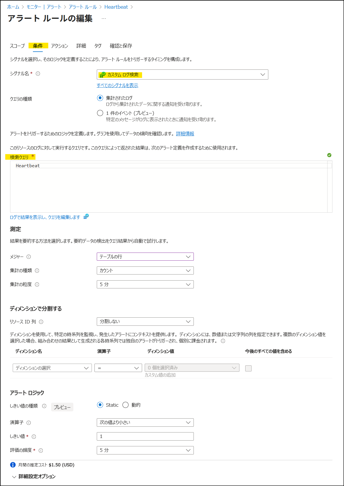

以下は [メトリック アラート ルール](https://learn.microsoft.com/ja-jp/azure/azure-monitor/alerts/alerts-create-metric-alert-rule)の条件を指定する画面の例です。
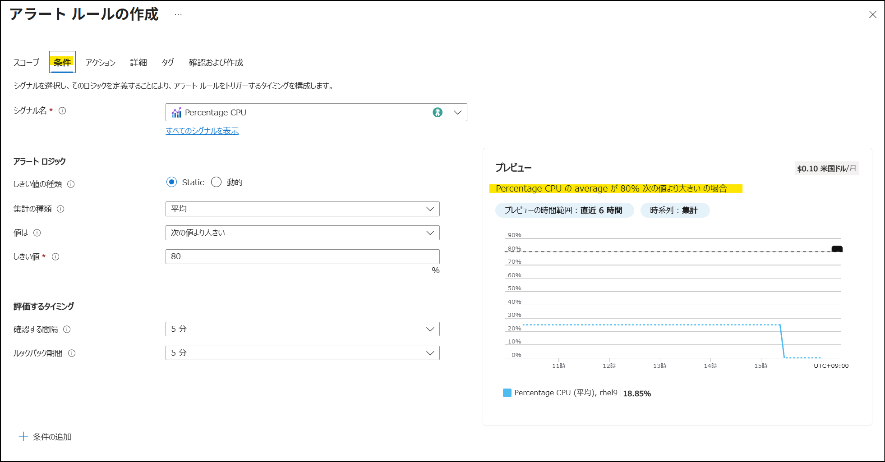
<!--<4-6_metricalert.png>-->

以下は[アクティビティ ログ アラート](https://learn.microsoft.com/ja-jp/azure/azure-monitor/alerts/alerts-create-activity-log-alert-rule?tabs=activity-log) の条件を指定する画面の例です。
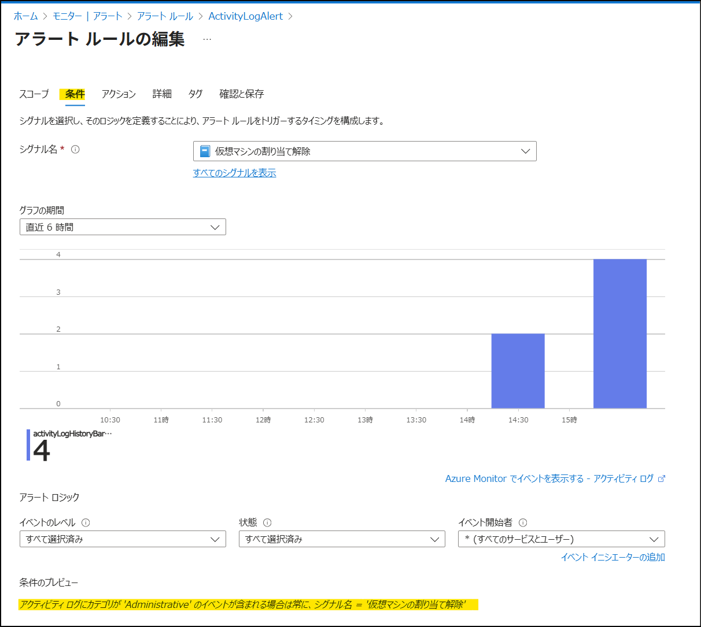
<!--<4-6_activitylogalert.png>-->

<br>

**アクション グループ**
アラートが発報した際の通知方法や実行する自動アクションを設定する機能です。
アラート ルールにアクション グループを関連付けることで、アラートが発報した際にアクション グループがトリガーされ、メールや電話、SMS で通知したり、Webhook などの自動アクションを実行することが可能です。
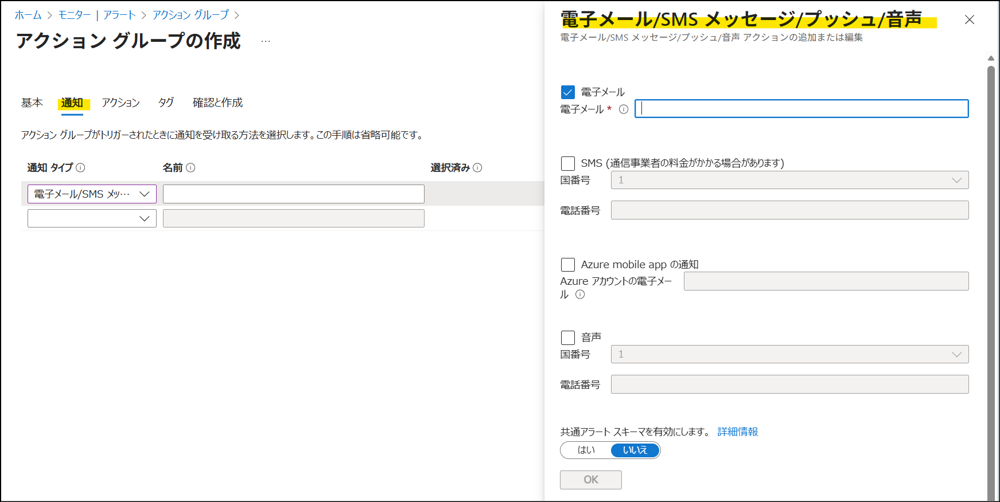
<!--<4-6_actgrp.png>-->

アクション グループには「共通アラート スキーマ」という設定項目があります。アラート スキーマとはアラートが発生した際に生成される通知データの構造であり、[共通アラート スキーマ](https://learn.microsoft.com/ja-jp/azure/azure-monitor/alerts/alerts-common-schema) / [非共通アラート スキーマ](https://learn.microsoft.com/ja-jp/azure/azure-monitor/alerts/alerts-non-common-schema-definitions)の 2 種類があります。

[共通アラート スキーマ](https://learn.microsoft.com/ja-jp/azure/azure-monitor/alerts/alerts-common-schema)は、Azure Monitor のすべてのアラート ルールで統一されたスキーマが提供されます。一方、[非共通アラート スキーマ](https://learn.microsoft.com/ja-jp/azure/azure-monitor/alerts/alerts-non-common-schema-definitions)では、アラート ルールの種類ごとに個別に定義された構造となります。アクション グループで Logic Apps や Webhook などの自動アクションを設定する場合、共通アラート スキーマの有効／無効によって連携されるデータ構造が異なるためご留意ください。
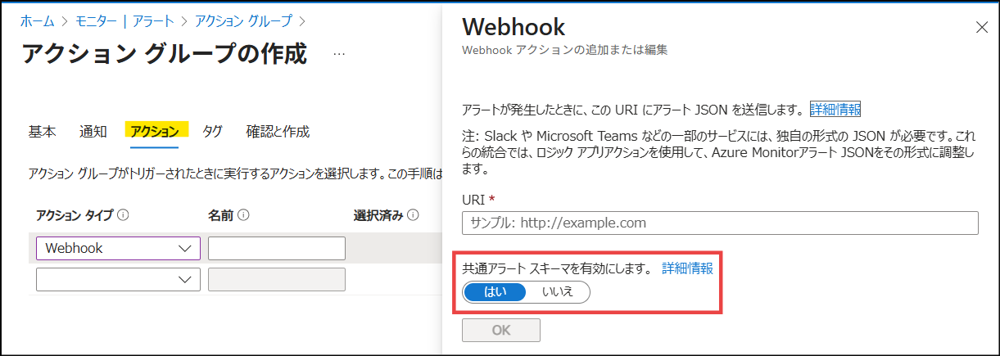

また、共通アラート スキーマの設定により、通知メールのフォーマットも変わります。「5.2 分析とレポート」セクションでは、共通アラート スキーマを有効化した場合の通知メールの例をご紹介しています。 非共通アラート スキーマのメールフォーマットを確認されたい場合は、[テスト アクション グループ](https://learn.microsoft.com/ja-jp/azure/azure-monitor/alerts/action-groups#test-an-action-group-in-the-azure-portal)にてご確認ください。
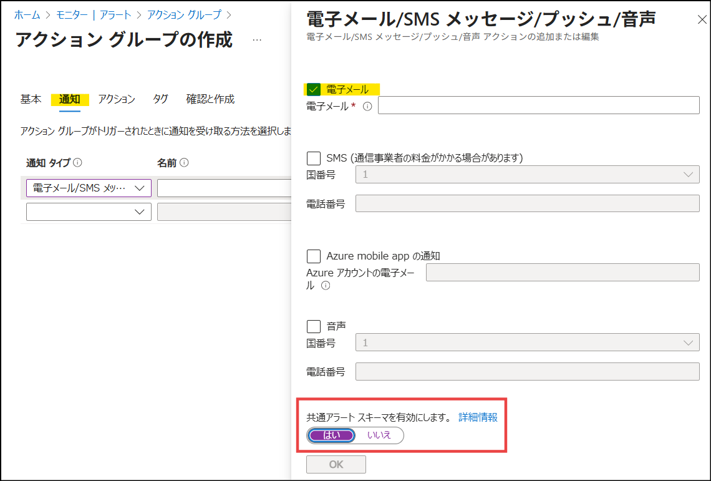


アラート ルールの種類やアクション グループの概要は、下記の公開情報をご覧ください。
[Azure Monitor の警告の概要 - Azure Monitor | Microsoft Learn](https://learn.microsoft.com/ja-jp/azure/azure-monitor/alerts/alerts-overview#types-of-alerts)
[Azure Monitor でアクション グループを作成および管理する - Azure Monitor | Microsoft Learn](https://learn.microsoft.com/ja-jp/azure/azure-monitor/alerts/action-groups)

<br><!-- 小項目の終わり <br> を追加する -->


### 4.7 サービス正常性
サービス正常性では、Azure サービス正常性のイベント（サービスに関する問題、計画メンテナンス、正常性の勧告、セキュリティ アドバイザリ、課金情報の更新）の情報を提供する機能です。ご利用いただいている Azure サービスおよびリージョンに影響がある正常性イベントが発生すると、[Azure ポータル > サービスの正常性](https://learn.microsoft.com/ja-jp/azure/service-health/service-notifications)に情報が表示されます。
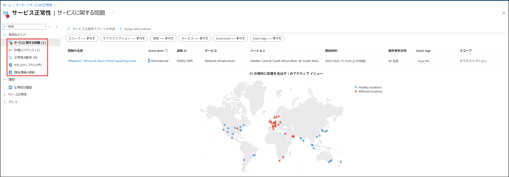


各イベントには一意の追跡 ID が付与されます。上記画面で各イベントのリンクをクリックすると、より詳細な情報を確認することができます。また、[サービス正常性アラート](https://learn.microsoft.com/ja-jp/azure/service-health/service-notifications)を設定すると、サービス正常性のイベントが発生した際に通知を受け取ることも可能です（5.2.5 サービス正常性アラートとリソース正常性アラート 参照）。
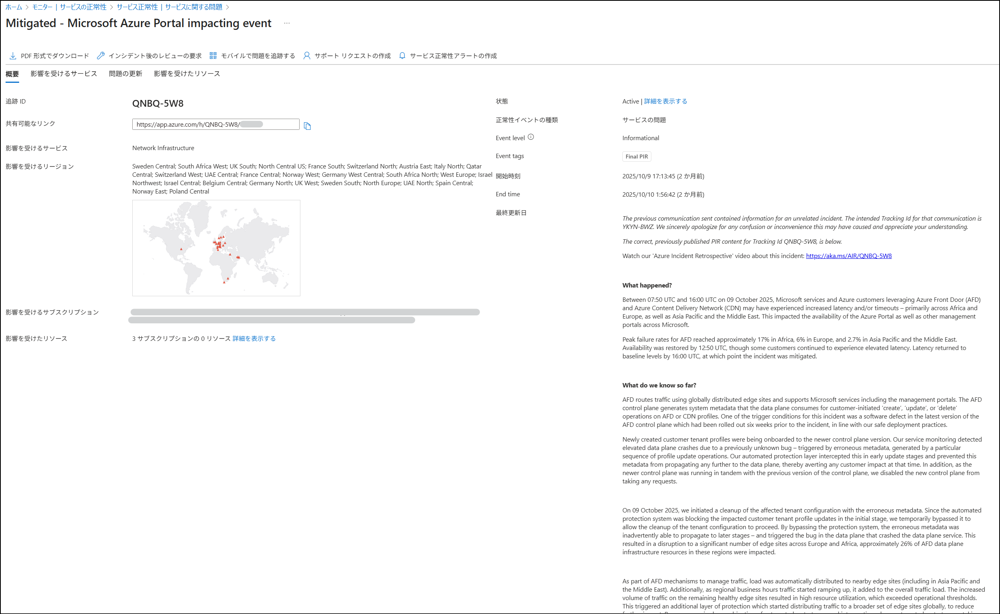


サービス正常性の概要は、下記の公開情報をご覧ください。
[Azure Service Health のドキュメント - Azure Service Health | Microsoft Learn](https://learn.microsoft.com/ja-jp/azure/service-health/)
[Azure Service Health 通知の概要 - Azure Service Health | Microsoft Learn](https://learn.microsoft.com/ja-jp/azure/service-health/service-health-notifications-properties)

<br><!-- 小項目の終わり <br> を追加する -->
<br><!-- 大項目の終わり <br> を追加する -->


<!-- 大項目 -->
## 5. 各機能とソリューション
本項目の説明

<br>

<!-- 中項目 -->
### 5.1 データ収集
本項目の説明

<br>


### 5.1.1 プラットフォーム メトリックとカスタム メトリック

**メトリックの種類**
Azure で扱われるメトリックには以下の 3 種類があります。
- プラットフォーム メトリック
- カスタム メトリック
- Prometheus メトリック (本項ではこちらの説明は割愛します。)

<br>

##### プラットフォーム メトリックとは
プラットフォーム メトリックとは、各 Azure リソースから既定で (ユーザーによる追加構成を必要とせず) 収集されるメトリックで、主に Azure リソースの正常性やパフォーマンスを示すデータです。プラットフォーム メトリックの収集・保持に費用はかかりません。Azure ポータル > 対象の Azure リソース > [監視] > [メトリック] のページ (メトリック エクスプローラーと呼ばれます) で確認ができます。

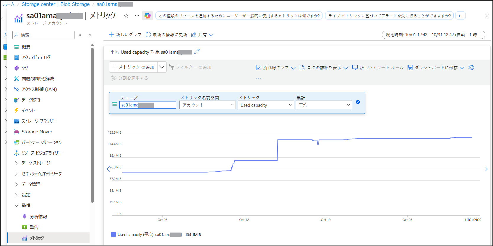
※ ストレージ アカウントのプラットフォーム メトリックを表示したときの例


どのようなメトリックが収集できるかは Azure リソースの種類によって異なります。
各種リソースでどのようなメトリックが収集されるかは、以下の公開情報に記載の表内に記載のリンクから確認いただけます。

[Supported metrics with Azure Monitor | Supported metrics and log categories by resource type](https://learn.microsoft.com/en-us/azure/azure-monitor/reference/metrics-index#supported-metrics-and-log-categories-by-resource-type)

<br>

##### カスタム メトリックとは
カスタム メトリックとはユーザーが収集を構成することで収集されるメトリックです。
例えば、Azure Monitor エージェントによって仮想マシンのゲスト OS から収集されるメトリックや、Application Insights によって Web アプリケーションから収集されるメトリックはカスタム メトリックとして扱われます。カスタム メトリックも、プラットフォーム メトリックと同様に Azure ポータル > 対象の Azure リソース > [監視] > [メトリック] から確認できます。

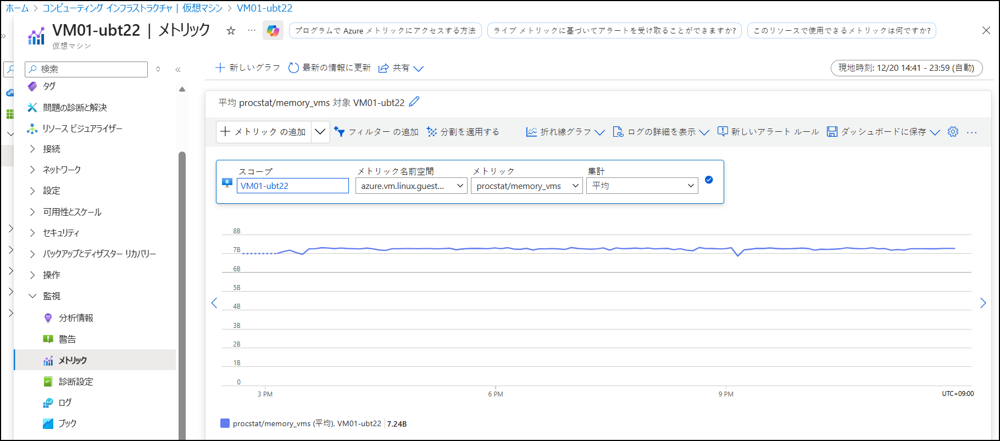
※ Linux 仮想マシンのゲスト メトリックを表示したときの例


カスタム メトリックの収集には費用がかかります。詳細は以下弊社公開情報をご確認ください。
[Azure Monitor の価格 | [メトリック] タブ](https://azure.microsoft.com/ja-jp/pricing/details/monitor/)

各種メトリックについてのより詳細な説明は、以下弊社公開情報をご参照ください。
[Azure Monitor のメトリック - Azure Monitor | Microsoft Learn](https://learn.microsoft.com/ja-jp/azure/azure-monitor/metrics/data-platform-metrics)


<br><!-- 小項目の終わり <br> を追加する -->


#### 5.1.2 仮想マシンからのログ収集

##### Azure Monitor エージェントとデータ収集ルールとは
Azure 仮想マシン (Azure VM) からログを収集するための主な手段は、Azure Monitor エージェントとデータ収集ルールを使用する方法です。それぞれを一言で表現すると、Azure Monitor エージェント (以降 "AMA") とは VM 上でデータを集めて送信するもので、データ収集ルール (以降 "DCR") とは AMA が収集するデータとその送信先を指定するものです。

<br>

##### Azure Monitor エージェントとデータ収集ルールによるログ収集の流れ
ログ収集を構成してからログが閲覧できるようになるまでの大まかな流れは以下の通りとなります。

- AMA を VM にインストールする、VM と DCR を関連付ける
↓
- 関連付けられた DCR の内容を AMA が認識する
↓
- AMA が DCR で指定されたログを指定された宛先に送信する
↓
- 送信されたログが Azure 基盤側に到着し、処理され、指定の宛先に格納される
↓
- Azure ポータル等でログが閲覧できるようになる

<br>

##### Azure Monitor エージェントとデータ収集ルールによるログ収集を構成する
上記の通り、収集したいログと送信先に応じて DCR を作成し、VM に関連付ける必要があります。
AMA と DCR を使用して収集できるデータの種類と、指定できる収集先は以下の通りです。

| データ ソース | 説明 | オペレーティング システム | 収集先 |
| -------------- | ------ | ----------------- | -------- |
| Windows イベント | Windows イベント ログ システムによって出力される情報 | Windows | Log Analytics ワークスペース (Event テーブル (*)) |
| パフォーマンス カウンター | オペレーティング システムとワークロードのパフォーマンスを測定する数値 | Windows, Linux | Log Analytics ワークスペース (Perf テーブル), Azure Monitor メトリック（プレビュー） |
| Syslog | Linux イベント ログ システムによって出力される情報 | Linux | Log Analytics ワークスペース (Syslog テーブル) |
| テキスト ログ | ローカル ディスクのテキスト ログ ファイルに出力される情報 | Windows, Linux | Log Analytics ワークスペース (任意のカスタム テーブル) |
| JSON ログ | ローカル ディスクの JSON ログ ファイルに送信される情報 | Windows, Linux | Log Analytics ワークスペース (任意のカスタム テーブル) |
| IIS ログ | インターネット インフォメーション サービス (IIS) によりローカル ディスク上のファイルに出力される情報 | Windows | Log Analytics ワークスペース (W3CIISLog テーブル) |


(*) Log Analytics ワークスペースに収集されたログはワークスペース内の特定のテーブル内に格納されます。テーブルについては以下をご参照ください。
[Log Analytics ワークスペースの概要 | ログ テーブル](https://learn.microsoft.com/ja-jp/azure/azure-monitor/logs/log-analytics-workspace-overview#log-tables)


AMA と DCR を使用してログ収集を行う場合、収集するデータ ソースの種類に関わらず、以下の前提条件を満たしているかご確認ください。
- OS がサポートされているか
[Azure Monitor エージェントでサポートされるオペレーティング システム - Azure Monitor | Microsoft Learn](https://learn.microsoft.com/ja-jp/azure/azure-monitor/agents/azure-monitor-agent-supported-operating-systems)

- ネットワーク要件を満たしているか
[Azure Monitor エージェントのネットワーク構成 - Azure Monitor | Microsoft Learn](https://learn.microsoft.com/ja-jp/azure/azure-monitor/agents/azure-monitor-agent-network-configuration?tabs=PowerShellWindows)

- 十分なディスク領域が確保されているか
[Azure Monitor エージェントの要件 | ディスク領域](https://learn.microsoft.com/ja-jp/azure/azure-monitor/agents/azure-monitor-agent-requirements#disk-spaces)


前提条件が確認できたら、次に DCR の作成を行います。
それぞれの作業は、Azure ポータル、コマンドライン (Azure CLI, Azure PowerShell)、ARM テンプレート等を使用して実施できます。ここでは、Azure ポータル を使用した方法について具体的にご紹介します。Azure ポータル での DCR の作成方法は以下をご参照ください。
[Azure Monitor を使用して仮想マシン クライアントからデータを収集する | データ収集ルールを作成する](https://learn.microsoft.com/ja-jp/azure/azure-monitor/vm/data-collection?tabs=current#create-a-data-collection-rule)

DCR が作成できたら、DCR と VM の関連付けおよび AMA のインストールを行います。
Azure ポータル で DCR を関連付けた場合、(VM に AMA が未インストールの場合は) AMA のインストールも自動で実施されます。具体的な手順は以下をご確認ください。
[Azure Monitor でデータ収集ルールの関連付けを管理する | Azure ポータル で DCR の関連付けを表示および変更する](https://learn.microsoft.com/ja-jp/azure/azure-monitor/data-collection/data-collection-rule-associations?tabs=cli#view-and-modify-associations-for-a-dcr-in-the-azure-portal)


※ Azure Monitor エージェントのインストールのみを行うことも可能です。詳細は後述の [Azure Monitor エージェントの管理] をご参照ください。
※ Azure ポータル 以外の方法で DCR を作成する方法、および DCR と VM の関連付けを実施する方法については以下をご参照ください。
[Azure Monitor でデータ収集ルール (DCR) を作成する | JSON を使用して DCR を作成または編集する](https://learn.microsoft.com/ja-jp/azure/azure-monitor/data-collection/data-collection-rule-create-edit?tabs=cli#create-or-edit-a-dcr-using-json)
[Azure Monitor でデータ収集ルールの関連付けを管理する | 新しい関連付けを作成する](https://learn.microsoft.com/ja-jp/azure/azure-monitor/data-collection/data-collection-rule-associations?tabs=cli#create-new-association)

Log Analytics ワークスペースに収集された各種ログは、KQL を使用してクエリすることで確認が可能です。
例えば、パフォーマンス カウンターを収集した場合、そのログは Perf テーブルに収集されるため、以下の様なクエリ結果が得られます。
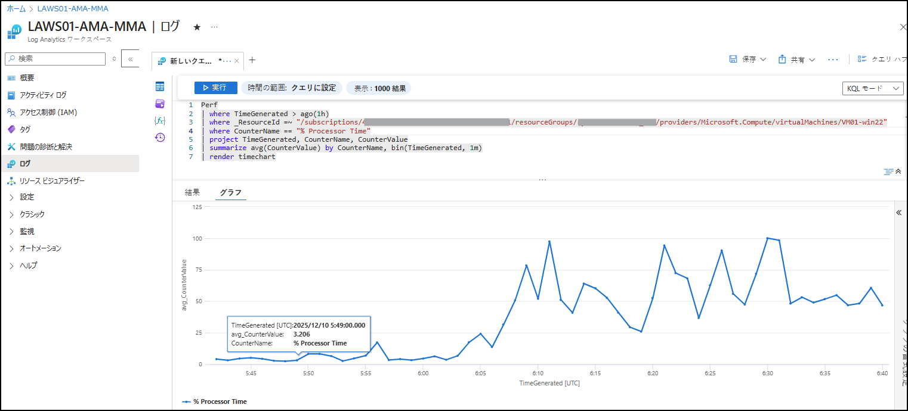


始めてクエリを実施される方は、以下弊社公開情報をご参照ください。
[Azure Monitor ログでログ クエリの使用を開始する](https://learn.microsoft.com/ja-jp/azure/azure-monitor/logs/get-started-queries?tabs=kql)
[Azure Monitor の Log Analytics の概要](https://learn.microsoft.com/ja-jp/azure/azure-monitor/logs/log-analytics-overview?tabs=simple)


<br>

##### Azure Monitor エージェントの管理
Azure Monitor エージェントを VM にインストールする方法として、先述の Azure ポータル上での作業以外に、Azure PowerShell および Azure CLI コマンドを使用する方法や、ARM テンプレートを使用する方法もございます。詳細は以下弊社公開情報にてご案内しておりますため、こちらをご参照ください。
[Azure Monitor エージェントのインストールと管理 | エージェント拡張機能をインストールする](https://learn.microsoft.com/ja-jp/azure/azure-monitor/agents/azure-monitor-agent-manage?tabs=azure-powershell#install-the-agent-extension)

Azure Monitor エージェントのアンインストールは、インストールと同様に、Azure ポータル, Azure PowerShell や Azure CLI, ARM テンプレートを使用した方法で実施できます。詳細は以下弊社公開情報にてご案内しておりますため、こちらをご参照ください。
[Azure Monitor エージェントのインストールと管理 | アンインストール](https://learn.microsoft.com/ja-jp/azure/azure-monitor/agents/azure-monitor-agent-manage?tabs=azure-portal#uninstall)

Azure Monitor エージェントの自動アップグレードを有効化することで、最新バージョンが利用可能となった場合に、自動でアップグレードを適用するように構成することが可能です。自動アップグレードの有効化は、インストール時に設定することも、インストール後に設定することも可能です。詳細な手順は以下をご参照ください。
[Azure の仮想マシンとスケール セットの拡張機能の自動アップグレード | 拡張機能の自動アップグレードを有効にする](https://learn.microsoft.com/ja-jp/azure/virtual-machines/automatic-extension-upgrade?tabs=RestAPI1%2CRestAPI2)

また、Azure Monitor エージェントの自動アップグレード機能に関するよくあるご質問については以下弊社ブログをご参照ください。
[Azure Monitor エージェントの自動アップグレード機能に関するよくあるご質問集](https://jpazmon-integ.github.io/blog/LogAnalytics/AMAAutoupgradeFAQ/)

<br><!-- 小項目の終わり <br> を追加する -->


#### 5.1.3 コンテナーからのログ収集
本文を入力

<br><!-- 小項目の終わり <br> を追加する -->


#### 5.1.4 アプリケーションからのログ収集
Application Insights は、アプリケーションのパフォーマンスを監視するサービスです。
Web アプリや API が
- 正常に動いているか
- エラーが発生していないか
- レスポンスが遅くなっていないか

といったことを、Application Insights を有効化することで、自動的にデータを収集し可視化できます。

収集したデータは 下図のように Azure ポータルの画面ですぐに閲覧できます。
前述の
「正常に動いているか」は [有効] グラフ (右側の緑色グラフ)、
「エラーが発生していないか」は [失敗した要求] グラフ (左側の赤色グラフ)、
「レスポンスが遅くなっていないか」は [サーバー応答時間] グラフ (左側の青色グラフ) 
にて確認できます。

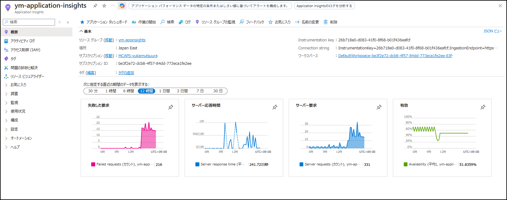
※ Application Insights の [概要] 画面

収集したデータの分析方法および可視化方法の詳細は、本記事の 5.2.8 と 5.3.4 をご覧ください。
また、Azure App Service や Azure VM などの Azure サービスに加えて、オンプレミスのサーバーで動作するアプリケーションからもログを収集できます。Application Insights の詳細については、以下の弊社公開情報をご参照ください。
[Application Insights OpenTelemetry の可観測性の概要 - Azure Monitor | Microsoft Learn](https://learn.microsoft.com/ja-jp/azure/azure-monitor/app/app-insights-overview)

<br>


アプリケーションで Application Insights を有効化する方法は 2 つあります。

##### 自動インストルメンテーション
自動インストルメンテーションはソース コードの変更なしで、Application Insights を有効にできます。
手動インストルメンテーションと比較して、簡単に有効化できる一方で一部の機能が制限されます。
自動インストルメンテーションを利用できるシナリオは以下弊社公開情報をご参照ください。
[Azure Monitor Application Insights の自動インストルメンテーション - Azure Monitor | Microsoft Learn](https://learn.microsoft.com/ja-jp/azure/azure-monitor/app/codeless-overview)

例えば、Azure App Service では Azure ポータルの [監視] > [Application Insights] から自動インストルメンテーションを有効化します。
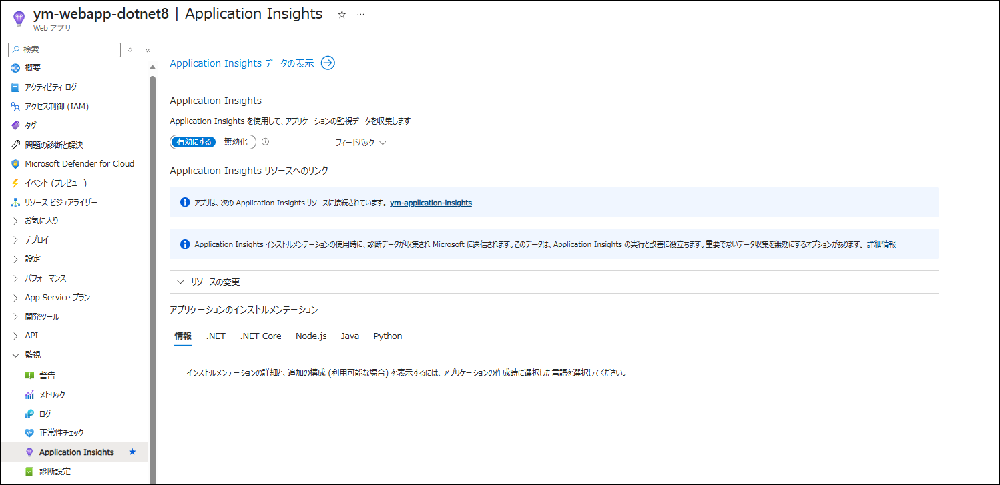
※ Azure App Service で自動インストルメンテーションを有効化

<br>

##### 手動インストルメンテーション
アプリケーションのソース コードに Application Insights SDK (クラシックまたは  Azure Monitor OpenTelemetry Distro) をインストールして、Application Insights を有効にします。ソース コードの変更は必要ですが、自動インストルメンテーションより多くの情報を取得でき、カスタム テレメトリの収集も可能です。

利用方法はアプリケーションの開発言語ごとに異なるため、詳細は以下の弊社公開情報をご参照ください。

[Application Insights で OpenTelemetry を有効にする - Azure Monitor | Microsoft Learn](https://learn.microsoft.com/ja-jp/azure/azure-monitor/app/opentelemetry-enable?tabs=net)
[Application Insights を使用して .NET アプリケーションと Node.js アプリケーションを監視する (クラシック API) - Azure Monitor | Microsoft Learn](https://learn.microsoft.com/ja-jp/azure/azure-monitor/app/classic-api?tabs=dotnet)


また、Application Insights の可用性テストを使って、アプリケーションの死活監視も可能です。
可用性テストでは、世界中のさまざまな場所から Web リクエストをアプリケーションに定期的に送信します。
アラート ルールの設定も可能で、アプリケーションの応答がない場合や応答が遅い場合はユーザーに警告も可能です。

可用性テストは Application Insights の [調査] > [有効] から設定と結果の確認ができます。
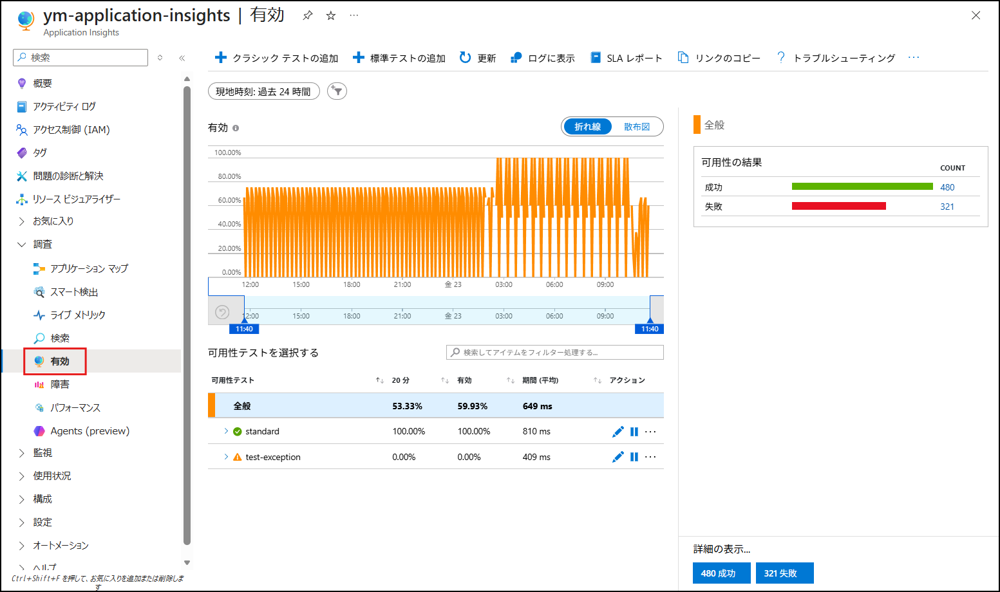


詳細な利用方法は、以下弊社公開情報にてご案内しております。
[Application Insights 可用性テスト - Azure Monitor | Microsoft Learn](https://learn.microsoft.com/ja-jp/azure/azure-monitor/app/availability?tabs=standard)


<br><!-- 小項目の終わり <br> を追加する -->


#### 5.1.5 ストレージへの収集
本文を入力

<br><!-- 小項目の終わり <br> を追加する -->


#### 5.1.6 診断設定

##### 診断設定とは
診断設定を使用することで、各 Azure リソースから出力される以下のデータを指定した宛先に送信することができます。
- アクティビティ ログ
- リソース ログ
- プラットフォーム メトリック

宛先には、以下を指定することが可能です。
- Log Analytics ワークスペース
- ストレージ アカウント
- Event Hubs
- Azure Monitor パートナー ソリューション

<br>

##### 診断設定の主な利用シナリオ
リソース ログは既定では収集されません。
そのため、リソース ログを収集し監視や分析を行う必要がある場合は診断設定をご利用ください。

アクティビティ ログおよびプラットフォーム メトリック (*1) は既定で収集されます (*2)。
ただし、そのままではそれぞれを監視したり分析したりする方法は限られています。診断設定を利用することで様々な監視シナリオ沿う形 (Log Analytics ワークスペース、ストレージ アカウント、および Event Hub) でデータを収集し、監視や分析を行うことが可能です。

また、既定で収集されるアクティビティ ログおよびプラットフォーム メトリック (*2) の保持期間はそれぞれ 90 日と 93 日です。
診断設定を用いて任意の宛先に収集することで、この保持期間を延長することが可能です。

(*1)
プラットフォーム メトリックについては、[5.1.1 プラットフォーム メトリックとカスタム メトリック] を参照ください。

(*2)
既定で収集されるアクティビティ ログおよびプラットフォーム　メトリックとは、それぞれ Azure ポータル 上の以下の箇所で確認することが可能なものを指します。

アクティビティ ログ
Azure ポータル > サブスクリプション > [アクティビティ ログ]
参考: [Azure Monitor のアクティビティ ログ | アクティビティ ログの表示と取得](https://learn.microsoft.com/ja-jp/azure/azure-monitor/platform/activity-log?tabs=log-analytics#view-and-retrieve-the-activity-log)

プラットフォーム メトリック
Azure ポータル > 対象の Azure リソース > [監視] > [メトリック] のページ (メトリック エクスプローラーと呼ばれます)
// メトリック エクスプローラーのリンクを入れた方が良いかも？

<br>

##### 診断設定の作成方法 (リソース ログ, プラットフォーム メトリック)
診断設定は Azure ポータル 上、Azure PowerShell や Azure CLI のコマンド、ARM テンプレートなどを用いて作成することが可能です。
Azure ポータル 上での作成方法としては、大きく Azure リソースのページから行う方法と、[モニター] のページから行う方法があります。ここでは、Azure ポータル > 対象の Azure リソース > [監視] > [診断設定] からの作成方法をご紹介します。
※ アクティビティ ログ用の診断設定は少し作成方法が異なります。詳細は後述の内容を確認ください。

Azure ポータル > 対象の Azure リソース > [監視] > [診断設定] > [診断設定を追加] を押下すると、以下のような作成画面が表示されます。
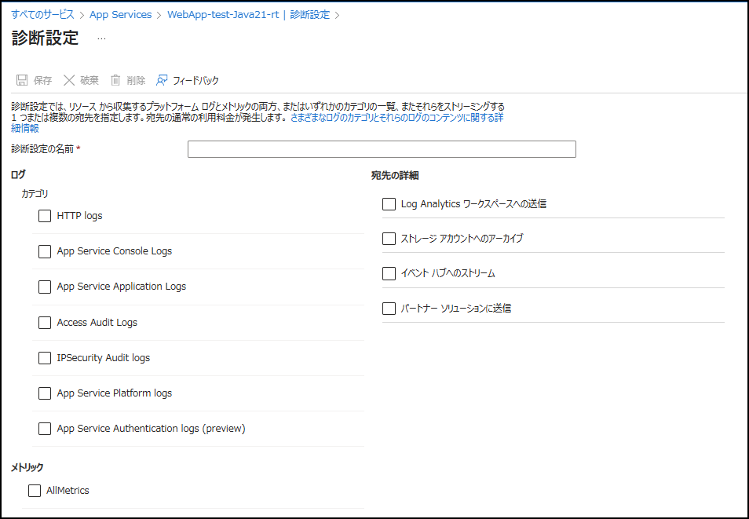
※ Web App リソースの診断設定作成画面


画像のように、収集対象のデータ (ログおよびメトリック) と宛先を選択することが可能です。
なお、ログはカテゴリ単位で選択することが可能ですが、このカテゴリについてはリソースの種類によって異なります。
また、メトリックについても、どのような種類のメトリックが収集されるかは、リソースの種類によって異なります。
各種リソースからどのようなログおよびメトリックが収集されるかは、以下の公開情報に記載の表内に記載のリンクから確認いただけます。

[Supported Resource log categories for Azure Monitor | Supported metrics and log categories by resource type](https://learn.microsoft.com/en-us/azure/azure-monitor/reference/logs-index#supported-metrics-and-log-categories-by-resource-type)

Log Analytics ワークスペースに収集した場合は以下のように確認が可能です。
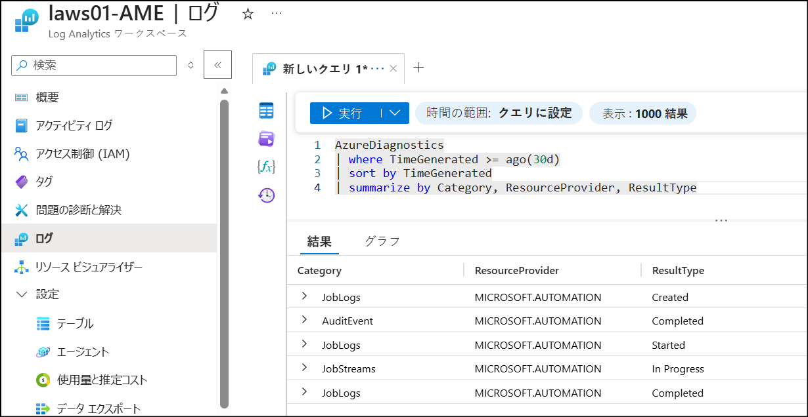
※ Log Analytics ワークスペースの AzureDiagnostics テーブルにクエリしたときのサンプル

<br>

※ リソース ログは Log Analytics ワークスペースの AzureDiagnostics テーブルに収集されます。ただし、一部のリソース種では設定によりリソース固有のテーブルに収集することも可能です。詳細は以下を参照ください。
[Azure Monitor のリソース ログ | 目的地 | Log Analytics ワークスペース | コレクション モード](https://learn.microsoft.com/ja-jp/azure/azure-monitor/platform/resource-logs?tabs=log-analytics#collection-mode)
[Azure リソース ログの一般的なスキーマとサービス固有のスキーマ](https://learn.microsoft.com/ja-jp/azure/azure-monitor/platform/resource-logs-schema)
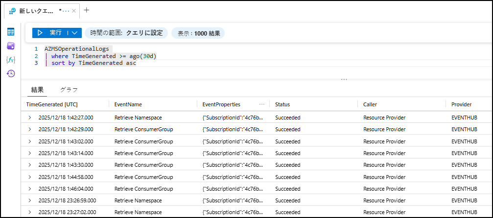
※ EventHub のリソース固有テーブルへクエリしたときの例

<br>

##### 診断設定の作成方法 (アクティビティ ログ)
アクティビティ ログ用の診断設定はサブスクリプションのスコープでのみ作成が可能です。
そのため、リソース ログ用の診断設定のように対象リソースの画面から診断設定を作成するのではなく、Azure ポータル > サブスクリプション > [アクティビティ ログ] > [診断設定] から作成します。
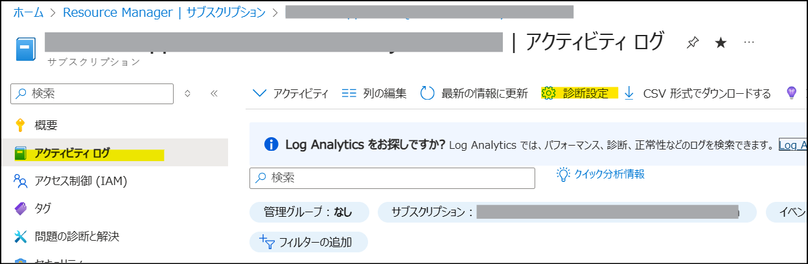


例えば、Log Analytics ワークスペースに送信した場合は、AzureActivity テーブルに収集され、ストレージ アカウントに送信した場合は以下の形式の json にログが収集されます。
`insights-activity-logs/resourceId=/SUBSCRIPTIONS/{subscription ID}/y={four-digit numeric year}/m={two-digit numeric month}/d={two-digit numeric day}/h={two-digit 24-hour clock hour}/m=00/PT1H.json`

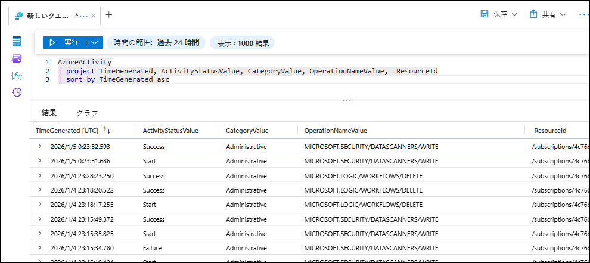
※ Log Analytics ワークスペースの AzureActivity テーブルにクエリしたときの例

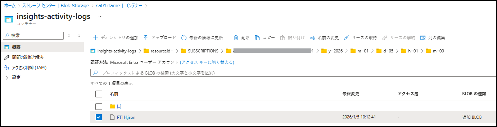
※ ストレージ アカウントにエクスポートされたアクティビティ ログの例

アクティビティ ログ用の診断設定の詳細については以下を参照ください。
[Azure Monitor のアクティビティ ログ | アクティビティ ログのエクスポート](https://learn.microsoft.com/ja-jp/azure/azure-monitor/platform/activity-log?tabs=log-analytics#export-activity-log)


<br><!-- 小項目の終わり <br> を追加する -->


#### 5.1.7 アクティビティ ログ
アクティビティ ログには各 Azure リソースの操作等のログ、サービス正常性、リソース正常性があります。

**アクティビティ ログ (操作等のログ)**
[モニター (監視)] > [アクティビティ ログ] にてサブスクリプション内の Azure リソースに対して実行された操作等のログの一覧を確認できます。
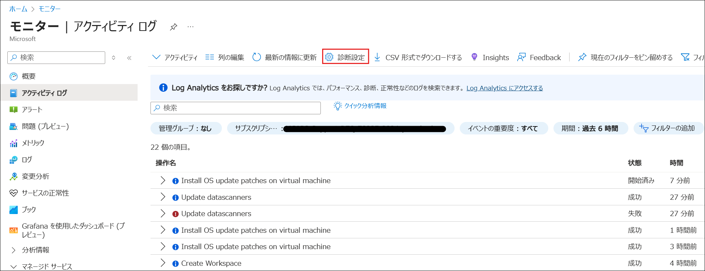
<!--<5-1-7_activitylog1.png>-->

既定ではアクティビティ ログの保持期間は 90 日間です。
90 日以上さかのぼって確認するためには、上図の [診断設定] からサブスクリプション スコープで診断設定を作成します。

[Azure Monitor アクティビティ ログ - Azure Monitor | Microsoft Learn](https://learn.microsoft.com/ja-jp/azure/azure-monitor/platform/activity-log?tabs=log-analytics#export-activity-log)

<br>

**サービス正常性**
サービス正常性では ご利用の Azure サービスの障害や計画メンテナンス、サービスの廃止などのイベントについて表示します。

[監視/モニター] > [サービス正常性] > [有効なイベント] もしくは [履歴] をクリックして確認します。
[有効なイベント] には現時点でアクティブなサービス正常性が表示され、[履歴] には過去 のサービス正常性イベントが表示されます。
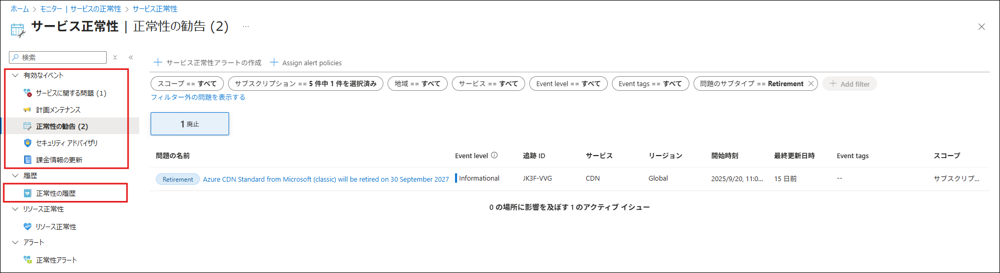


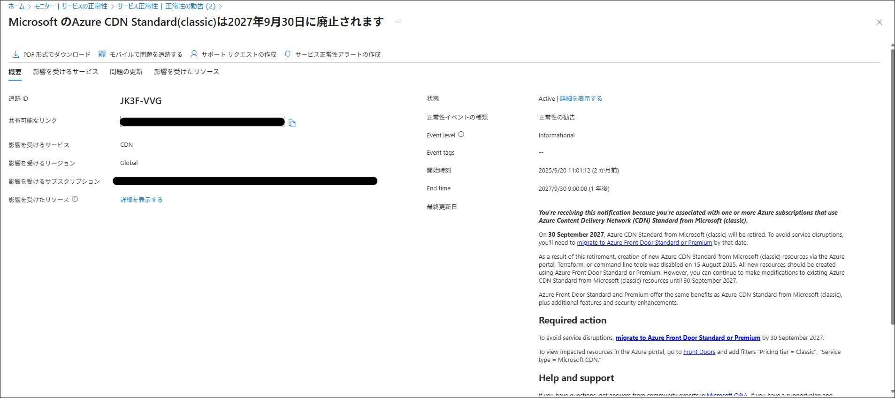

[Azure Service Health ポータル - Azure Service Health | Microsoft Learn](https://learn.microsoft.com/ja-jp/azure/service-health/service-health-portal-update)

<br>

**リソース正常性**
リソース正常性では、ご利用の Azure リソースが正常であるかどうかを評価し、リソースの状態が [利用可能 (Available)]、[使用不可 (Unavailable)]、[不明 (Unknown)]、[低下 (Degraded)] のいずれかの状態と表示します。

[監視/モニター] > [サービス正常性] > [リソース正常性] にて、確認したいリソースの種類を指定して確認します。
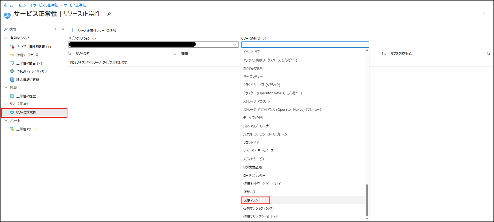

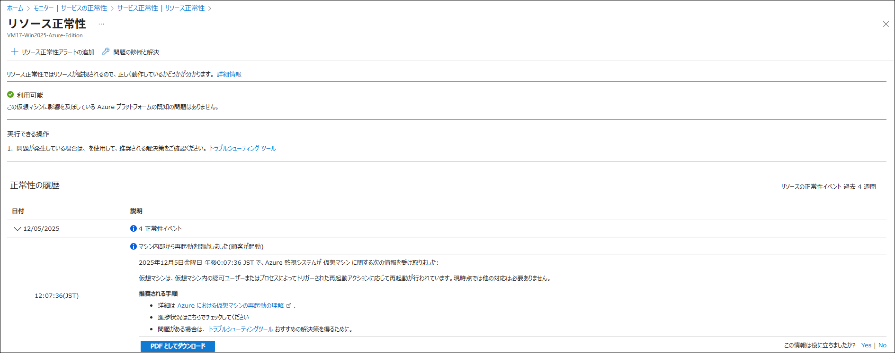


[Azure Resource Health の概要 - Azure Service Health | Microsoft Learn](https://learn.microsoft.com/ja-jp/azure/service-health/resource-health-overview).

**参考**
[Azure Monitor の各種データの保持期間について | Japan Azure Monitoring Support Blog](https://jpazmon-integ.github.io/blog/AzureMonitorEssential/MonitorRetentionPeriod/)


<br><!-- 小項目の終わり <br> を追加する -->


#### 5.1.8 データ エクスポート
##### データ エクスポートとは
Log Analytics ワークスペースのデータ エクスポート機能を使用することで、Log Analytics ワークスペースのテーブルに格納されるログを他の宛先 (ストレージ アカウントまたは Event Hubs) にエクスポートすることが可能です。データ エクスポート ルールを作成し、その中で対象となるテーブルと宛先を指定します。

データ エクスポート ルールを作成すると、対象のデータが Azure Monitor のパイプラインに到着次第、Log Analytics ワークスペースのテーブルに取り込まれるのと並行して、指定した宛先へのエクスポートが実施されます。
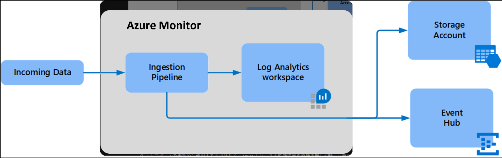
※ データ エクスポート機能によるエクスポートのイメージ図

<br>

##### データ エクスポート機能の主な利用シナリオ - ストレージ アカウント
- 改ざん防止に関するコンプライアンス: Log Analytics ワークスペースに取り込まれたデータを変更することできません。しかし、以下手順で消去することは可能です。
[Log Analytics ワークスペースのデータを削除する方法](https://jpazmon-integ.github.io/blog/LogAnalytics/LogAnalyticsWorkspacePurge/)
一方で、不変ポリシーが設定されたストレージ アカウントに格納されたデータは、設定した保持期間を超えるまでは変更、削除いずれも出来ません。そのため、データの改ざん (消去) 防止の要件がある場合は、不変ポリシーが設定されたストレージ アカウントにエクスポートすることをご検討ください。

- データの冗長化および長期保持: 監査データやセキュリティ データ等、冗長化や長期保存が必要であるデータについて、Log Analytics ワークスペースと同一リージョンにあるストレージ アカウントへのエクスポートをご利用いただけます。
GRS、GZRS など、ストレージ アカウントの冗長オプションを使用することで、他のリージョンにデータをレプリケートすることができます。また、ストレージ アカウントにエクスポートされたデータは、Log Analytics ワークスペースに設定された保持期間の影響は受けないため、ストレージ アカウントにログをエクスポートし、ストレージ アカウントで長期保持することが可能です。
さらに、ストレージ アカウントのライフサイクル管理ポリシーを利用することで、ストレージ アカウントにエクスポートされたデータを管理する (一定期間を過ぎた後に自動で削除する等) ことが可能です。ライフサイクル管理については以下をご参照ください。
[Azure Blob Storage ライフサイクル管理の概要](https://learn.microsoft.com/ja-jp/azure/storage/blobs/lifecycle-management-overview)
[ライフサイクル管理ポリシーを構成する](https://learn.microsoft.com/ja-jp/azure/storage/blobs/lifecycle-management-policy-configure?tabs=azure-portal)

補足:
ストレージ アカウント上にエクスポートされたJSON ファイル内のデータは、KQL の externaldata 演算子を使用することでクエリすることが可能です。
(参考) [externaldata operator](https://learn.microsoft.com/en-us/kusto/query/externaldata-operator?view=microsoft-fabric)


<br>

##### データ エクスポート機能の主な利用シナリオ - Event Hubs
Azure サービスおよびその他のツールとの統合: Event Hubs にエクスポートすることで、他 Azure サービスやツールとの統合が実現可能です。

<br>

##### データ エクスポート機能の利用開始方法
はじめに、以下の制限事項、およびデータ エクスポート ルール作成者に必要なアクセス許可が付与されていることをご確認ください。
[Azure Monitor の Log Analytics ワークスペース データ エクスポート | 制限事項](https://learn.microsoft.com/ja-jp/azure/azure-monitor/logs/logs-data-export?tabs=portal#limitations)
[Azure Monitor の Log Analytics ワークスペース データ エクスポート | 権限が必要です](https://learn.microsoft.com/ja-jp/azure/azure-monitor/logs/logs-data-export?tabs=portal#permissions-required)

データ エクスポート ルールの作成手順については以下をご参照ください。
[Azure Monitor の Log Analytics ワークスペース データ エクスポート | データ エクスポートを有効にする](https://learn.microsoft.com/ja-jp/azure/azure-monitor/logs/logs-data-export?tabs=portal#enable-data-export)

一部のテーブルはデータ エクスポート機能がサポートされていないため、ご注意ください。
サポート対象外のテーブルは以下より確認いただけます。
[Log Analytics workspace data export in Azure Monitor | Unsupported tables](https://learn.microsoft.com/en-us/azure/azure-monitor/logs/logs-data-export?tabs=portal#unsupported-tables)


<br><!-- 小項目の終わり <br> を追加する -->


#### 5.1.9 ネットワークの監視
Network Watcher は、仮想マシン (VM)、仮想ネットワーク (VNet)、アプリケーション ゲートウェイ、ロード バランサーなどの IaaS 製品のネットワーク正常性の監視や修復が可能なサービスです。
[Azure Network Watcher の概要 | Microsoft Learn](https://learn.microsoft.com/ja-jp/azure/network-watcher/network-watcher-overview?toc=%2Fazure%2Fazure-monitor%2Ftoc.json)

Network Watcher の機能の一つであるネットワークの分析情報は、Azure ポータル 上の [監視/モニター] > [分析情報] > [ネットワーク] にて確認できます。
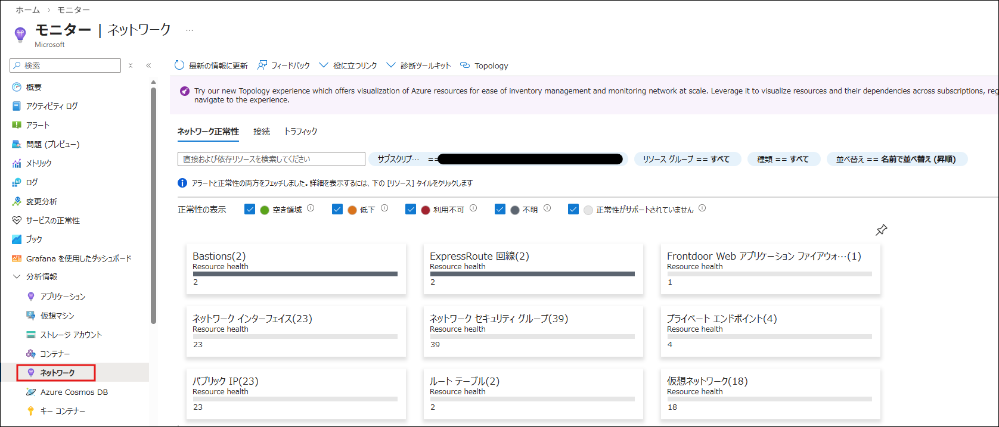
<!--<5-1-9_netowok_monitor1.png>-->
[ネットワークの分析情報 | Microsoft Learn](https://learn.microsoft.com/ja-jp/azure/network-watcher/network-insights-overview?toc=%2Fazure%2Fazure-monitor%2Ftoc.json)

<br>

**お問い合わせに関するご留意事項**
ネットワークの分析情報を含め Network Watcher については、Japan Azure Monitoring サポート チームではなく、Japan Azure Networking サポート チームにて対応しております。これらに関するお困りごとやご質問はネットワーク製品観点でお問い合わせを発行してください。

Japan Azure Networking サポート チームのブログは下記リンクよりご確認ください。
[Japan Azure IaaS Core Support Blog](https://jpaztech.github.io/blog/index.html)


<br><!-- 小項目の終わり <br> を追加する -->.
<br><!-- 中項目の終わり <br> を追加する -->


<!-- 中項目 -->
### 5.2 分析とレポート
本項目の説明

<br>


#### 5.2.1 Log Analytics ワークスペースのクエリ  
各種の Azure リソースやマシンから Log Analytics ワークスペースに収集したデータはクエリを実行して確認します。

**クエリのモード**
クエリを実行する 2 種類のモードがあります。
簡易モードでは [ログ] > [テーブル] > [対象テーブルの 実行] をクリックすることで、簡単にクエリを実行可能です。
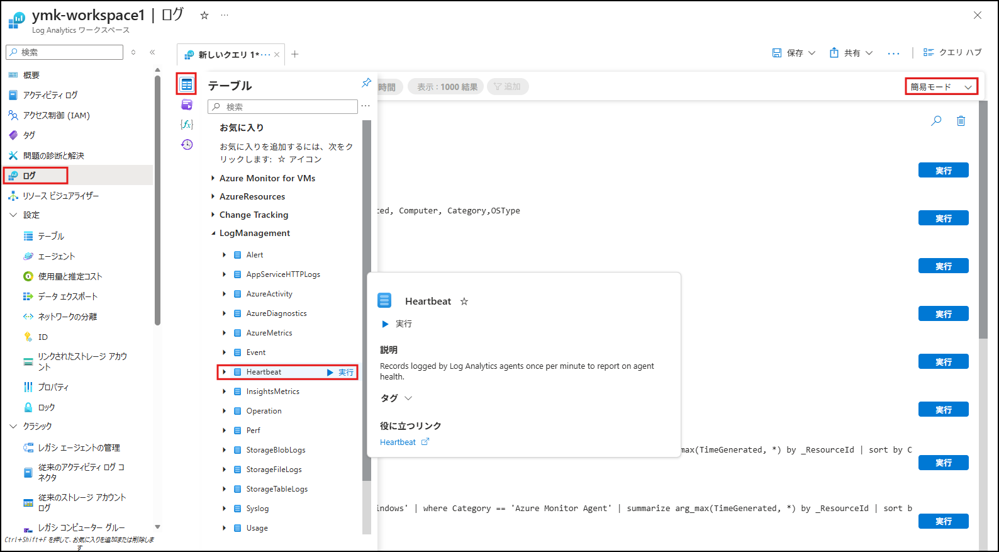


KQL モードではより詳細なクエリを指定して実行することでカスタマイズしたクエリ実行結果を取得することが可能です。
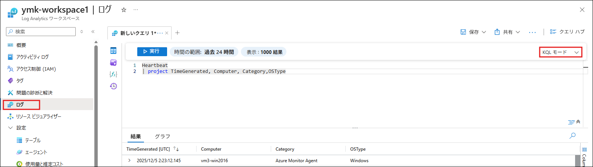

[Azure Monitor ログでログ クエリの使用を開始する - Azure Monitor | Microsoft Learn](https://learn.microsoft.com/ja-jp/azure/azure-monitor/logs/get-started-queries?tabs=kql#search-queries)

<br>


**共有機能**
クエリの実行結果は [共有] から Excel 等のファイルに出力可能です。
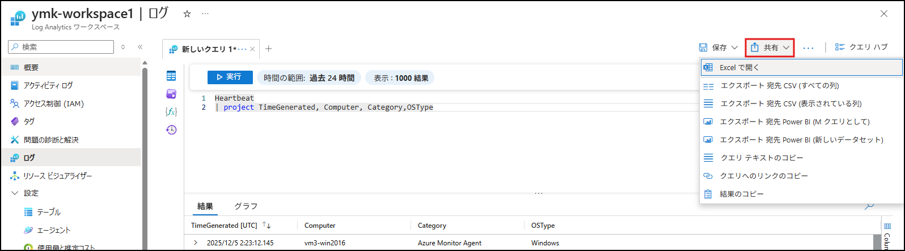

[Log Analytics と Excel を統合する - Azure Monitor | Microsoft Learn](https://learn.microsoft.com/ja-jp/azure/azure-monitor/logs/log-excel)

<br>


**アクセス制御モード**
Log Analytics ワークスペースのアクセス制御モードには 2 種類あります。
ワークスペース コンテキスト アクセス制御モードでは Log Analytics ワークスペースの [ログ] からアクセスすることで、複数のリソースから Log Analytics ワークスペースに収集された全てのログを参照します。
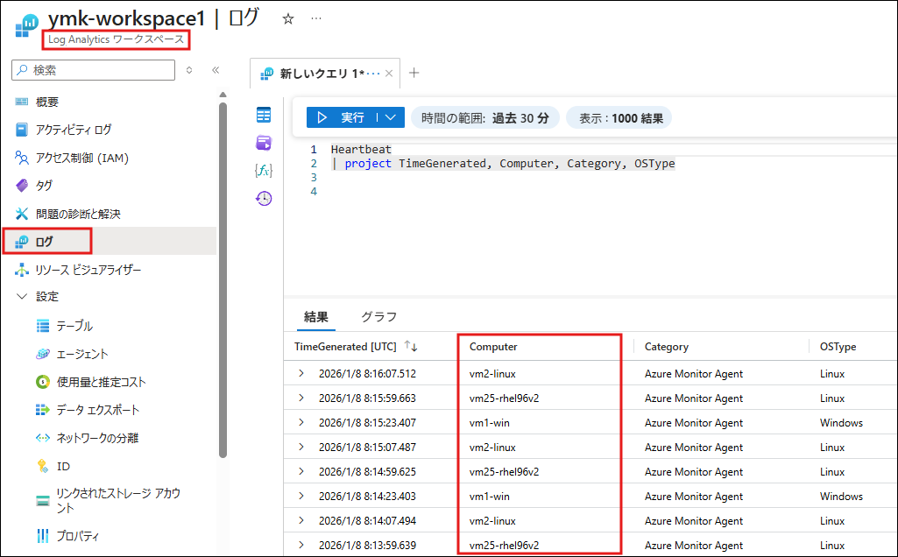
ワークスペース コンテキスト アクセス制御モードの場合の例

リソース コンテキスト アクセス制御モードでは 各 Azure リソース (例: Azure VM) の画面左側メニューの [監視] > [ログ] からアクセスすることで、対象のリソースから Log Analytics ワークスペースに収集されたログのみを参照します。
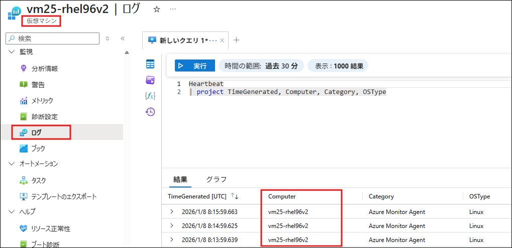
リソース コンテキスト アクセス制御モードの場合の例

[Log Analytics ワークスペースのアクセス制御モードの違いについて | Japan Azure Monitoring Support Blog](https://jpazmon-integ.github.io/blog/LogAnalytics/AccessControlMode/)


**参考**
Log Analytics ワークスペース内の各テーブルの詳細情報のリンク一覧:
[Azure Monitor Resource log / log analytics tables - Azure Monitor | Microsoft Learn](https://learn.microsoft.com/en-us/azure/azure-monitor/reference/tables-index)

各テーブルのサンプル クエリが記載されているページへのリンク一覧:
[Azure Monitor log analytics queries by tables - Azure Monitor | Microsoft Learn](https://learn.microsoft.com/en-us/azure/azure-monitor/reference/queries-by-table)


<br><!-- 小項目の終わり <br> を追加する -->


#### 5.2.2 ログ アラート ルール
ログ アラート ルールは、Azure リソースやお客様のアプリケーションなどから収集されたログを監視する機能です。
Log Analytics ワークスペースに収集されたログに加え、Azure Resource Graph や Azure Data Explorer のデータを監視することもできます。


**1. 定期的にクエリを実行してログを評価する**
[KQL　(Kusto Query Language)](https://learn.microsoft.com/ja-jp/kusto/query/?view=azure-monitor) という Log Analytics のクエリ言語を使って監視する条件を定義します。
例 : 仮想マシンが停止していないかどうか (過去 10 分間の Heartbeat のレコードが 0 件かどうか)
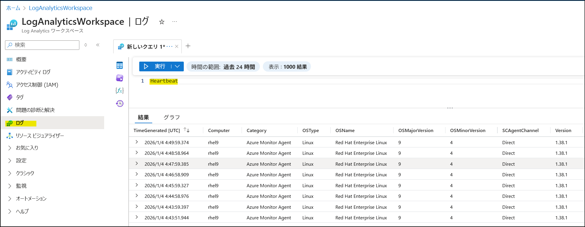


ログ アラート ルールは、指定された評価期間のログを対象に、定期的にクエリを実行します。クエリの実行結果がしきい値（例：過去 10 分間の Heartbeat のレコード数 < 1）を満たすと、アラートが発報します。
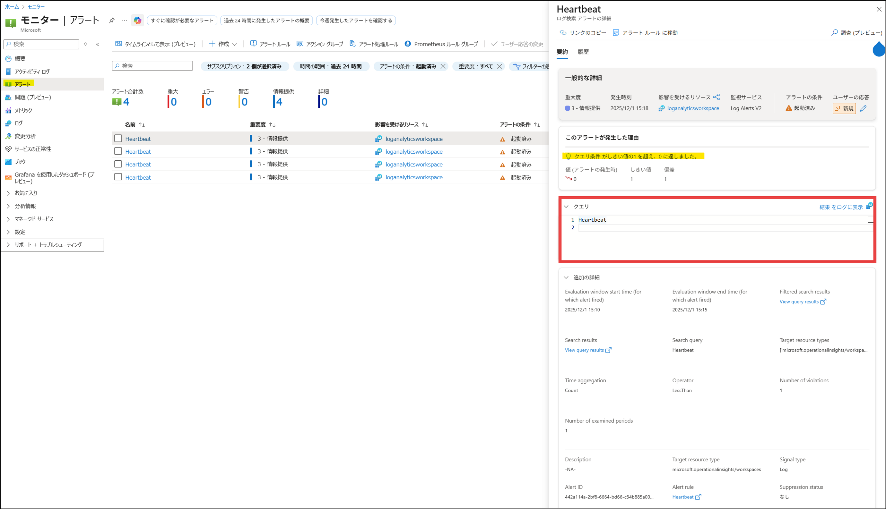


**2. 通知や自動アクションを実行する**
アラートが発報した時に通知する方法や、実行するアクションは「アクション グループ」で設定します。
アラート ルールにアクション グループを関連付けると、メールや電話、SMS で通知したり、Webhook などの自動アクションを実行することが可能です。

※ 以下例は [Azure Monitor のアクション グループ](https://learn.microsoft.com/ja-jp/azure/azure-monitor/alerts/action-groups#create-an-action-group-in-the-azure-portal)で共通アラート スキーマを有効化した時に通知されたメールです。
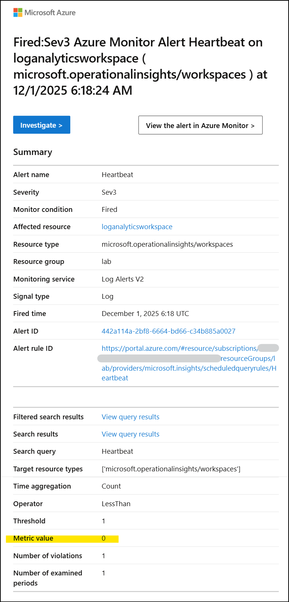


ログ アラート ルールの設定手順などは、公開情報やブログをご覧ください。
[Azure Monitor のログ検索アラート ルールを作成する - Azure Monitor | Microsoft Learn](https://learn.microsoft.com/ja-jp/azure/azure-monitor/alerts/alerts-create-log-alert-rule)
[Azure Monitor でアクション グループを作成および管理する - Azure Monitor | Microsoft Learn](https://learn.microsoft.com/ja-jp/azure/azure-monitor/alerts/action-groups)
[Azure Monitor のアラートに関するよくあるご質問 | Japan Azure Monitoring Support Blog](https://jpazmon-integ.github.io/blog/AzureMonitorEssential/MonitorAlertFAQ/#%E3%83%AD%E3%82%B0-%E3%82%A2%E3%83%A9%E3%83%BC%E3%83%88-%E3%83%AB%E3%83%BC%E3%83%AB)

<br><!-- 小項目の終わり <br> を追加する -->


#### 5.2.3 メトリック アラート ルール
メトリック アラート ルールは、Azure リソースのパフォーマンスや状態を示すメトリックを監視する機能です。
既定で収集されるプラットフォーム メトリックや、既定では収集されない[カスタム メトリック](https://learn.microsoft.com/ja-jp/azure/azure-monitor/metrics/metrics-custom-overview)を監視することが可能です。

**1. 定期的にメトリックの値を評価する**
監視する Azure リソースや[メトリック](https://learn.microsoft.com/ja-jp/azure/azure-monitor/metrics/data-platform-metrics)を決め、しきい値などの監視条件を指定します。
例 : Azure VM の CPU 使用率が 80% を超えているかどうか
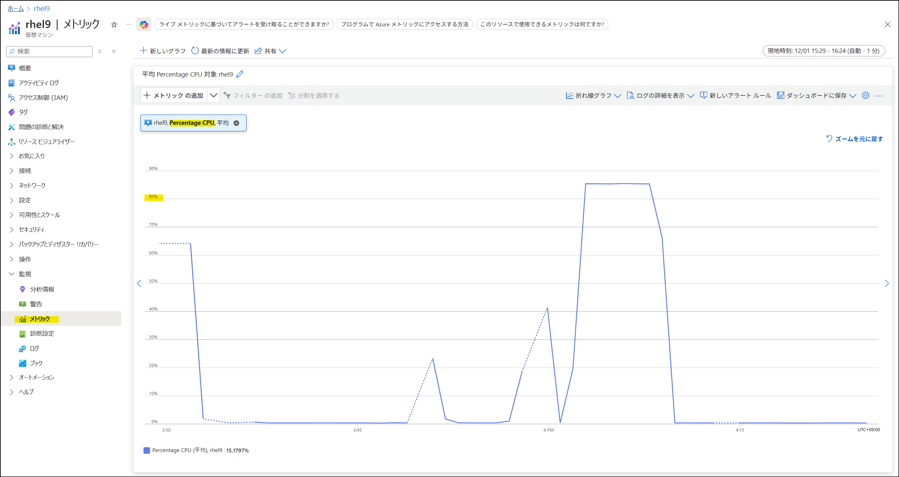
<!--<5-2-3_metric_percentagecpu.png>-->

メトリック アラート ルールは、指定されたルックバック期間（評価期間）のメトリックを対象に、しきい値を満たしているかどうかを定期的に評価します。メトリックの値がしきい値（例：PercentageCpu > 80）を満たすと、アラートが発報します。
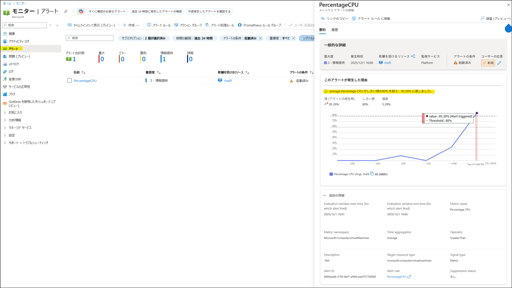
<!--<5-2-3_metricalert_percentagecpu_portal.png>-->


**2. 通知や自動アクションを実行する**
アラートが発報した時に通知する方法や、実行するアクションは「アクション グループ」で設定します。
アラート ルールにアクション グループを関連付けると、メールや電話、SMS で通知したり、Webhook などの自動アクションを実行することが可能です。

※ 以下例は [Azure Monitor のアクション グループ](https://learn.microsoft.com/ja-jp/azure/azure-monitor/alerts/action-groups#create-an-action-group-in-the-azure-portal)で共通アラート スキーマを有効化した時に通知されたメールです。
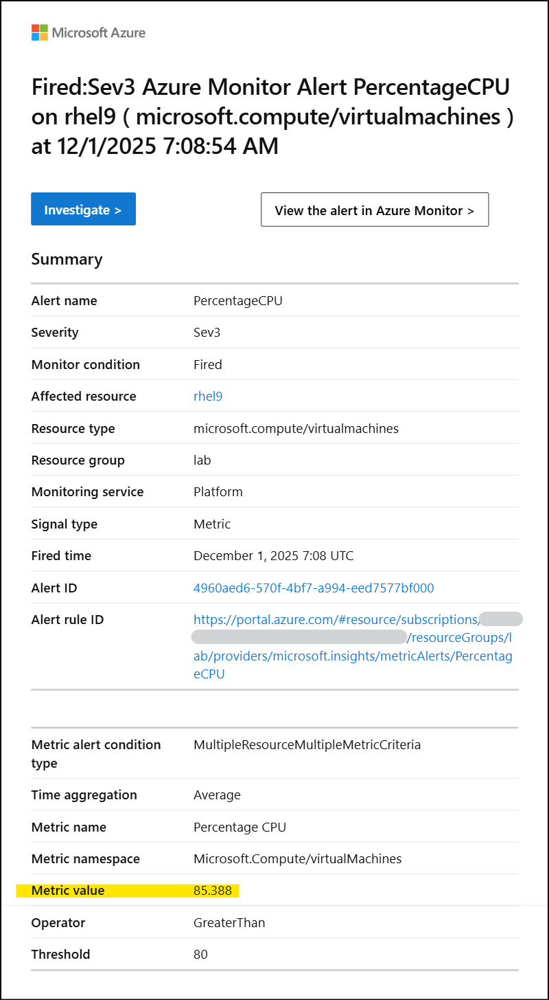
<!--<5-2-3_metricalert_percentagecpu_actiongrp.png>-->


メトリック アラート ルールの設定手順などは、公開情報やブログをご覧ください。
[Azure Monitor のメトリック警告ルールを作成する - Azure Monitor | Microsoft Learn](https://learn.microsoft.com/ja-jp/azure/azure-monitor/alerts/alerts-create-metric-alert-rule)
[Azure Monitor でアクション グループを作成および管理する - Azure Monitor | Microsoft Learn](https://learn.microsoft.com/ja-jp/azure/azure-monitor/alerts/action-groups)
[Azure Monitor のアラートに関するよくあるご質問 | Japan Azure Monitoring Support Blog](https://jpazmon-integ.github.io/blog/AzureMonitorEssential/MonitorAlertFAQ/#%E3%83%A1%E3%83%88%E3%83%AA%E3%83%83%E3%82%AF-%E3%82%A2%E3%83%A9%E3%83%BC%E3%83%88-%E3%83%AB%E3%83%BC%E3%83%AB)

<br><!-- 小項目の終わり <br> を追加する -->


#### 5.2.4 アクティビティ ログ アラート
アクティビティ ログ アラートは、Azure リソースの[アクティビティ ログ](https://learn.microsoft.com/ja-jp/azure/azure-monitor/platform/activity-log?tabs=log-analytics)を監視する機能です。
アクティビティ ログ アラートには、サービス正常性アラートやリソース正常性アラートも含まれます。


**1. 条件に一致するアクティビティ ログが記録されているかどうかを評価する**
監視する Azure リソースや[アクティビティ ログ](https://learn.microsoft.com/ja-jp/azure/azure-monitor/platform/activity-log?tabs=log-analytics)の条件を決めます。
例 : Azure VM の割り当て解除 (Deallocate Virtual Machine)
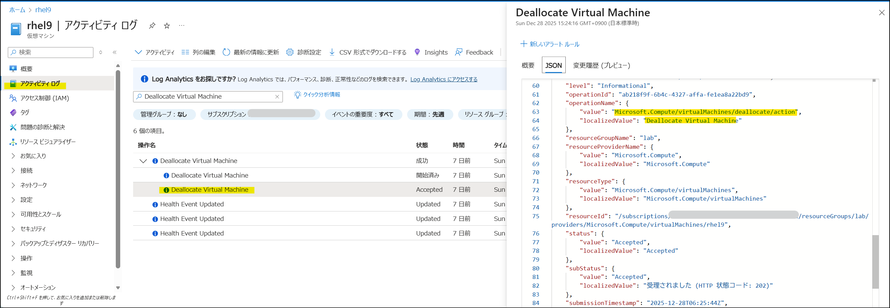
<!--<5-2-4_activitylog.png>-->


アクティビティ ログ アラートは、指定した条件に一致するアクティビティ ログ イベントが発生しているかどうかを評価します。監視対象の Azure リソースで条件に一致するアクティビティ ログが記録されると、アラートが発報します。
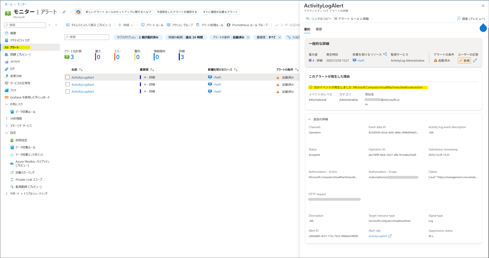
<!--<5-2-4_activitylogalert-portal.png>-->


**2. 通知や自動アクションを実行する**
アラートが発報した時に通知する方法や、実行するアクションは「アクション グループ」で設定します。
アラート ルールにアクション グループを関連付けると、メールや電話、SMS で通知したり、Webhook などの自動アクションを実行することが可能です。

※ 以下例は [Azure Monitor のアクション グループ](https://learn.microsoft.com/ja-jp/azure/azure-monitor/alerts/action-groups#create-an-action-group-in-the-azure-portal)で共通アラート スキーマを有効化した時に通知されたメールです。
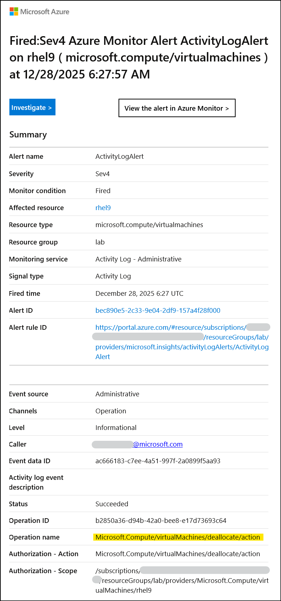


アクティビティ ログ アラートの設定手順などは、公開情報やブログをご覧ください。
[アクティビティ ログ、サービス正常性、またはリソース正常性の警告ルールを作成する - Azure Monitor | Microsoft Learn](https://learn.microsoft.com/ja-jp/azure/azure-monitor/alerts/alerts-create-activity-log-alert-rule?tabs=activity-log)
[Azure Monitor のアラートに関するよくあるご質問 | Japan Azure Monitoring Support Blog](https://jpazmon-integ.github.io/blog/AzureMonitorEssential/MonitorAlertFAQ/#%E3%83%AD%E3%82%B0-%E3%82%A2%E3%83%A9%E3%83%BC%E3%83%88-%E3%83%AB%E3%83%BC%E3%83%AB)

<br><!-- 小項目の終わり <br> を追加する -->


#### 5.2.5 サービス正常性アラートとリソース正常性アラート

##### サービス正常性アラート
サービス正常性アラートは、お客様環境にてご利用いただいている Azure サービスおよびリージョンを監視対象とし、Azure サービス自体の正常性を監視する機能です。Azure サービスの障害や計画メンテナンス、サービスの廃止などのイベントが発生した際に、メールや SMS 等の方法で通知することが可能です。
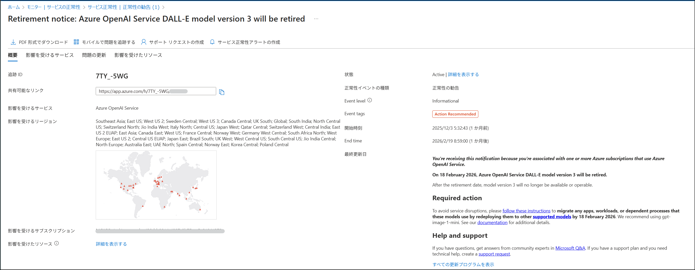


**1. 条件に一致するアクティビティ ログが記録されているかどうかを評価する**
[監視する Azure サービスやリージョン、イベントの種類を決めます](https://learn.microsoft.com/ja-jp/azure/service-health/alerts-activity-log-service-notifications-portal#alert-and-new-action-group-using-azure-portal)。サービス正常性アラートは、ご利用いただいているサービスのご利用いただいているリージョンを対象としたイベントが発生した場合にのみ通知が行われる仕組みのため、"サービス" や "リージョン" はすべて選択いただくことを推奨しております。
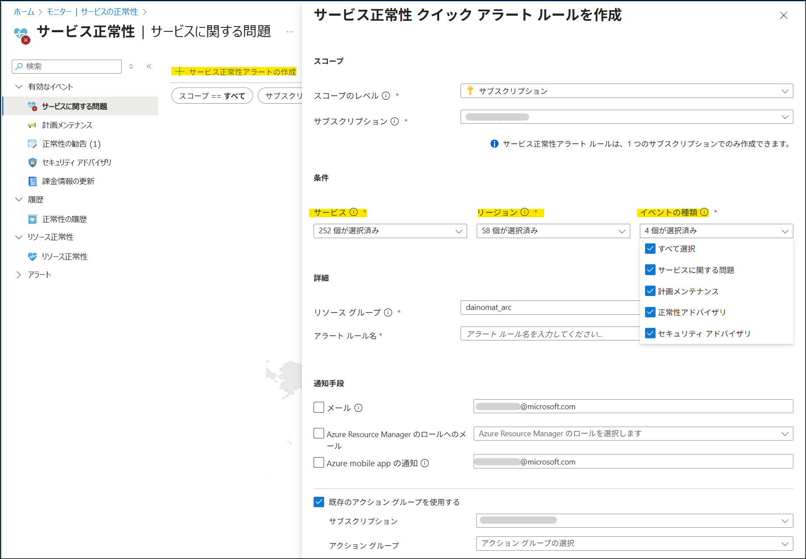

例. Azure OpenAI Service の正常性の勧告
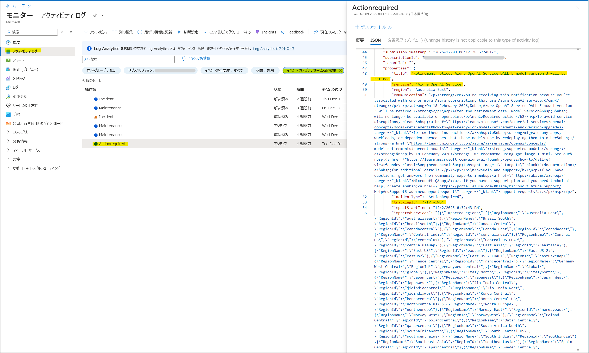


サービス正常性アラート（アクティビティ ログ アラート）は、指定した条件に一致するアクティビティ ログ イベントが発生しているかどうかを評価します。監視対象のサービスやリージョンに関するサービス正常性イベントのアクティビティ ログが記録されると、アラートが発報します。
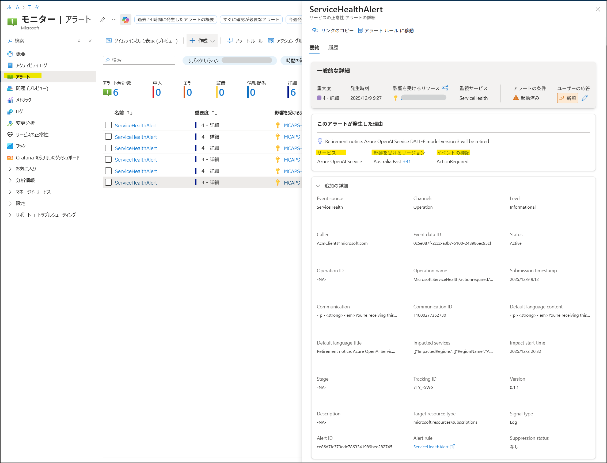


**2. 通知や自動アクションを実行する**
アラートが発報した時に通知する方法や、実行するアクションは「アクション グループ」で設定します。
アラート ルールにアクション グループを関連付けると、メールや電話、SMS で通知したり、Webhook などの自動アクションを実行することが可能です。


※ 以下例は [Azure Monitor のアクション グループ](https://learn.microsoft.com/ja-jp/azure/azure-monitor/alerts/action-groups#create-an-action-group-in-the-azure-portal) によって通知されたメールです。
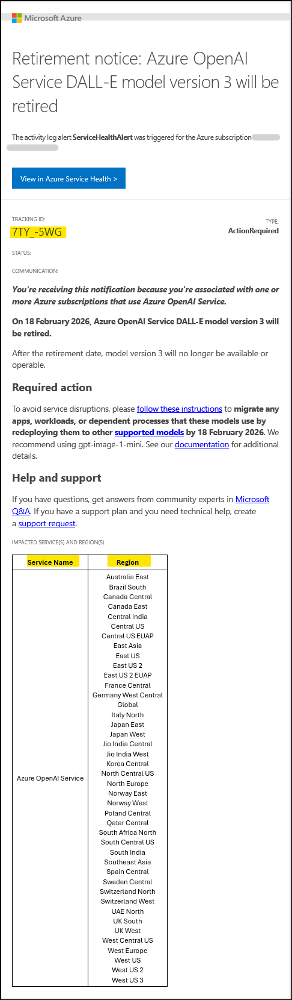
<!--<5-2-5_servicehealthalert-actiongrp.png>-->

サービス正常性アラートにつきましては、別途サポート ブログを作成しております。
サービス正常性アラートの設定手順などは、ブログや公開情報をご覧ください。
[サービス正常性アラートの設定手順と推奨設定について | Japan Azure Monitoring Support Blog](https://jpazmon-integ.github.io/blog/ame/HowToSetUpServiceHealthAlertsAndRecommendedSettings/)
[Azure ポータル で Azure サービス通知の Service Health アラートを作成する - Azure Service Health | Microsoft Learn](https://learn.microsoft.com/ja-jp/azure/service-health/alerts-activity-log-service-notifications-portal)

<br>

##### リソース正常性アラート
リソース正常性アラートは、Azure リソースの正常性を監視する機能です。
リソースの正常性に変化が生じた際に、メールや SMS 等の方法で通知することが可能です。サービス正常性アラートはAzure サービスおよびリージョンを監視対象としますが、リソース正常性アラートはお客様環境の固有のリソースを監視します。監視対象のスコープが異なるとご認識ください。

**1. 条件に一致するアクティビティ ログが記録されているかどうかを評価する**
[監視する Azure リソースや監視条件を決めます](https://learn.microsoft.com/ja-jp/azure/service-health/resource-health-alert-arm-template-guide)。
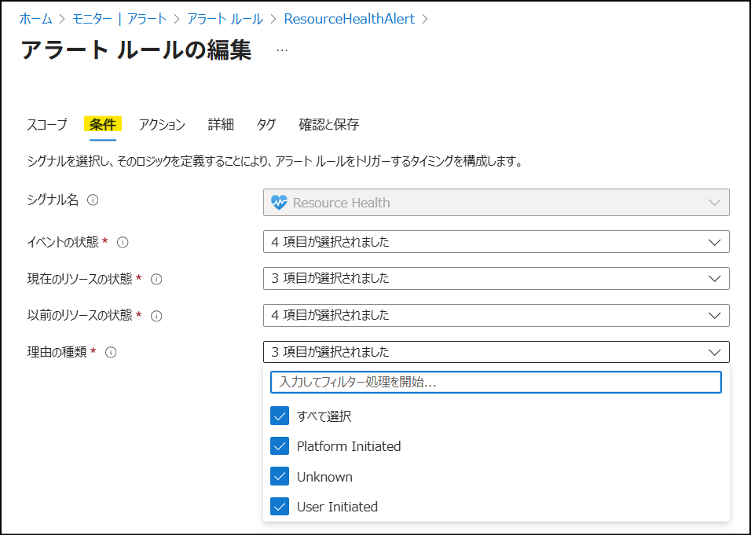


例 : Azure VM のリソース正常性（以下はリソース正常性が解消した際のアクティビティ ログの一例）
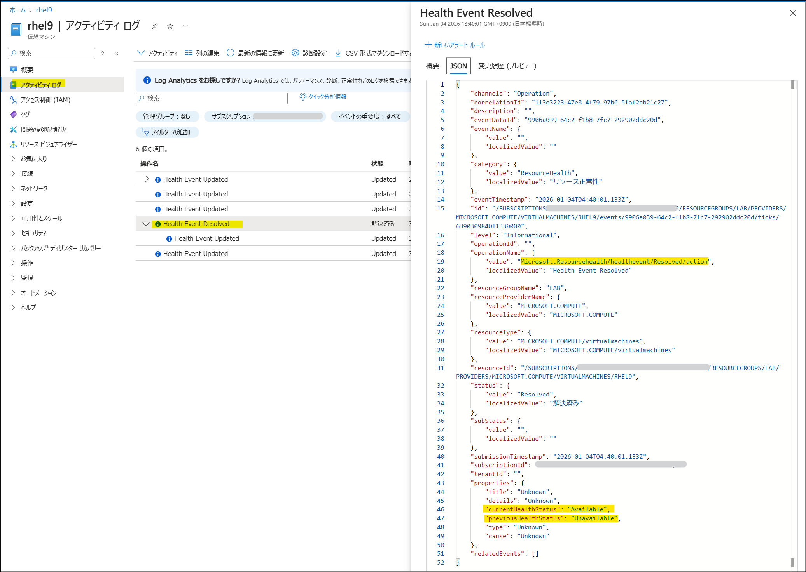


リソース正常性アラート（アクティビティ ログ アラート）は、指定した条件に一致するアクティビティ ログ イベントが発生しているかどうかを評価します。監視対象のサービスやリージョンに関するサービス正常性イベントのアクティビティ ログが記録されると、アラートが発報します。
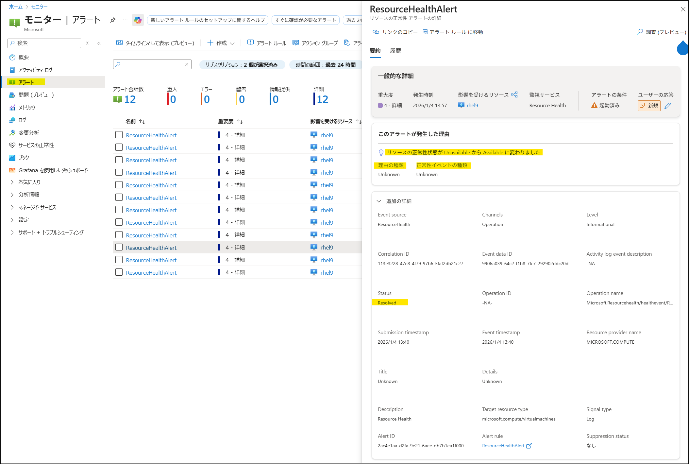


**2. 通知や自動アクションを実行する**
アラートが発報した時に通知する方法や、実行するアクションは「アクション グループ」で設定します。
アラート ルールにアクション グループを関連付けると、メールや電話、SMS で通知したり、Webhook などの自動アクションを実行することが可能です。

※ 以下例は [Azure Monitor のアクション グループ](https://learn.microsoft.com/ja-jp/azure/azure-monitor/alerts/action-groups#create-an-action-group-in-the-azure-portal)で共通アラート スキーマを有効化した時に通知されたメールです。
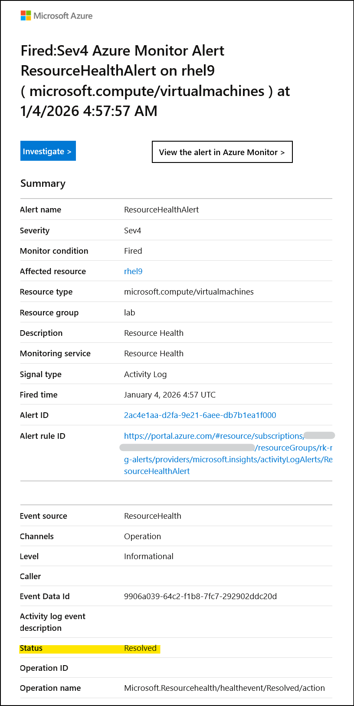


リソース正常性アラートにつきましては、別途サポート ブログを作成しております。
リソース正常性アラートの設定手順などは、ブログや公開情報をご覧ください。
[リソース正常性アラートに関するよくあるご質問](https://jpazmon-integ.github.io/blog/AzureMonitorEssential/ResourceHealthAlert/)
[Resource Health アラートを作成する方法 - Azure Service Health | Microsoft Learn](https://learn.microsoft.com/ja-jp/azure/service-health/resource-health-alert-arm-template-guide)

<br><!-- 小項目の終わり <br> を追加する -->


#### 5.2.6 Log Analytics ワークスペースのコスト分析
本文を入力

<br><!-- 小項目の終わり <br> を追加する -->


#### 5.2.7 ストレージ アカウントに収集したデータの可視化

5.1.6 の診断設定や 5.1.8 のデータ エクスポートにて、ストレージ アカウントに出力したログ ファイルに対してもクエリを実行することが可能です。本記事では次の 2 つのアプローチを紹介します。

1 つは Azure Data Explorer に BLOB（ログ ファイル）を取り込んで分析する方法、もう 1 つは Log Analytics ワークスペースで externaldata 演算子を使ってクエリを実行する方法です。それぞれの詳細な手順は、以下のセクションで解説します。
[Azure Data Explorer を使う方法](#azure-data-explorer)
[externaldata 演算子を使う方法](#`externaldata`-演算子を使う方法)

なお、頻繁にデータにクエリしたり、アラートを発報する必要がある場合は、診断設定ではストレージ アカウントではなく Log Analytics ワークスペースへ収集することをご検討ください。

<br>


##### Azure Data Explorer を使う方法 <a id="azure-data-explorer"></a>
Azure Data Explorer の概要については、以下の公開情報をご参照ください。
[Azure Data Explorerとは - Azure Data Explorer | Microsoft Learn](https://learn.microsoft.com/ja-jp/azure/data-explorer/data-explorer-overview)

なお、Azure Data Explorer リソースの利用にはコストが発生する点をご留意ください。
[Azure Data Explorer の取り込まれたデータのGBあたりのコスト - Azure Data Explorer | Microsoft Learn](https://learn.microsoft.com/ja-jp/azure/data-explorer/pricing-cost-drivers)

以下に Azure Data Explorer に BLOB を取り込んで、クエリする方法を簡単にご紹介します。

1. クラスターを作成します。作成手順は以下の公開情報をご参照ください。
[クイック スタート: Azure Data Explorer クラスターとデータベースを作成する - Azure Data Explorer | Microsoft Learn](https://learn.microsoft.com/ja-jp/azure/data-explorer/create-cluster-and-database?tabs=free#create-a-cluster)

2. データベースを作成します。作成手順は以下の公開情報をご参照ください。
[クイック スタート: Azure Data Explorer クラスターとデータベースを作成する - Azure Data Explorer | Microsoft Learn](https://learn.microsoft.com/ja-jp/azure/data-explorer/create-cluster-and-database?tabs=free#create-a-database)

3. Azure Data Explorer のクラスターに下記のリンクまたは下図の ADX の [概要] の [URI] からアクセスします。
[Azure Data Explorer](https://dataexplorer.azure.com/)
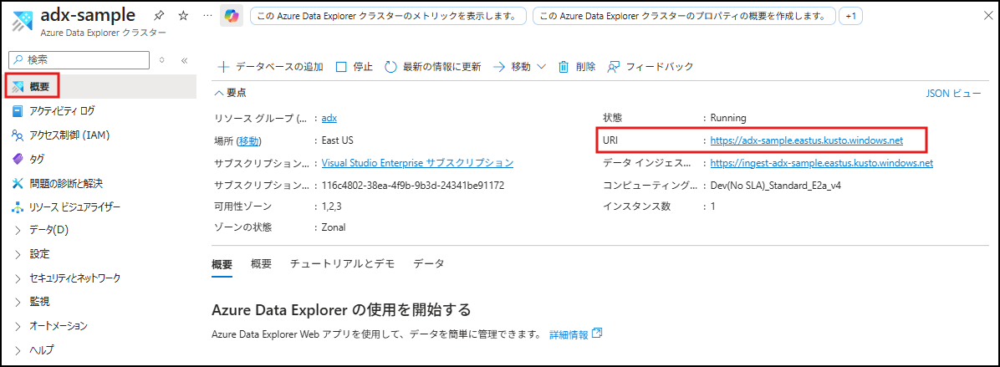

4. クエリを実行したいファイルがあるコンテナーからログを取りこみます。手順は以下の公開情報を参照ください。
[Azure Storage からデータを取得する - Azure Data Explorer | Microsoft Learn](https://learn.microsoft.com/ja-jp/azure/data-explorer/get-data-storage)

5. 4 で作成したテーブルに対して、下図のように Log Analytics ワークスペースと同じクエリでデータを参照できます。

    Azure Data Explorer のクエリ結果 ※テーブル名は手順 4 にて設定できます。
    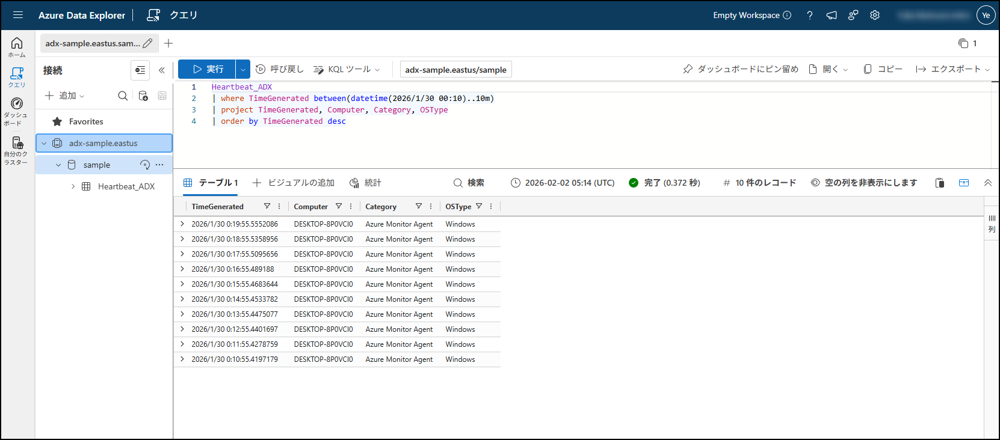

    Log Analytics ワークスペースのクエリ結果
    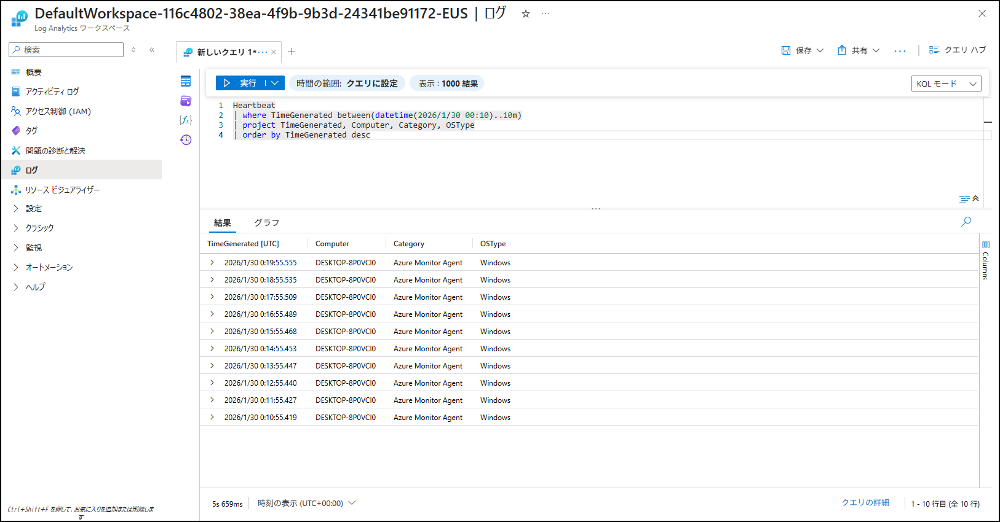


<br>

##### `externaldata` 演算子を使う方法
Log Analytics ワークスペースの [ログ] から `externaldata` 演算子にて、ストレージ アカウントの BLOB に対してクエリを実行できます。`externaldata` 演算子については、以下の公開情報をご参照ください。

[エクスターナルデータ演算子 - Kusto | Microsoft Learn](https://learn.microsoft.com/ja-jp/kusto/query/externaldata-operator?view=microsoft-fabric)


`externaldata` 演算子の使い方を簡単にご紹介します。

1. クエリを実行したい BLOB の SAS を取得します。SAS の取得方法については、以下の公開情報をご参照ください。
   [ストレージ コンテナーと BLOB の共有アクセス署名 (SAS) トークンを作成する - Foundry Tools | Microsoft Learn](https://learn.microsoft.com/ja-jp/azure/ai-services/translator/document-translation/how-to-guides/create-sas-tokens?source=recommendations&tabs=Containers#create-sas-tokens-in-the-azure-portal)

2. [BLOB SAS URL] をコピーします。
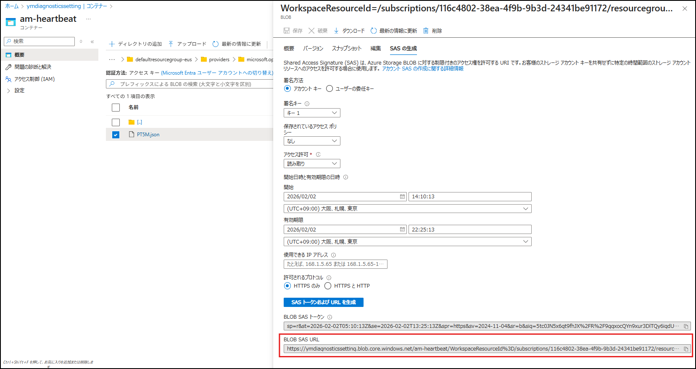

3. Log Analytics ワークスペースの [ログ] にて、2 でコピーした [BLOB SAS URL] を下記クエリの <BLOB SAS URL> に設定すると、BLOB のデータに対してクエリを実行できます。
    ```
    let Testdata = externaldata(TimeGenerated:datetime, Computer:string, Category:string, OSType:string)[
    h@"<BLOB SAS URL>"  
    ] with (format='multijson');  
    Testdata  
    ```
    
    externaldata 演算子の実行例
    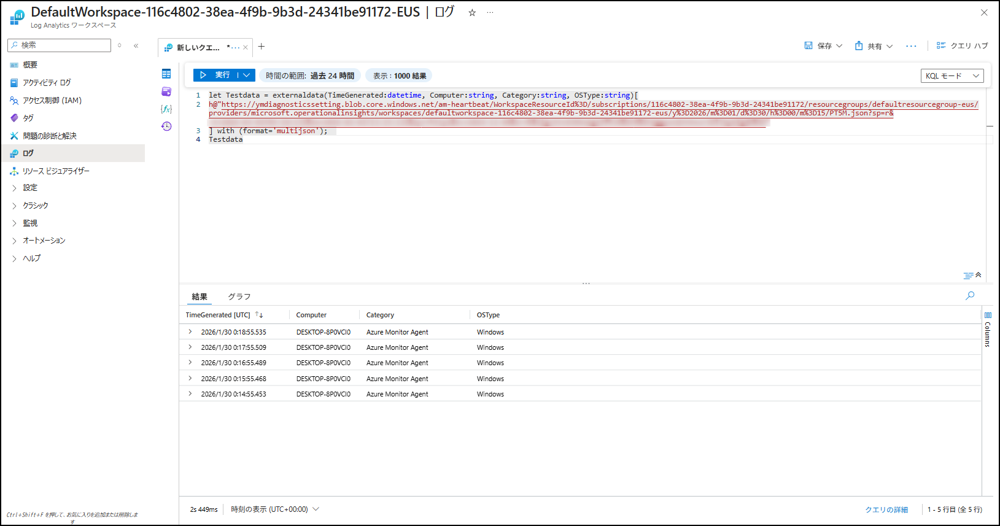
  
    なお、txt 形式で1行のレコードを dynamic として取り込むことで、全プロパティを取得することもできます。
    ```
    let Testdata = externaldata(RawData:dynamic) [
    h@"<BLOB SAS URL>"  
    ] with (format='txt');  
    Testdata  
    | evaluate bag_unpack(RawData)  
    ```
    
    externaldata 演算子ですべてのプロパティを取得する実行例
    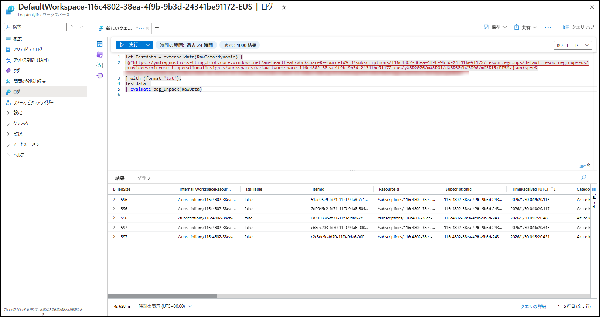


<br><!-- 小項目の終わり <br> を追加する -->


#### 5.2.8 Application Insights のクエリ

Application Insights に記録されたログは、Application Insights が Log Analytics ワークスペースと統合されているため、Application Insights と Log Analytics ワークスペースの両方から参照できます。

Application Insights は [監視] > [ログ] からクエリを実行します。
UI の構成や機能は同じであるため、クエリの実行方法については 5.2.1 を参照ください。ただし、ご留意いただく点が 2 つあります。


**i. Application Insights と Log Analytics ワークスペースで同じデータを参照する場合のテーブルとカラムが異なります。**

Application Insights と Log Analytics ワークスペースのテーブルとカラムの対応は以下の弊社公開情報でご案内しております。
[Application Insights のクラシック リソースをワークスペースベースのリソースに移行する - Azure Monitor - Azure Monitor | Microsoft Learn](https://learn.microsoft.com/ja-jp/previous-versions/azure/azure-monitor/app/convert-classic-resource#workspace-based-resource-changes)

テーブルは [テーブル構造] にてご案内しており、Application Insights では [レガシ テーブル名] が利用されています。Log Analytics ワークスペースでは、[新しいテーブル名] が利用されています。カラムは [テーブル スキーマ] にてご案内しております。

例えばリクエスト ログを取得するには、Application Insights では requests テーブルを参照し、Log Analytics ワークスペースでは AppRequests テーブルを参照します。

<br>

**ii. Log Analytics ワークスペースからは関連付いたすべての Application Insights のログが参照されます。**

Application Insights の [ログ] からクエリを実行すると、対象の Application Insights のログのみを参照します。
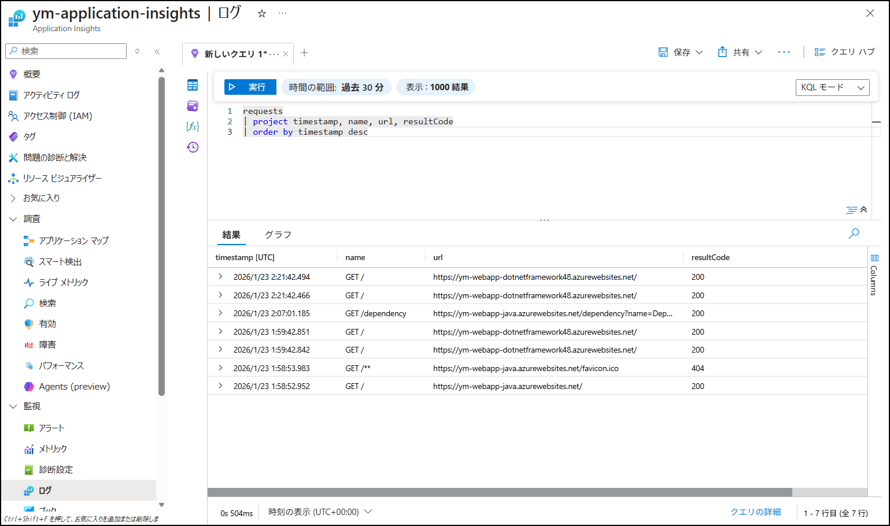
※ Application Insights の [ログ]


一方で、Log Analytics ワークスペースの [ログ] からクエリを実行すると、対象の Log Analytics ワークスペースに関連付いたすべての Application Insights のログを参照できます。下図の赤枠は上図の Application Insights とは別の Application Insights のログです。他の Application Insights からのログも同時に参照できることが分かります。
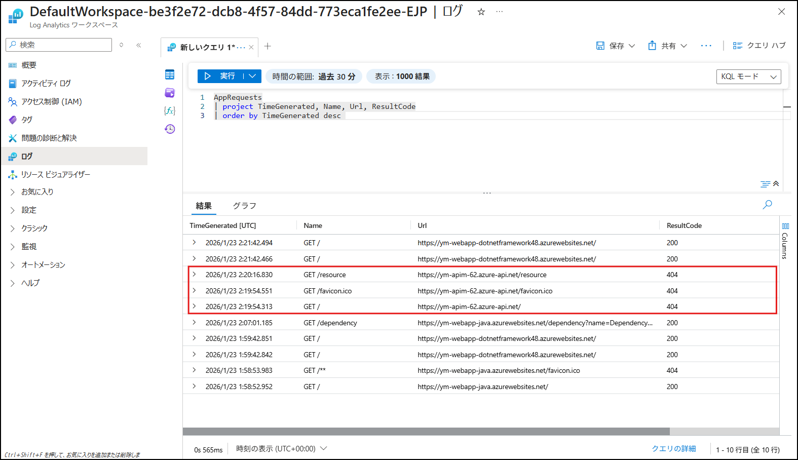
※ Log Analytics ワークスペースの [ログ]

<br><!-- 大項目の終わり <br> を追加する -->


<!-- 中項目 -->
### 5.3 可視化
本項目の説明

<br>

#### 5.3.1 ワークブック
本文を入力

<br><!-- 小項目の終わり <br> を追加する -->


#### 5.3.2 ダッシュボード
Log Analytics ワークスペース内のログに対して実行したクエリをグラフ等に可視化し、ダッシュボードにピン留めすることで、Log Analytics ワークスペースに保存されたデータをリアルタイムで確認できます。

**ログ クエリの可視化手順**
Log Analytics ワークスペースにてクエリを実行します。クエリの実行方法については 5.2.1 を参照してください。

```
<サンプル クエリ>
AzureMetrics
| where MetricName contains "Percentage CPU"
| summarize AggregatedValue = avg(Average) by bin(TimeGenerated, 1m), _ResourceId
| render timechart
```

[保存] > [ピン留め先 Azure ダッシュボード] をクリックします。
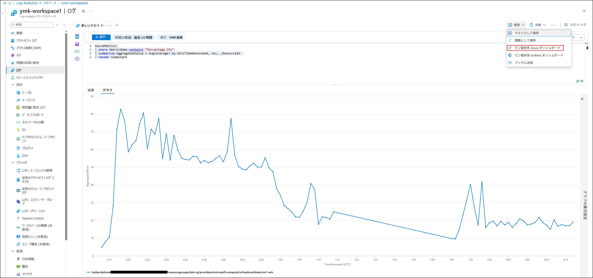

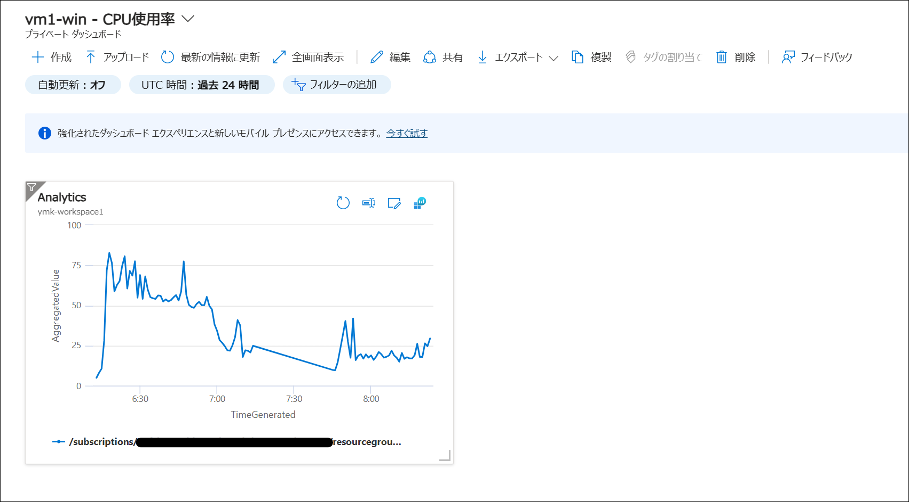

[Azure Monitor ログのデータを視覚化するダッシュボードを作成して共有する - Azure Monitor | Microsoft Learn](https://learn.microsoft.com/ja-jp/azure/azure-monitor/visualize/tutorial-logs-dashboards)


<br>

**■ Azure ワークブックとの違い**
ダッシュボードと類似機能の Azure ワークブックとの違いについて説明します。Azure ワークブックの詳細は 5.3.1 を参照してください。

<Azure ワークブック>
- テンプレートが充実している
- 分析内容のカスタマイズ性が高い (KQL 等にて分析内容を要件に併せて変更できます。) 
- 設定が比較的難しいため利用難度が高い

*Azure ワークブックは Azure ポータル 上の [監視/モニター] > [ブック] からアクセスできます。
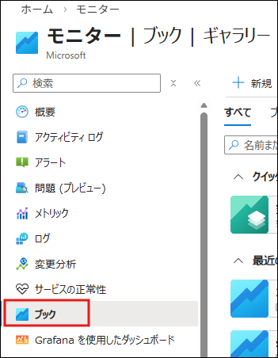


<ダッシュボード>
*   画面の表示方法 (レイアウト) を容易に変更できる
    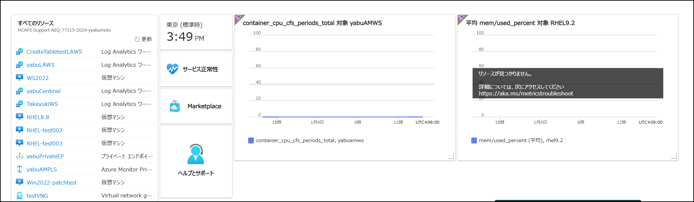
    [Azure ポータル でダッシュボードを作成する - Azure ポータル | Microsoft Learn](https://learn.microsoft.com/ja-jp/azure/azure-portal/azure-portal-dashboards#resize-or-rearrange-tiles)

*   Azure ワークブックをダッシュボードにピン留めすることができる
    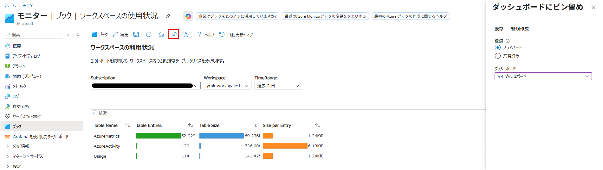

*   分析グラフ以外にもリソースやソリューション ページ等よく使う項目のリンクとしても活用できる
    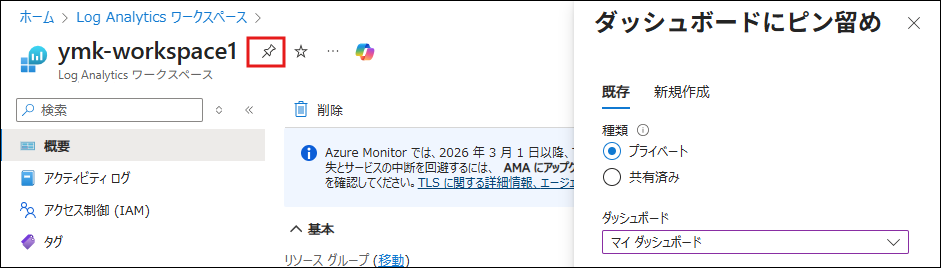
    [Azure ポータル でダッシュボードを作成する - Azure ポータル | Microsoft Learn](https://learn.microsoft.com/ja-jp/azure/azure-portal/azure-portal-dashboards#pin-content-from-a-resource-page)

*   ダッシュボードは Azure ポータル 上の ポータル メニュー (画面左上の三本線アイコン) > [ダッシュボード] からアクセスできます。
    

    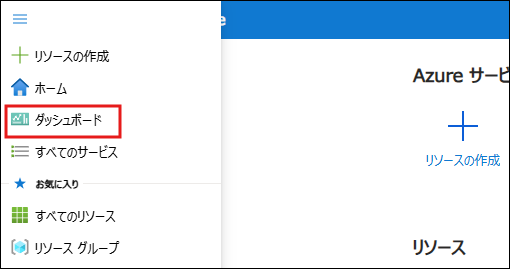


<br><!-- 小項目の終わり <br> を追加する -->


#### 5.3.3 メトリック エクスプローラー
メトリック エクスプローラーではメトリックを時系列のグラフとして可視化します。
各 Azure リソース (例: Azure VM) の画面左側メニューの [監視] > [メトリック] からメトリック エクスプローラーにアクセスします。
[Azure Monitor メトリックス エクスプローラーを使用してメトリックを分析する - Azure Monitor | Microsoft Learn](https://learn.microsoft.com/ja-jp/azure/azure-monitor/metrics/analyze-metrics)

以下は Azure VM のプラットフォーム メトリック (ホスト メトリック) と ゲスト メトリックの表示の例です。

ホスト メトリックとゲスト メトリックの違いに関しましては、下記のサポート ブログをご参照ください。
[Azure VM の監視について | Japan Azure Monitoring Support Blog](https://jpazmon-integ.github.io/blog/LogAnalytics/MonitorAzVM_logs/)

**プラットフォーム メトリック**
プラットフォーム メトリックは Azure VM を作成すると自動的に収集が開始され、[メトリック名前空間] を “仮想マシンホスト” に設定すると確認できます。
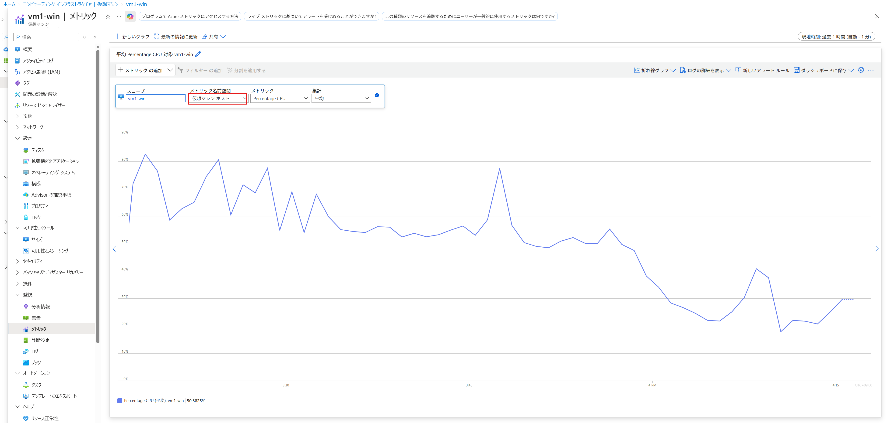
Azure VM のプラットフォーム メトリックのグラフを可視化した例

**ゲスト メトリック**
ゲスト メトリックは ゲスト OS にインストールした Azure Monitor エージェントにより収集され、[メトリック名前空間] を “仮想マシンのゲスト” に設定すると確認できます。
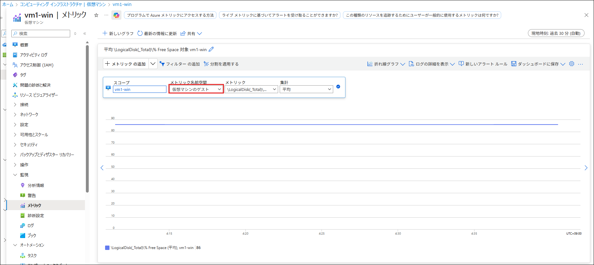
Azure VM のゲスト メトリックのグラフを可視化した例


<br><!-- 小項目の終わり <br> を追加する -->


#### 5.3.4 Application Insights の可視化

Application Insights に収集されたデータは、クエリを利用しなくても Azure ポータルの UI から可視化・分析できます。
もちろん Log Analytics ワークスペースへ記録した他のログと同様に、クエリを利用した分析やアラート ルールの構成も可能です。

はじめに Application Insights の [調査] タブ内の各メニューを簡単に紹介します。詳細な使い方は公開情報をご参照ください。

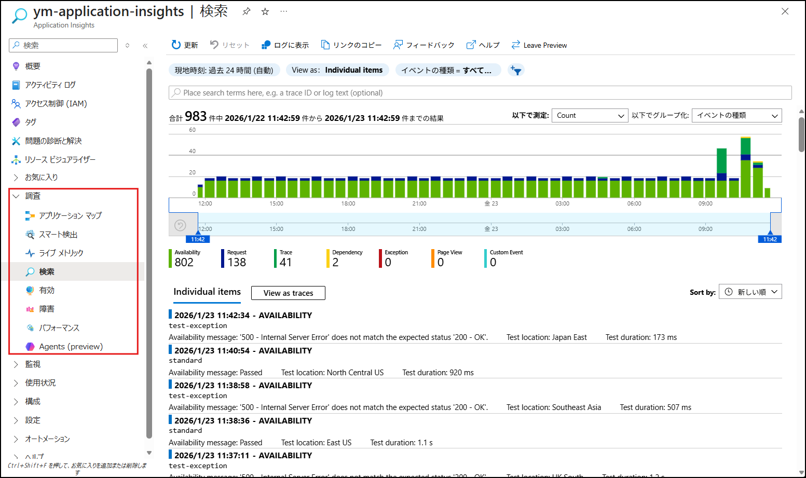


| ポータルの表示 | 内容 | 公開情報のリンク |
|--|--|--|
| アプリケーション マップ | アプリケーションの依存関係を可視化し、各コンポーネント間のパフォーマンスを表示します。 | [公開情報](https://learn.microsoft.com/ja-jp/azure/azure-monitor/app/app-map) |
| スマート検出 | 機械学習によってアプリケーションの異常を検知します。アラート ルールによる通知も設定できます。 | [公開情報](https://learn.microsoft.com/ja-jp/azure/azure-monitor/alerts/proactive-diagnostics) |
| ライブ メトリック | アプリケーションから収集されるテレメトリをリアルタイムに表示します。 |[公開情報](https://learn.microsoft.com/ja-jp/azure/azure-monitor/app/live-stream?tabs=otel) |
| 検索 | 記録されたテレメトリを検索します。後述の [失敗] と [パフォーマンス] では表示されない、ページ ビュー、例外、カスタム イベントなどの個々のテレメトリ項目を検索できます。 | [公開情報](https://learn.microsoft.com/ja-jp/azure/azure-monitor/app/failures-performance-transactions?tabs=search-view%2Cresults-list) |
| 有効 | 可用性テストを作成し、その結果を表示します。 | [公開情報](https://learn.microsoft.com/ja-jp/azure/azure-monitor/app/availability?tabs=standard) [ブログ](https://jpazmon-integ.github.io/blog/applicationInsights/privateAvailabilityTestSampleCode/) |
| 障害 | アプリケーションのエラー状況を分析します。 | [公開情報](https://learn.microsoft.com/ja-jp/azure/azure-monitor/app/failures-performance-transactions?tabs=failures-view%2Cresults-list) |
| パフォーマンス | 応答時間とリクエスト数からアプリケーションのパフォーマンスを分析します。 | [公開情報](https://learn.microsoft.com/ja-jp/azure/azure-monitor/app/failures-performance-transactions?tabs=performance-view%2Cresults-list) |
| Agents (Preview) | AI エージェントの監視データを可視化します。| [公開情報](https://learn.microsoft.com/ja-jp/azure/azure-monitor/app/agents-view) |


また、[使用状況] タブ内の各メニューではアプリケーションの利用状況 (ユーザー、セッションなど) を分析できます。

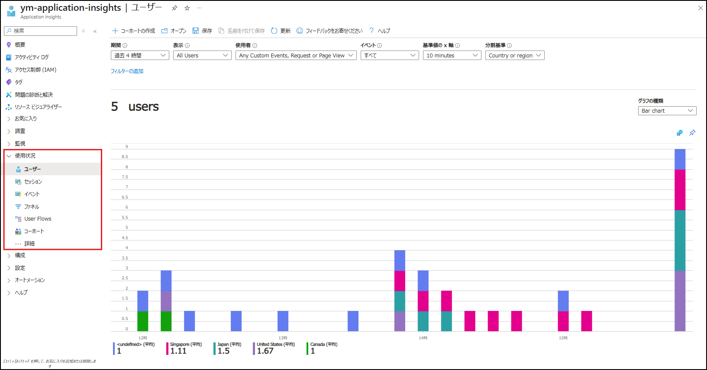

詳細は以下の弊社公開情報をご参照ください。
[Application Insights による利用状況分析 - Azure Monitor | Microsoft Learn](https://learn.microsoft.com/ja-jp/azure/azure-monitor/app/usage?tabs=users)


<br><!-- 小項目の終わり <br> を追加する -->
<br><!-- 大項目の終わり <br> を追加する -->


<!-- 大項目 -->
## 6. セキュリティ
本文を入力

<br>


### 6.1 データ保護
本文

<br><!-- 中項目の終わり <br> を追加する -->


### 6.2 データ削除
Log Analytics ワークスペースのログは、[保持期間](https://learn.microsoft.com/ja-jp/azure/azure-monitor/logs/data-retention-configure?tabs=portal-3%2Cportal-1%2Cportal-2)を超えると自動的に削除されます。
一方、保持期間を迎える前にログを削除する場合は、 [REST API](https://learn.microsoft.com/ja-jp/azure/azure-monitor/logs/personal-data-mgmt) を利用いただく必要がございます (Azure ポータルから手動でログを削除することはできません)。
ログを削除するための REST API は用途の異なる [2 種類](https://learn.microsoft.com/ja-jp/azure/azure-monitor/logs/personal-data-mgmt#export-delete-or-purge-personal-data)があり、目的に応じて使い分けていただく必要があります。


- [Purge API](https://learn.microsoft.com/ja-jp/rest/api/loganalytics/workspace-purge/purge?view=rest-loganalytics-2025-07-01&tabs=HTTP)
Log Analytics ワークスペースから対象データを完全に削除します。このため、[GDPR（EU 一般データ保護規則）](https://learn.microsoft.com/ja-jp/compliance/regulatory/gdpr)に準拠しています。

- [Delete Data API](https://learn.microsoft.com/ja-jp/azure/azure-monitor/logs/delete-log-data?tabs=api)
対象データを削除済みとしてマークします（物理的にデータを削除しません）。このため、[GDPR（EU 一般データ保護規則）](https://learn.microsoft.com/ja-jp/compliance/regulatory/gdpr)に準拠していません。

<br>

GDPR（EU 一般データ保護規則）の要件に準拠する必要がある場合は Purge API、それ以外の場合は基本的に Delete Data API をご利用ください。
REST API の実行手順や前提条件は、下記の公開情報やサポート ブログをご覧ください。

[Azure Monitor ログで個人データを管理する - Azure Monitor | Microsoft Learn](https://learn.microsoft.com/ja-jp/azure/azure-monitor/logs/personal-data-mgmt)
[Log Analytics ワークスペースのデータを削除する方法 | Japan Azure Monitoring Support Blog](https://jpazmon-integ.github.io/blog/LogAnalytics/LogAnalyticsWorkspacePurge/)

<br><!-- 中項目の終わり <br> を追加する -->


### 6.3 Azure Monitor Private Link Scope (AMPLS)
本文


<br><!-- 中項目の終わり <br> を追加する -->
<br><!-- 大項目の終わり <br> を追加する -->
