[更新履歴]
- 2026/07/30 : ブログ公開

<!-- more -->

## 目次
- [1. はじめに](#1-はじめに)
- [2. 用語集](#2-用語集)
  - [2.1 リタイア済み製品](#2-1-リタイア済み製品)
  - [2.2 リタイア予定の製品](#2-2-リタイア予定の製品)
- [3. 概念](#3-概念)
- [4. 監視シナリオ例](#4-監視シナリオ例)
  - [4.1 仮想マシンの死活監視](#4-1-仮想マシンの死活監視)
  - [4.2 仮想マシン ホストのパフォーマンス監視](#4-2-仮想マシン-ホストのパフォーマンス監視)
  - [4.3 Azure VM のゲスト OS のパフォーマンス監視](#4-3-Azure-VM-のゲスト-OS-のパフォーマンス監視)
  - [4.4 仮想マシン ログの監視](#4-4-仮想マシン-ログの監視)
  - [4.5 OS 内のサービス監視](#4-5-OS-内のサービス監視)
  - [4.6 アラート ルールの設定](#4-6-アラート-ルールの設定)
  - [4.7 サービス正常性](#4-7-サービス正常性)
- [5. 各機能とソリューション](#5-各機能とソリューション)
  - [5.1 データ収集](#5-1-データ収集)
    - [5.1.1 プラットフォーム メトリックとカスタム メトリック](#5-1-1-プラットフォーム-メトリックとカスタム-メトリック)
    - [5.1.2 アクティビティ ログ](#5-1-2-アクティビティ-ログ)
    - [5.1.3 仮想マシンからのログ収集](#5-1-3-仮想マシンからのログ収集)
    - [5.1.4 コンテナーからのログ収集](#5-1-4-コンテナーからのログ収集)
    - [5.1.5 アプリケーションからのログ収集](#5-1-5-アプリケーションからのログ収集)
    - [5.1.6 診断設定](#5-1-6-診断設定)
    - [5.1.7 データ エクスポート](#5-1-7-データ-エクスポート)
    - [5.1.8 ネットワークの監視](#5-1-8-ネットワークの監視)
  - [5.2 分析とレポート](#5-2-分析とレポート)
    - [5.2.1 Log Analytics ワークスペースのクエリ](#5-2-1-Log-Analytics-ワークスペースのクエリ)
    - [5.2.2 ログ アラート ルール](#5-2-2-ログ-アラート-ルール)
    - [5.2.3 メトリック アラート ルール](#5-2-3-メトリック-アラート-ルール)
    - [5.2.4 アクティビティ ログ アラート](#5-2-4-アクティビティ-ログ-アラート)
    - [5.2.5 サービス正常性アラートとリソース正常性アラート](#5-2-5-サービス正常性アラートとリソース正常性アラート)
    - [5.2.6 Log Analytics ワークスペースのコスト分析](#5-2-6-Log-Analytics-ワークスペースのコスト分析)
    - [5.2.7 ストレージ アカウントに収集したデータの可視化](#5-2-7-ストレージ-アカウントに収集したデータの可視化)
    - [5.2.8 Application Insights のクエリ](#5-2-8-Application-Insights-のクエリ)
  - [5.3 可視化](#5-3-可視化)
    - [5.3.1 ワークブック](#5-3-1-ワークブック)
    - [5.3.2 ダッシュボード](#5-3-2-ダッシュボード)
    - [5.3.3 メトリック エクスプローラー](#5-3-3-メトリック-エクスプローラー)
    - [5.3.4 Application Insights の可視化](#5-3-4-Application-Insights-の可視化)
- [6. セキュリティ](#6-セキュリティ)
  - [6.1 Azure Monitor Private Link Scope (AMPLS)](#6-1-Azure-Monitor-Private-Link-Scope-AMPLS)
  - [6.2 データ削除](#6-2-データ削除)
  

<br>


<!-- 1章始まり--大項目 -->
## 1. はじめに
この記事はこれから Azure Monitor 製品を利用する方や、追加の監視構成を検討している方への入り口となることを目的にしています。Azure Monitor 製品にはどのような機能があり、構成することで何を行うことができるのかを極力簡潔に記載しています。
また、製品を利用するうえで頻出の用語や、各ソリューションの概念図も載せています。
是非ご覧いただき、Azure Monitor 製品ご利用の一助となれば幸いです。

※本記事は Microsoft Learn の Azure Monitor に関する公開情報を代替するものではありません。各機能の詳細や、最新の情報は Microsoft Learn でご確認ください。
[Azure Monitor のドキュメント - Azure Monitor | Microsoft Learn](https://learn.microsoft.com/ja-jp/azure/azure-monitor/)

<br><!-- 1章終わり--大項目の終わり <br> を追加する -->


<!-- 2章始まり--大項目 -->
## 2. 用語集
本項では Azure Monitor 関連製品でよく使われる用語を記載しています。
本ブログ記事や公開情報を参照する際の参考となれば幸いです。

<br>

### Azure Monitor 全般に関連する用語
**Azure Monitor**
Azure リソースやアプリケーションの状態を収集、分析、可視化、通知するための監視サービス ソリューションの総称です。
メトリックやログの収集と可視化、アラートによる通知など、監視に必要な機能をまとめて提供しています。

<br>

### ログ収集機能に関連する用語
**Azure Monitor エージェント (AMA)**
OS にインストールされ、ログやメトリック情報を Azure 上に送信するためのエージェントです。
Windows 用と Linux 用があり、Azure VM の場合は拡張機能としてインストールされます。

**データ収集ルール (DCR)**
Azure Monitor エージェントが収集するデータの種類や送信先を定義するルールです。
Windows イベント ログ、Syslog、パフォーマンス カウンターなどの収集設定に利用します。

**データ収集エンドポイント (DCE)**
Azure Monitor エージェントやログ インジェスト API のデータ送信先となるエンドポイントです。
ネットワーク制御や Azure Monitor Private Link Scope (AMPLS) を利用する構成で必要になる場合があります。

**Azure Monitor Private Link Scope (AMPLS)**
Azure Monitor の各リソースへのアクセスをプライベート エンドポイント経由で実現するための構成リソースです。
Log Analytics ワークスペースや Application Insights、DCE などを AMPLS に関連付け、プライベート エンドポイント経由で通信できます。

**VM Insights**
Azure Monitor で仮想マシンのパフォーマンスや依存関係のデータを収集し監視するための機能です。
CPU、メモリ、ディスク、ネットワークなどの情報を収集し、複数 VM の状態をまとめて確認できます。
Azure Monitor エージェント (AMA) が使用されます。

**変更履歴とインベントリ**
OS 内のソフトウェア、サービス、ファイル、レジストリなどの変更情報を収集するための機能です。
サービスの起動状態や構成変更を Log Analytics ワークスペースで確認できます。
Change Tracking and Inventory とも呼ばれます。

**Application Insights**
アプリケーションの可用性、性能、利用状況、例外などを監視するための Azure Monitor の機能です。
アプリケーションから送信されるテレメトリを収集し、ログ検索や可視化に利用できます。

**可用性テスト**
Application Insights で外部からアプリケーションの応答を定期的に確認する機能です。
Web サイトや API の応答失敗や遅延を検知し、アラートに利用できます。

**Container Insights**
AKS などのコンテナー環境を監視するための Azure Monitor の機能です。
ノード、Pod、コンテナーのログやパフォーマンス情報を収集し、分析やアラートに利用できます。

**Managed Prometheus**
Prometheus 形式のメトリックを Azure Monitor ワークスペースに収集するマネージド サービスです。
AKS などのコンテナー環境で、メトリック中心の監視を行う場合に利用します。

**診断設定**
Azure リソースのプラットフォーム ログやメトリックを送信するための設定です。
Log Analytics ワークスペース、ストレージ アカウント、Event Hubs などを送信先にできます。

**Log Analytics ワークスペースのデータ エクスポート機能**
Log Analytics ワークスペースに収集されたログを継続的に外部へ送信する機能です。
ストレージ アカウントや Event Hubs にデータを保管、連携したい場合に利用します。

**Network Watcher**
Azure 仮想ネットワークの接続性や通信経路を診断、監視するためのサービスです。
接続モニターや仮想ネットワーク フロー ログなど、ネットワーク監視に関連する機能を提供します。

<br>

### データの種類・呼称に関連する用語
**Heartbeat ログ**
Azure Monitor エージェントが既定で Azure Monitor に定期的に送信するログです。
一定時間 Heartbeat ログが届かないことを条件に、仮想マシンの死活監視を構成できます。

**パフォーマンス カウンター**
Windows や Linux の OS が持つ CPU、メモリ、ディスクなどの性能値です。
仮想マシン ゲストのパフォーマンス監視で、Log Analytics ワークスペースに収集して分析できます。

**アクティビティ ログ**
Azure リソースに対する管理操作やサービス正常性イベントを記録するサブスクリプション単位のログです。
誰が、いつ、どのリソースに対して操作したかを確認できます。


**プラットフォーム メトリック**
Azure リソースから自動的に収集されるメトリックです。
仮想マシンではホスト側の CPU、ディスク、ネットワークなどの状態を追加エージェントなしで確認できます。

**カスタム メトリック**
利用者やエージェントが任意に送信するメトリックです。
仮想マシンのゲスト OS 内のパフォーマンス情報など、標準のプラットフォーム メトリックでは取得できない値を扱えます。

**ゲスト OS メトリック**
仮想マシンの OS 内部から収集する CPU、メモリ、ディスクなどのパフォーマンス情報です。
Azure Monitor エージェントとデータ収集ルールを使って収集します。
カスタム メトリックの一種に該当します。

**テレメトリ**
アプリケーションやサービスから送信される要求、例外、依存関係、トレースなどの監視データです。
Application Insights では、これらのデータをもとに性能分析や障害調査を行います。

<br>

### データの分析・可視化に関連する用語
**Log Analytics ワークスペース**
Azure Monitor ログを保存し、KQL で検索や分析を行うためのデータ ストアです。
仮想マシン、コンテナー、アプリケーションなど、複数のリソースのログを集約できます。

**ストレージ アカウント**
Azure のログやメトリックを長期保管するために利用できるストレージ サービスです。
診断設定やデータ エクスポートの送信先として指定できます。

**Kusto Query Language (KQL)**
Log Analytics ワークスペースや Application Insights に収集したログを検索、集計、分析するためのクエリ言語です。
ログ アラート ルールやワークブックで条件判定や可視化を行う際にも利用します。

**サービス正常性**
Azure サービス側の障害、メンテナンス、正常性勧告を確認するための機能です。
利用中のリージョンやサービスに影響するイベントを把握し、通知を構成できます。

**リソース正常性**
個々の Azure リソースが利用可能な状態かを確認するための機能です。
仮想マシンやストレージ アカウントなど、リソース単位の停止や性能低下の切り分けに利用します。

**メトリック エクスプローラー**
Azure Monitor メトリック (プラットフォーム メトリック、カスタム メトリック) をグラフで表示し、期間や集計方法を変えて確認するための画面です。
リソースの性能傾向を把握し、メトリック アラートの条件検討にも利用できます。

**ワークブック**
Azure Monitor のログ、メトリック、テキスト、パラメーターを組み合わせて可視化する機能です。
監視データの分析画面や運用レポートを柔軟に作成できます。

**ダッシュボード**
Azure ポータル上で複数のリソースや監視グラフをまとめて表示するための画面です。
メトリック、ログ クエリ、ワークブックなどを配置して運用状況を確認できます。

**コスト分析**
Log Analytics ワークスペースのデータ取り込み量や保存期間を確認し、利用料金を把握する作業です。
テーブルごとのデータ量や課金対象データを確認して、収集設定の見直しに役立てます。

<br>

### 監視・通知に関連する用語
**アラート ルール**
メトリック、ログ、アクティビティ ログなどの条件を評価し、異常を検知するための機能です。
条件に一致した場合は、アクション グループを通じて通知や自動処理を実行できます。

**ログ アラート ルール**
Log Analytics ワークスペースや Application Insights の KQL クエリ結果を条件にするアラートです。
ログ内の特定イベント、文字列、集計値などをもとに異常を検知できます。ログ検索アラート ルールとも呼ばれます。

**メトリック アラート ルール**
Azure Monitor メトリックの値を条件にするアラート ルールです。
CPU 使用率や応答時間など、数値データのしきい値監視に利用します。

**アクティビティ ログ アラート**
Azure サブスクリプション内の管理操作やサービス正常性イベントを条件にするアラート ルールです。
リソースの作成、削除、停止、障害通知などのイベントを検知・通知できます。

**アクション グループ**
アラート発生時の通知先や実行するアクションをまとめた設定です。
メール、SMS、Webhook、Azure Functions などへの通知や連携に利用します。

**オートスケール**
メトリックやスケジュールを条件に、リソースのインスタンス数を自動で増減する機能です。
負荷に応じて性能を確保しながら、不要なコストを抑えるために利用します。

<br><!-- 小項目の終わり <br> を追加する -->


## 2.1 リタイア済み製品
本項では、Azure Monitor で以前提供されていた機能やソリューションのうち 2026 年 7 月 1 日時点で廃止済みまたは非推奨となっているものを記載します。後継機能への移行や対応方法に関する情報をあわせてご紹介しますので、該当する製品を現在もご利用の場合にはご参照ください。なお、本情報は公開情報をもとに Azure Monitor に関連する主なリタイア済み製品を整理したものであり、すべての製品を網羅していることを保証するものではありません。

| リタイア日 | 対象機能 | 主な対応 |
|---|---|---|
| 2024 年 2 月 29 日 | Application Insights クラシック版 | ワークスペース版 Application Insights へ移行 |
| 2024 年 8 月 31 日 | Log Analytics エージェント (OMS Agent/MMA) | Azure Monitor エージェントへ移行 |
| 2024 年 8 月 31 日 | コンテナー監視ソリューション | Container Insights へ移行 |
| 2026 年 3 月 31 日 | Azure Diagnostics 拡張機能 (WAD/LAD) | Azure Monitor エージェントへ移行 |
| 2026 年 3 月 31 日 | Log Analytics beta API | Log Analytics クエリ API v1 へ移行 |

<br>
  
#### Application Insights のクラシック版
2024 年 2 月 29 日に廃止されました。クラシック版 Application Insights リソースは、テレメトリ データを独自のワークスペースに保存していました。ワークスペース版では、Log Analytics ワークスペースにテレメトリ データを保存するため、Log Analytics の機能が使えるようになりました。既にクラシック版リソースへのテレメトリ取り込みは停止されており、廃止後に Application Insights リソースを作成する場合は、必ず 1 つの Log Analytics ワークスペースが必要です。

[Application Insights のクラシック リソースをワークスペースベースのリソースに移行する - Azure Monitor | Microsoft Learn](https://learn.microsoft.com/ja-jp/previous-versions/azure/azure-monitor/app/convert-classic-resource)
[Application Insights クラシック版 (廃止) とワークスペース版との違いについて | Japan Azure Monitoring Support Blog](https://jpazmon-integ.github.io/blog/applicationInsights/aboutDifferentTypesOfAi/)
 
<br>
 
#### Log Analytics エージェント (OMS Agent, Microsoft Monitoring Agent/MMA)
2024 年 8 月 31 日に廃止されました。Log Analytics エージェント (OMS/MMA) は、仮想マシンやオンプレミス サーバーからログやパフォーマンス データを収集するために使用されていたレガシー エージェントです。
2026 年 3 月 2 日以降、順次データの収集が停止するため、後継の Azure Monitor エージェントへ移行が必要です。

[Log Analytics エージェントから Azure Monitor エージェントへの移行 - Azure Monitor | Microsoft Learn](https://learn.microsoft.com/ja-jp/azure/azure-monitor/agents/azure-monitor-agent-migration)
[Log Analytics エージェントから Azure Monitor エージェントへの移行に関するよくあるご質問集 | Japan Azure Monitoring Support Blog](https://jpazmon-integ.github.io/blog/LogAnalytics/HowToMigrateToAmaFromLA/)
[Migrate to Azure Monitor agent–based VM insights by 31 August 2024 について | Japan Azure Monitoring Support Blog](https://jpazmon-integ.github.io/blog/LogAnalytics/HowToMigrateToAmaBasedVMInsights/)

<br>

#### コンテナー監視ソリューション
2024 年 8 月 31 日より非推奨となりました。コンテナー監視ソリューションは、Log Analytics エージェントを利用して Docker や Windows コンテナーのホストとコンテナーを一元的に監視する機能です。後継は Container Insights です。
  
[コンテナー監視ソリューションからコンテナーの分析情報の使用への移行 - Azure Monitor | Microsoft Learn](https://learn.microsoft.com/ja-jp/azure/azure-monitor/containers/container-insights-transition-solution)

<br>
  
#### Azure Diagnostics 拡張機能 (WAD/LAD)
2026 年 3 月 31 日に廃止されました。Azure Diagnostics 拡張機能は、仮想マシンのログやメトリックをストレージ アカウントや Event Hubs に送信する機能です。引き続きログやメトリックを収集する場合は、後継の Azure Monitor エージェントへの移行が必要です。Azure Monitor エージェントは、基本的に Log Analytics ワークスペースへデータを送信します。ストレージ アカウントや Event Hubs にデータを送信する場合は、Log Analytics のデータ エクスポート機能を利用します。

[Azure Diagnostic Extensions (WAD/LAD) から Azure Monitor エージェントに移行する - Azure Monitor | Microsoft Learn](https://learn.microsoft.com/ja-jp/azure/azure-monitor/agents/azure-monitor-agent-migration-wad-lad)
[Retirement notice ： Migrate to Azure Monitor Agent before 31 March 2026 について | Japan Azure Monitoring Support Blog](https://jpazmon-integ.github.io/blog/LogAnalytics/HowToMigrateToAmaFromAzureDiagnostics/)
[Azure Monitor の Log Analytics ワークスペース データ エクスポート - Azure Monitor | Microsoft Learn](https://learn.microsoft.com/ja-jp/azure/azure-monitor/logs/logs-data-export?tabs=portal)

<br>

#### Log Analytics beta API
2026 年 3 月 31 日に廃止されました。Log Analytics beta API は、現在公開されている Log Analytics クエリ API のバージョン v1 より前から提供している beta 版の API です。beta API では Log Analytics のクエリが正常に実行できなくなるため、API 呼び出しのパスを beta から v1 に変更する必要があります。
 
[バッチクエリとベータクエリを使用して標準の Log Analytics クエリ API に移行する - Azure Monitor | Microsoft Learn](https://learn.microsoft.com/ja-jp/azure/azure-monitor/logs/api/migrate-batch-and-beta)


<br><!-- 小項目の終わり <br> を追加する -->


## 2.2 リタイア予定の製品
本項では、Azure Monitor で以前提供されていた機能やソリューションのうち 2026 年 7 月 1 日時点で今後廃止予定のものを記載しています。本情報は、公開情報をもとに Azure Monitor に関連する主なリタイア予定を整理したものであり、すべての変更を網羅していることを保証するものではありません。また、リタイア日や影響範囲は変更される場合があります。  
ご利用の環境がリタイアの影響を受ける場合、原則として[サービス正常性](https://learn.microsoft.com/ja-jp/azure/service-health/overview)を通じて対象サブスクリプションへ通知される予定です。実際の影響、対応期限、および必要な作業については、Azure ポータル > [モニター (監視)] > **[サービスの正常性] > [正常性に関する勧告]** に表示される通知を必ずご確認ください。

| リタイア予定日 | 対象機能 | 主な対応 |
|------|---|---|
| 2026 年 7 月 31 日 | Azure Monitor エージェントから Event Hubs／ストレージへ仮想マシンのクライアント データを直接送信する機能 （プレビュー） | Log Analytics のデータ エクスポートなど、代替の送信方法へ切り替え |
| 2026 年 9 月 14 日 | HTTP Data Collector API | DCR ベースのログ インジェスト API へ移行 |
| 2026 年 9 月 15 日 | アクティビティ ログのレガシー転送方式 | Azure Monitor の診断設定へ移行 |
| 2026 年 9 月 30 日 | Container Insights の ContainerLog テーブル | ContainerLogV2 テーブルへ移行し、クエリやアラート ルールを更新 |
| 2026 年 9 月 30 日 | Container Insights のレガシー認証 | マネージド ID 認証へ移行 |
| 2026 年 9 月 30 日 | Application Insights API キー | Microsoft Entra ID 認証へ移行 |
| 2026 年 9 月 30 日 | Application Insights URL Ping テスト（クラシック テスト） | 標準テストへ移行 |
| 2027 年 3 月 31 日 | Application Insights .NET Classic API SDK 2.x | Application Insights .NET SDK 3.x または Azure Monitor OpenTelemetry Distro へ移行 |
| 2028 年 3 月 31 日 | Log Analytics batch API | バッチ要求を個別の Logs Query API 呼び出しへ変更 |
| 2028 年 6 月 30 日 | VM Insights の Map 機能と Dependency Agent | インベントリや変更の追跡には Change Tracking とインベントリを検討し、依存関係の可視化については監視要件に応じた代替手段を検討 |

<br>

#### 仮想マシン クライアント データを Event Hubs とストレージ アカウントに送信する （プレビュー）
2026 年 7 月 31 日に廃止予定です。Azure Monitor エージェントで Event Hubs やストレージ アカウントに仮想マシンのデータを直接送信する機能をプレビューで提供していましたが、廃止までに代替の送信方法 (Log Analytics のデータ エクスポート機能など) への切り替えをご検討ください。

[Event Hubs と Storage にデータを送信する (プレビュー) - Azure Monitor | Microsoft Learn](https://learn.microsoft.com/ja-jp/azure/azure-monitor/vm/send-event-hubs-storage?tabs=windows%2Cwindows-1)
[【非推奨】AMA を使用して VM のデータを Event Hub とストレージ アカウントに送信する方法 | Japan Azure Monitoring Support Blog](https://jpazmon-integ.github.io/blog/LogAnalytics/HowToSendVMDataToEventHubAndStorage/)
[Azure Monitor の Log Analytics ワークスペース データ エクスポート - Azure Monitor | Microsoft Learn](https://learn.microsoft.com/ja-jp/azure/azure-monitor/logs/logs-data-export?tabs=portal)

<br>

#### HTTP Data Collector API
2026 年 9 月 14 日にサポート終了予定です。Data Collector API は、Log Analytics ワークスペースにカスタム ログ データを HTTP 経由で送信するためのレガシー API です。後継のログ インジェスト API では、データ収集ルール (DCR) による取り込み時の変換やフィルタリング、RBAC によるきめ細かなアクセス制御が可能です。サポート終了後も Data Collector API でログを送信できる予定ですが、ログの取り込みに関する処理能力や柔軟性、問題が発生した際のサポートの有無を考慮し、ログ インジェスト API への移行を推奨しております。移行にあたっては、ログ インジェスト API を呼び出すようにスクリプトやアプリケーションの改修が必要です。

[HTTP データ コレクター API からログ インジェスト API に移行する - Azure Monitor | Microsoft Learn](https://learn.microsoft.com/ja-jp/azure/azure-monitor/logs/custom-logs-migrate)
[Retirement notice ： Transition to DCR-based custom log ingestion by 14 September 2026 について | Japan Azure Monitoring Support Blog](https://jpazmon-integ.github.io/blog/LogAnalytics/HowToMigrateToLogIngestionAPI/)

<br>

#### アクティビティ ログのレガシー転送方式
2026 年 9 月 15 日に廃止予定です。アクティビティ ログを Log Analytics ワークスペース、Event Hubs、またはストレージ アカウントへ転送するレガシー方式をご利用されている場合は、廃止期日までに診断設定へ移行をお願いいたします。

[従来の収集方法 - Azure Monitor | Microsoft Learn](https://learn.microsoft.com/ja-jp/previous-versions/azure/azure-monitor/essentials/legacy-collection-methods?tabs=powershell)

<br>

#### ContainerLog テーブル
2026 年 9 月 30 日に廃止予定です。ContainerLog テーブルは、Container Insights で使用されてきた旧ログ スキーマです。後継の ContainerLogV2 テーブルでは、ログ エントリの構造化 (LogLevel や ContainerName 等のカラム追加) や複数行のログ取り込みがサポートされています。ContainerLogV2 は、ConfigMap やデータ収集ルール (DCR) で有効化することが可能です。また、既存のクエリやアラート ルールで ContainerLog テーブルを参照している場合は、ContainerLogV2 に合わせた書き換えも必要になります。

[Container Insights の ContainerLogV2 スキーマを構成する - Azure Monitor | Microsoft Learn](https://learn.microsoft.com/ja-jp/azure/azure-monitor/containers/container-insights-logs-schema)

<br>

#### Container Insights のレガシー認証
2026 年 9 月 30 日にサポート終了予定です。レガシー認証は、証明書と Log Analytics ワークスペース キーを使用して、監視エージェントから Azure Monitor へデータを送信する従来の認証方式です。現在は、より安全なマネージド ID 認証が既定の認証方式となっています。マネージド ID 認証では、クラスターのマネージド ID を使用して Azure Monitor へデータを送信するため、Log Analytics ワークスペース キーを管理する必要がありません。また、Syslog の収集や高スケール モードなど、マネージド ID 認証を前提とする新しい Container Insights の機能も利用できます。
レガシー認証を使用しているクラスターは、廃止日までにマネージド ID 認証へ移行する必要があります。Azure Resource Graph を使用して対象となる AKS クラスターおよび Azure Arc 対応 Kubernetes クラスターを確認できます。移行は Azure ポータルの移行機能に加え、Azure CLI を使用して実施できます。

[コンテナーの分析情報のレガシー認証 - Azure Monitor | Microsoft Learn](https://learn.microsoft.com/ja-jp/azure/azure-monitor/containers/container-insights-authentication?tabs=cli)

<br>

#### Application Insights API キー
2026 年 9 月 30 日に廃止予定です。
※ Application Insights API キーは、api.applicationinsights.io などで Application Insights のテレメトリ データをクエリする際に使用される API キーです。廃止後は API キーによるクエリができなくなるため、Microsoft Entra ID 認証への移行が必要です。
※ 当初案内されていた 2026 年 3 月 31 日から延長されています。

[Microsoft Entra ID を使用した Application Insights の認証 - Azure Monitor | Microsoft Learn](https://learn.microsoft.com/ja-jp/azure/azure-monitor/app/azure-ad-authentication)
[Application Insights API キーの廃止と移行について | Japan Azure Monitoring Support Blog](https://jpazmon-integ.github.io/blog/applicationInsights/api-key-deprecate-and-migration/)

<br>

#### Application Insights URL Ping テスト（クラシック テスト）
2026 年 9 月 30 日に廃止予定です。URL Ping テストは、クラシック テストとも呼ばれ、指定した URL に HTTP リクエストを送信してエンドポイントが応答するかどうかを検証する機能です。後継の標準テストでは、エンドポイントの応答に加え、SSL 証明書の有効性検証や有効期限のチェック、HTTP リクエスト メソッドの指定やカスタム ヘッダーの設定といった機能が追加されています。廃止後は既存の URL Ping テストがリソースから削除されるため、標準テストへの移行が必要です。

[Application Insights の可用性テスト - Azure Monitor | Microsoft Learn](https://learn.microsoft.com/ja-jp/azure/azure-monitor/app/availability)
[Application Insights 可用性テスト の クラシック と 標準 の違いについて | Japan Azure Monitoring Support Blog](https://jpazmon-integ.github.io/blog/applicationInsights/aboutAvailabilityTest/)
  
<br>

#### Application Insights .NET Classic API SDK 2.x
2027 年 3 月 31 日に廃止予定です。移行先は次のいずれかが挙げられます。
*   Application Insights .NET SDK 3.x
*   Azure Monitor OpenTelemetry Distro

新規アプリケーションでは、Azure Monitor OpenTelemetry Distro が推奨されています。既存の `TelemetryClient` や `Track*` 呼び出しへの互換性が必要な場合は、SDK 3.x への移行も検討いただけます。

[Application Insights を使用して .NET アプリケーションと Node.js アプリケーションを監視する (クラシック API 2.x) - Azure Monitor | Microsoft Learn](https://learn.microsoft.com/ja-jp/previous-versions/azure/azure-monitor/app/classic-api?tabs=dotnet%2Cnet)
[Application Insights クラシック API ソフトウェア開発キット (SDK) を Azure Monitor OpenTelemetry に移行する - Azure Monitor | Microsoft Learn](https://learn.microsoft.com/ja-jp/azure/azure-monitor/app/migrate-to-opentelemetry?tabs=dotnet)

<br>

#### Log Analytics batch API
2028 年 3 月 31 日に廃止予定です。現在公開されている Log Analytics クエリ API（バージョン v1）に含まれる機能の一つで、複数のクエリをまとめて一回の API 呼び出しで送信します。

廃止後は batch 操作を利用できなくなるため、バッチ要求の `requests` 配列に含まれている各クエリを分割し、Logs クエリ API の `query` 操作を個別に実行するよう、アプリケーションやスクリプトを変更する必要があります。Azure SDK のバッチ クエリ メソッドを使用している場合も、個別のクエリ メソッドへ変更する必要があります。  

[バッチクエリとベータクエリを使用して標準の Log Analytics クエリ API に移行する - Azure Monitor | Microsoft Learn](https://learn.microsoft.com/ja-jp/azure/azure-monitor/logs/api/migrate-batch-and-beta)

<br>

#### VM Insights の Map 機能と Dependency Agent
2028 年 6 月 30 日に廃止予定です。VM Insights の Map 機能は、仮想マシン上で動作するプロセスや、TCP 接続によるサーバーや外部サービスへの依存関係をマップとして可視化する機能です。この機能では、Azure Monitor エージェントに加えて Dependency Agent も使用します。

廃止後は、Azure ポータルの VM Insights の Map 機能、マップ データを利用するブック、Dependency Agent によるデータ送信、および Service Map API などが利用できなくなります。

仮想マシン内のソフトウェア、Windows サービス、Linux デーモン、ファイル、Windows レジストリなどのインベントリや変更を把握する用途については、Azure Monitor エージェントを使用する Change Tracking とインベントリが一部の代替となる場合があります。

ただし、Change Tracking とインベントリは、プロセス間の依存関係、TCP 接続、サーバーや外部サービスとの通信関係をマップとして可視化する機能を提供しないため、VM Insights の Map 機能を完全に置き換えるものではありません。これらの依存関係データを引き続き収集する必要がある場合は、現在の利用状況と監視要件を確認し、必要に応じて別の代替手段をご検討ください。
  
[VM Insights Map と Dependency Agent の提供終了に関するガイダンス - Azure Monitor | Microsoft Learn](https://learn.microsoft.com/ja-jp/azure/azure-monitor/vm/vminsights-maps-retirement)
[Azure Monitor エージェントを使用した Azure Change Tracking とインベントリの概要 | Microsoft Learn](https://learn.microsoft.com/ja-jp/azure/azure-change-tracking-inventory/overview-monitoring-agent)


<br><!-- 小項目の終わり <br> を追加する -->
<br><!-- 2章終わり--大項目の終わり <br> を追加する -->


<!-- 大項目 -->
## 3. 概念
ここでは Azure Monitor のソリューション間の関係とデータの流れの概念図を記載します。
図の矢印はデータの流れを示します。
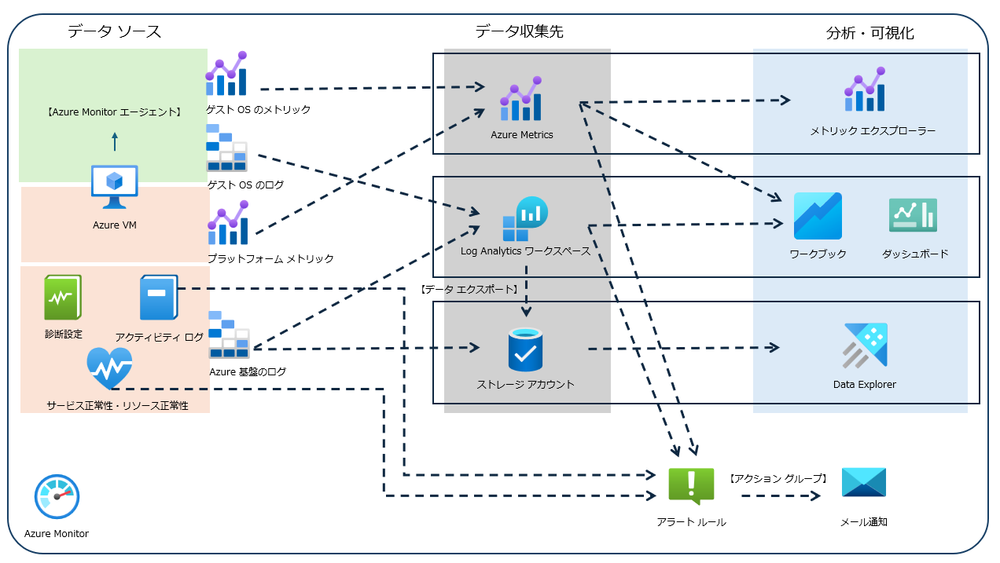

<br><!-- 小項目の終わり <br> を追加する -->
<br><!-- 2章終わり--大項目の終わり <br> を追加する -->

<!-- 大項目 -->
## 4. 監視シナリオ例
まずは仮想マシンを例に、Azure Monitor での監視方法について記載します。
どのようなデータを利用し、どのような監視を実現することができるか、具体的な例も示しながらご紹介します。
この章を読むことで、Azure Monitor の基本的な監視構成を知ることができます。

<br>

### 4.1 仮想マシンの死活監視
本項では Azure VM が期待どおり稼働しているかを確認し、VM の停止や OS からの応答を検知する死活監視について記載します。
Azure Monitor における Azure VM の死活監視では、Azure 基盤側とゲスト OS 側の 2 つのレイヤーがあり、レイヤーごとに監視対象や方法が異なります。

**■ Azure 基盤側の監視**
VM の可用性メトリックやリソース正常性の監視を死活監視に利用する方法です。
VM の可用性メトリック (VM Availability Metric) は Azure 基盤側のメトリック情報であり、VM の利用状況を示します。
メトリックの値が 1 の場合は VM が実行中で利用可能な状態です。VM のシャットダウンや再起動を行った場合は、値が 0 となります。

※ VM の可用性メトリックを表示した例
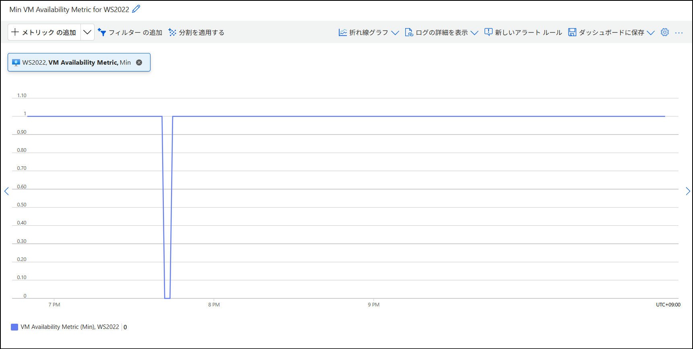

Azure 基盤側のメトリックは、可用性だけでなく CPU 使用率等のパフォーマンス データについても確認することが可能ですが、この点については次項でご紹介します。

リソース正常性は Azure 基盤側から対象のリソースに何らかの問題が起きている場合に知らせる機能であり、この情報をもとに監視を行います。リソース正常性については、本記事 [5.2.5 サービス正常性アラートとリソース正常性アラート](#5-2-5-サービス正常性アラートとリソース正常性アラート) をご参照ください。

<br>

**■ Azure VM の OS 側の監視**
Azure VM のゲスト OS 内で動作するエージェントが収集する、Heartbeat ログや OS のメトリックを監視する方法です。
Heartbeat ログの収集状況から、一定時間ログが届かない場合にはエージェントの停止やネットワークの異常等の問題が発生している可能性を検知することが可能です。

ワークブックを利用すると、複数の VM の稼働状態や Heartbeat ログの有無を一覧で視覚化することもできます。
ワークブックについては、本記事 [5.3 可視化](#5-3-可視化) をご参照ください。

※ Heartbeat ログの収集状況をワークブックで可視化した例
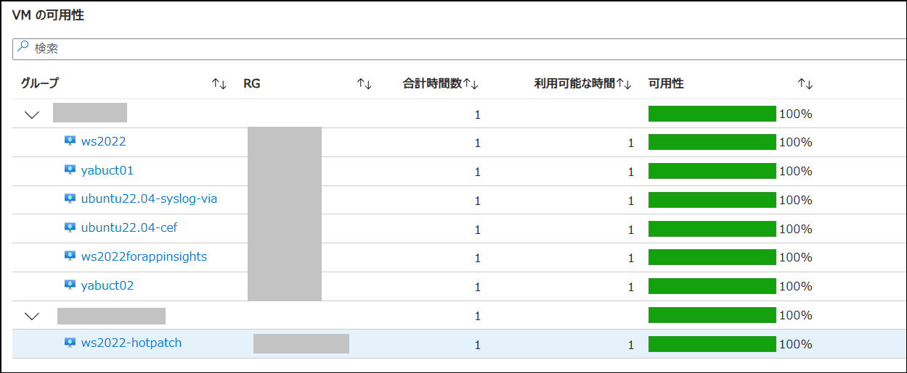


また、Azure 基盤側と OS 側を問わず、前述したシグナルはアラート ルールの条件として設定し、メール通知することもできます。
アラート ルールについては、本記事 [4.6 アラート ルールの設定](#4-6-アラート-ルールの設定) をご参照ください。


これらの監視方法を組み合わせることで、より信頼性の高い死活監視を構成することが可能です。
Azure VM の死活監視の詳細については、以下のブログをご参照ください。
[Azure VM における死活監視の考え方 | Japan Azure Monitoring Support Blog](https://jpazmon-integ.github.io/blog/LogAnalytics/MonitorVM02/)


<br><!-- 小項目の終わり <br> を追加する -->


### 4.2 仮想マシン ホストのパフォーマンス監視
前項 [4.1 仮想マシンの死活監視](#4-1-仮想マシンの死活監視) で紹介した Azure 基盤側のメトリック情報を利用して、Azure VM のパフォーマンス監視を行うことができます。

※ Azure VM の CPU とメモリの使用率を表示した例
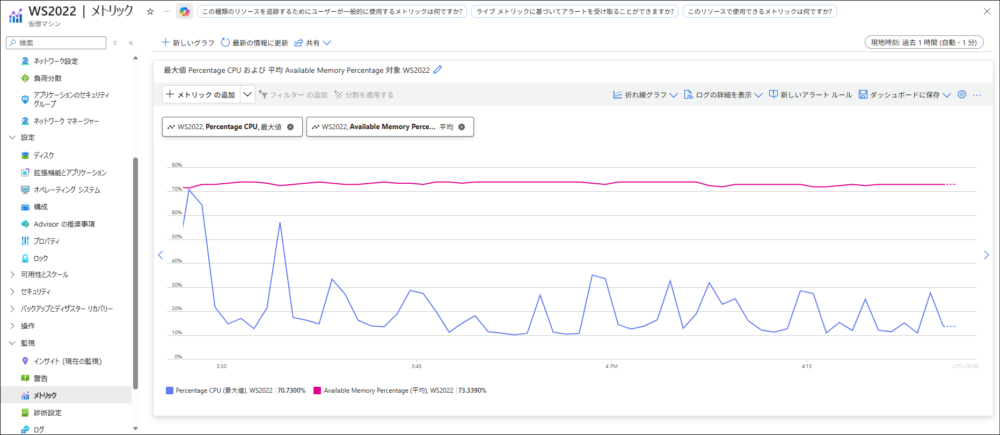

Azure 基盤側で収集されるメトリックはプラットフォーム メトリックと呼ばれます。
プラットフォーム メトリックは Azure 基盤上のハイパーバイザー層から自動的に収集されるため、Azure VM の作成後に追加構成を行うことなく利用できる点が大きな特徴です。
このため、お客様の要件によりゲスト OS にエージェントをインストールできない場合にも有用です。

Azure VM でサポートされているプラットフォーム メトリックの一覧は以下の公開情報をご参照ください。
[サポートされているメトリック - Microsoft.Compute/virtualMachines - Azure Monitor | Microsoft Learn](https://learn.microsoft.com/ja-jp/azure/azure-monitor/reference/supported-metrics/microsoft-compute-virtualmachines-metrics)

プラットフォーム メトリックは Azure 基盤側から見える CPU、メモリ、ディスク I/O、ネットワークなどの監視に向いています。
例えば Windows OS 内の C ドライブの空き容量を監視したい、といった場合には、各ドライブの空き容量を示すメトリックがプラットフォーム メトリックとして提供されていないため、このシナリオではプラットフォーム メトリックを利用した監視は適しません。

サポートされていないメトリックやより詳細なゲスト OS の情報を監視したい場合には、ゲスト OS 内のエージェントが収集するゲスト OS メトリックやログを利用します。
プラットフォーム メトリックは Azure ポータルの監視画面での確認や、本記事 [4.6 アラート ルールの設定](#4-6-アラート-ルールの設定) で紹介するアラート ルールを設定することで、特定の条件に一致した場合に利用者へ通知を行うこともできます。

<br><!-- 小項目の終わり <br> を追加する -->


### 4.3 Azure VM のゲスト OS のパフォーマンス監視
前項 [4.2 仮想マシン ホストのパフォーマンス監視](#4-2-仮想マシン-ホストのパフォーマンス監視) で紹介した Azure VM のプラットフォーム メトリックでは取得できないゲスト OS 内部の詳細なパフォーマンス情報を監視したい場合は、エージェントが収集するゲスト OS のパフォーマンス情報 (ゲスト OS メトリック) を利用して監視を行います。

Azure Monitor エージェント (AMA) と呼ばれるエージェントをゲスト OS にインストールする必要がありますが、Windows の Perfmon で確認できるパフォーマンス カウンターや、Linux OS 内の特定のパフォーマンス カウンターのデータを収集することができます。

Azure VM のプラットフォーム メトリックの場合と同様に、収集した情報は Azure ポータルの監視画面での確認や、アラート ルールによる監視と通知に利用できます。

※ Windows のパフォーマンス カウンター情報を AMA により収集した例
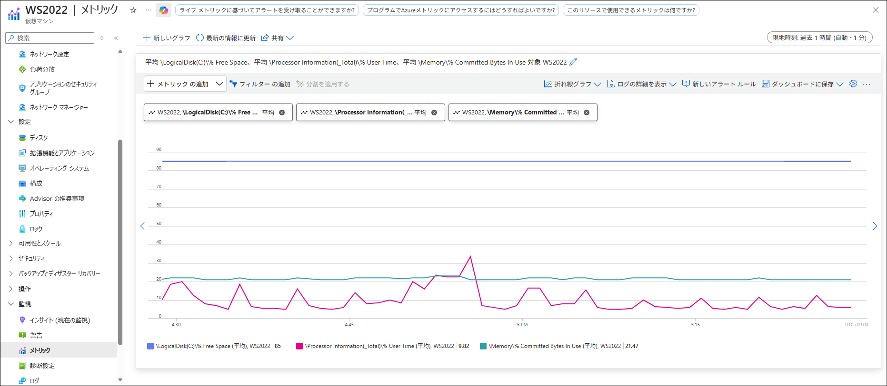

<br>

**■ プラットフォーム メトリックとゲスト OS メトリックの違い**
|  | プラットフォーム メトリック | ゲスト OS メトリック |
|------|----------------------------|-------------------|
| **データ ソース** | Azure ハイパーバイザー層で収集される Azure 基盤側のメトリック | ゲスト OS 内のパフォーマンス カウンターやパフォーマンス データ |
| **収集方法** | Azure VM の作成後に自動で収集 | OS にインストールしたエージェントが収集 |
| **ゲスト OS へのエージェント インストール** | 不要 | 必要 |
| **向いている監視要件** | VM 全体の CPU、メモリ、ディスク I/O、ネットワークなどを追加構成なしで監視したい場合 | OS 内のドライブ空き容量、プロセス、アプリケーション固有のパフォーマンス カウンターなどを監視したい場合 |

<br>

例えば以下のようなシナリオではゲスト OS のパフォーマンス監視が有用です。
Azure 基盤側から VM 全体の状態をプラットフォーム メトリックで確認し、さらに OS 内部の詳細な状態や追加で必要な情報をゲスト OS メトリックを利用する、というように監視要件に応じて使い分けたり組み合わせて利用します。

| シナリオ | 利用するデータ例 |  |
|------|------------------|--------|
| Windows OS 内の C ドライブの空き容量を監視したい | `\LogicalDisk(C:)\% Free Space` など | プラットフォーム メトリックにはドライブ単位の空き容量を示すメトリックがないため、OS 内のパフォーマンス カウンターを収集します。 |
| SQL Server の詳細な性能を監視したい | `\SQLServer:Buffer Manager\Checkpoint pages/sec`、`\SQLServer:SQL Statistics\Batch Requests/sec` など | SQL Server が公開する Perfmon カウンターを収集することで、アプリケーションやミドルウェア固有の性能値を監視できます。 |
| 特定プロセスの CPU やメモリ使用量を監視したい | `\Process(*)\% Processor Time`、`\Process(*)\Working Set` など | VM 全体ではなく、OS 内のプロセス単位で負荷を確認したい場合に利用します。 |

※ SQL Server のパフォーマンス カウンター情報を AMA により収集した例
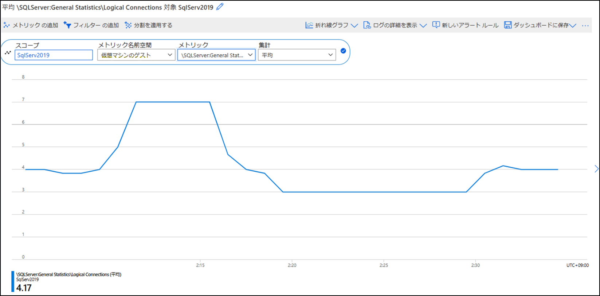


<br><!-- 小項目の終わり <br> を追加する -->


### 4.4 仮想マシン ログの監視
前項 [4.3 Azure VM のゲスト OS のパフォーマンス監視](#4-3-Azure-VM-のゲスト-OS-のパフォーマンス監視) で触れた Azure Monitor エージェント (AMA) を利用することで、ゲスト OS のログ情報を収集し、監視することも可能です。

※ Windows OS の C ドライブの空き容量の情報をログとして収集した例
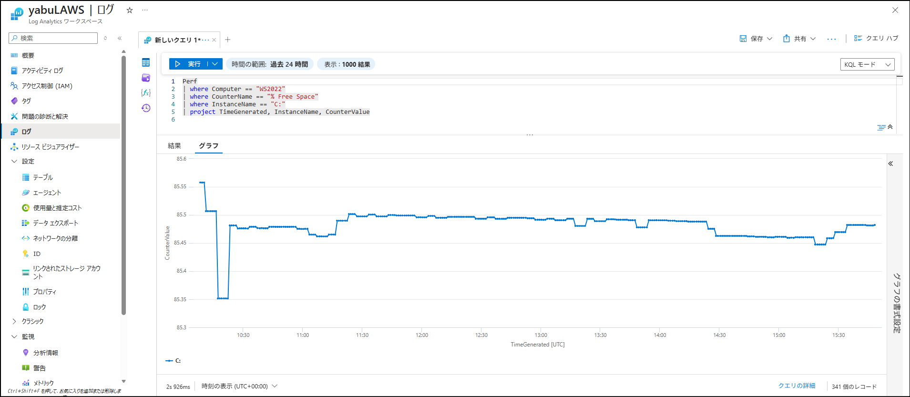


AMA によりゲスト OS の各情報をログとして Log Analytics ワークスペースと呼ばれる Azure 上のデータ ストアに収集し、クエリ言語である KQL により検索します。また、ログ アラート ルールでクエリ検索結果をもとにアラートを構成し、監視を行うことができます。ログ アラート ルールについては、本記事 [5.2.2 ログ アラート ルール](#5-2-2-ログ-アラート-ルール)をご参照ください。

ゲスト OS のログを収集することで、例えば以下のようなシナリオに対応できます。
- Windows イベント ログに特定のイベント ID のログが出力された場合に通知する
- Linux の Syslog に特定の Facility のログが出力された場合に通知する
- アプリケーションが出力するテキスト ログに `ERROR` や `Failed` などの任意の文字列が出力された場合に通知する
- 同じエラー ログが一定時間内に複数回出力された場合のみ通知する
- 複数の VM から収集したログをクエリにより検索し同じエラーが複数台で発生していないか確認する
- パフォーマンス情報をログとして収集し複数の VM をまとめて監視する

このように、ログ監視は KQL により条件を記載することで様々な要件に対応することができます。
AMA により収集可能なログ種については、本記事 [5.1.3 仮想マシンからのログ収集](#5-1-3-仮想マシンからのログ収集)をご参照ください。


<br><!-- 小項目の終わり <br> を追加する -->


### 4.5 OS 内のサービス監視
変更履歴とインベントリ機能を有効化することで、OS 内のサービス状態を監視することができます。

※ Windows Update サービスが停止状態であることを示すログを抽出した例
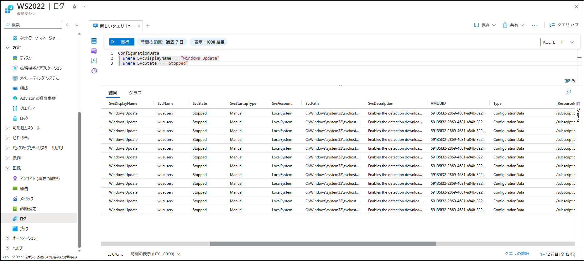


変更履歴とインベントリ機能も、Azure Monitor エージェント (AMA) を利用して情報を Log Analytics ワークスペースに収集します。
Windows サービスや Linux デーモンの状態、構成変更などをログとして確認できるため、ログ アラート ルールを利用することで、特定のサービスが停止状態となった場合に通知を行う等の構成が可能です。

例えば、サービス監視では以下のようなシナリオに対応できます。

- Azure VM 上の Web サーバーやデータベースなど、業務上重要なサービスが停止した場合に通知する
- サービスのスタートアップの種類が自動から手動や無効に変更された場合に検知する
- パッチ適用やアプリケーション更新後に、想定外のサービス停止や状態変更が発生していないか確認する
- 複数の VM で同じサービスの状態を横断的に確認し停止している VM を特定する

また、変更履歴とインベントリ機能はサービス監視だけでなく、OS 内の構成変更を確認する用途でも利用できます。
例えば、インストール済みソフトウェアの追加や削除、ファイルの変更、Windows のレジストリ キーの変更などを追跡できます。
これにより、監査やガバナンスの向上を目的として構成変更がないかを確認したり、意図しない変更を検知したりすることができます。障害対応においても、例えば事象発生時における構成変更の有無を確認することに利用できます。

[Azure Monitor エージェントを使用した Azure Change Tracking とインベントリの概要 | Microsoft Learn](https://learn.microsoft.com/ja-jp/azure/azure-change-tracking-inventory/overview-monitoring-agent)
[ConfigurationData のログ テーブル クエリの例 - Azure Monitor | Microsoft Learn](https://learn.microsoft.com/ja-jp/azure/azure-monitor/reference/queries/configurationdata)


<br><!-- 小項目の終わり <br> を追加する -->


### 4.6 アラート ルールの設定
Azure Monitor には、各種 Azure サービスやリソースを監視する機能があり、異常を検知した際にメールや SMS などの通知や自動アクションを実行できます。

**■ アラート ルール**
各種 Azure サービスやリソースを監視する機能の総称です。監視対象のデータ（メトリックやログ、アクティビティ ログなど）や監視条件を決め、異常を検知します。監視するデータの種類によってアラート ルールの種類が異なります。

| アラート ルールの種類        | 概要                                                                                                               |
| ---------------------------- | ------------------------------------------------------------------------------------------------------------------ |
| ログ アラート ルール         | Log Analytics ワークスペースに収集されたログや、Azure Resource Graph や Azure Data Explorer のデータを監視 |
| メトリック アラート ルール   | Azure リソースのパフォーマンスや状態を示す[プラットフォーム メトリックやカスタム メトリック](https://learn.microsoft.com/ja-jp/azure/azure-monitor/metrics/data-platform-metrics)を監視           | 
| アクティビティ ログ アラート | Azure の[アクティビティ ログ](https://learn.microsoft.com/ja-jp/azure/azure-monitor/platform/activity-log-schema)を監視 （サービス正常性アラートやリソース正常性アラートも含む）    | 


以下は[ログ アラート ルール](https://learn.microsoft.com/ja-jp/azure/azure-monitor/alerts/alerts-create-log-alert-rule)の条件を指定する画面の例です。
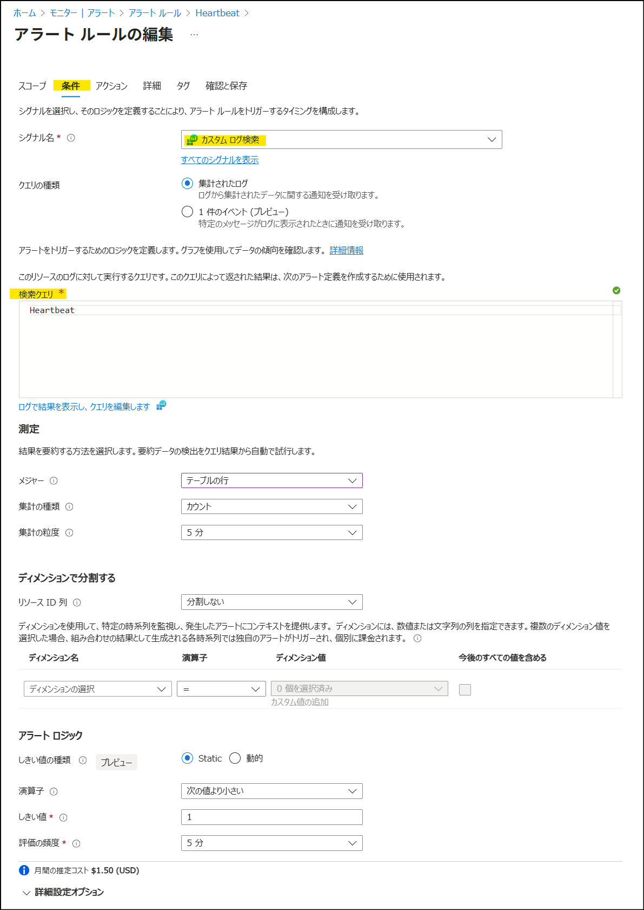

以下は [メトリック アラート ルール](https://learn.microsoft.com/ja-jp/azure/azure-monitor/alerts/alerts-create-metric-alert-rule)の条件を指定する画面の例です。
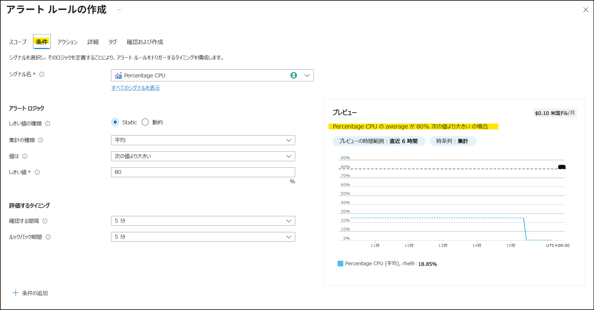
<!--<4-6_metricalert.png>-->

以下は[アクティビティ ログ アラート](https://learn.microsoft.com/ja-jp/azure/azure-monitor/alerts/alerts-create-activity-log-alert-rule?tabs=activity-log) の条件を指定する画面の例です。
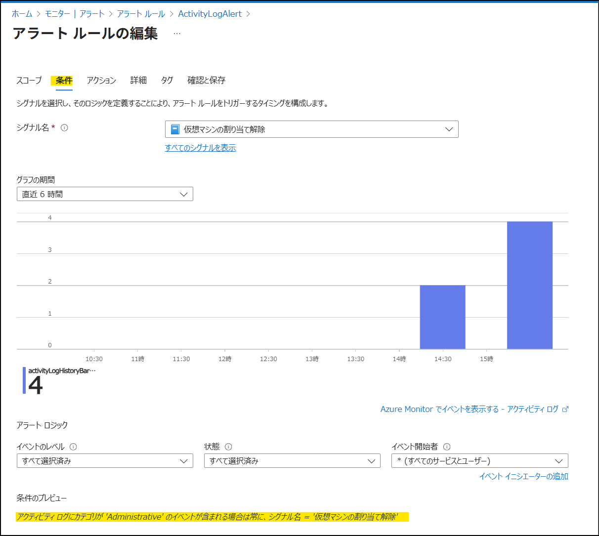
<!--<4-6_activitylogalert.png>-->

<br>

**■ アクション グループ**
アラートが発報した際の通知方法や実行する自動アクションを設定する機能です。
アラート ルールにアクション グループを関連付けることで、アラートが発報した際にアクション グループがトリガーされ、メールや電話、SMS で通知したり、Webhook などの自動アクションを実行することが可能です。
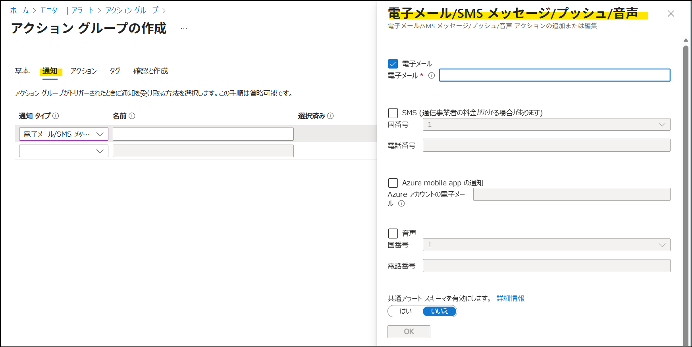
<!--<4-6_actgrp.png>-->

アクション グループには「共通アラート スキーマ」という設定項目があります。アラート スキーマとはアラートが発生した際に生成される通知データの構造であり、共通アラート スキーマ / 非共通アラート スキーマの 2 種類があります。

[共通アラート スキーマ](https://learn.microsoft.com/ja-jp/azure/azure-monitor/alerts/alerts-common-schema)は、Azure Monitor のすべてのアラート ルールで統一されたスキーマが提供されます。一方、[非共通アラート スキーマ](https://learn.microsoft.com/ja-jp/azure/azure-monitor/alerts/alerts-non-common-schema-definitions)では、アラート ルールの種類ごとに個別に定義された構造となります。アクション グループで Logic Apps や Webhook などの自動アクションを設定する場合、共通アラート スキーマの有効／無効によって連携されるデータ構造が異なるためご留意ください。
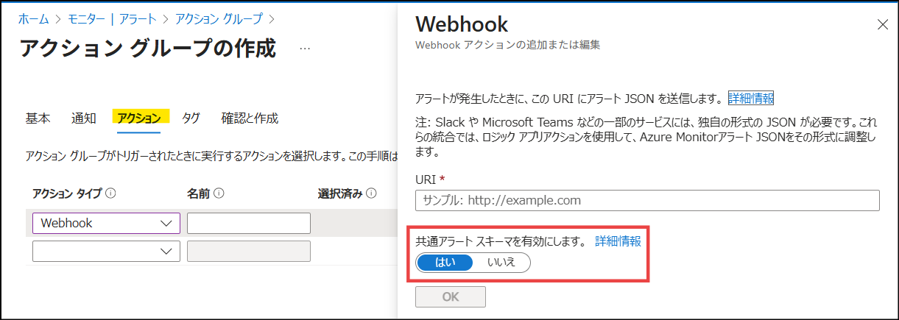

また、共通アラート スキーマの設定により、通知メールのフォーマットも変わります。本記事 [5.2 分析とレポート](#5-2-分析とレポート) では、共通アラート スキーマを有効化した場合の通知メールの例をご紹介しています。非共通アラート スキーマのメール フォーマットを確認されたい場合は、[テスト アクション グループ](https://learn.microsoft.com/ja-jp/azure/azure-monitor/alerts/action-groups#test-an-action-group-in-the-azure-portal)にてご確認ください。
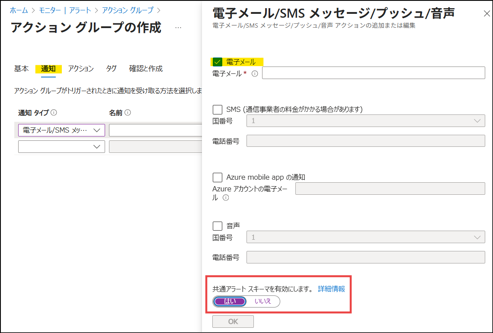


アラート ルールの種類やアクション グループの詳細は、以下の公開情報をご参照ください。
[Azure Monitor の警告の概要 - Azure Monitor | Microsoft Learn](https://learn.microsoft.com/ja-jp/azure/azure-monitor/alerts/alerts-overview#types-of-alerts)
[Azure Monitor アラートの種類 - Azure Monitor | Microsoft Learn](https://learn.microsoft.com/ja-jp/azure/azure-monitor/alerts/alerts-types)
[Azure Monitor でアクション グループを作成および管理する - Azure Monitor | Microsoft Learn](https://learn.microsoft.com/ja-jp/azure/azure-monitor/alerts/action-groups)

<br><!-- 小項目の終わり <br> を追加する -->


### 4.7 サービス正常性
サービス正常性は、Azure サービス正常性のイベント（サービスに関する問題、計画メンテナンス、正常性の勧告、セキュリティ アドバイザリ、課金情報の更新）の情報を提供する機能です。ご利用いただいている Azure サービスおよびリージョンに影響がある正常性イベントが発生すると、Azure ポータル > [モニター (監視)] > [サービスの正常性] に情報が表示されます。
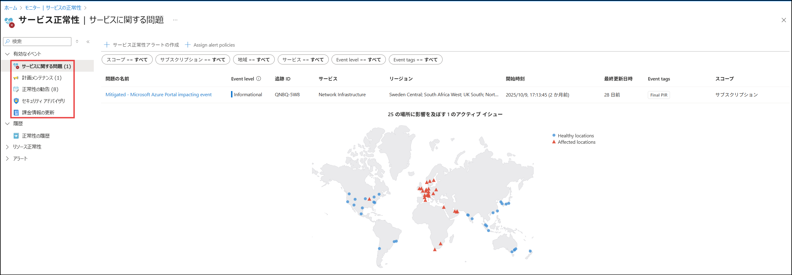


各イベントには一意の追跡 ID が付与されます。上記画面で各イベントのリンクをクリックすると、より詳細な情報を確認することができます。また、[サービス正常性アラート](https://learn.microsoft.com/ja-jp/azure/service-health/service-notifications)を設定すると、サービス正常性のイベントが発生した際に通知を受け取ることも可能です。サービス正常性アラートについては、本記事 [5.2.5 サービス正常性アラートとリソース正常性アラート](#5-2-5-サービス正常性アラートとリソース正常性アラート) をご参照ください。
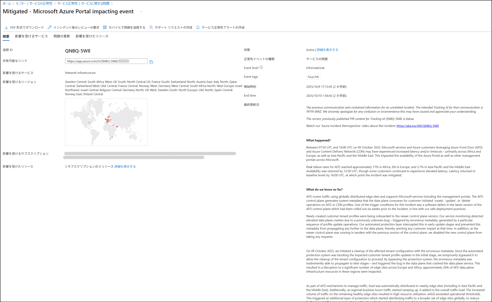


サービス正常性の概要は、以下の公開情報をご参照ください。
[Azure Service Health のドキュメント - Azure Service Health | Microsoft Learn](https://learn.microsoft.com/ja-jp/azure/service-health/)
[Azure Service Health 通知の概要 - Azure Service Health | Microsoft Learn](https://learn.microsoft.com/ja-jp/azure/service-health/service-health-notifications-properties)

<br><!-- 小項目の終わり <br> を追加する -->
<br><!-- 大項目の終わり <br> を追加する -->


<!-- 大項目 -->
## 5. 各機能とソリューション
ここでは、Azure Monitor の代表的な機能やソリューションについて記載します。
本章を読むことで、監視データの取得、分析、可視化の方法と作業の流れを知ることができます。

<br>

### 5.1 データ収集
本項では、監視に利用するデータの種類とその取得方法をご紹介します。

<br>


#### 5.1.1 プラットフォーム メトリックとカスタム メトリック
Azure で扱われるメトリックには以下の 3 種類があります。
- プラットフォーム メトリック
- カスタム メトリック
- Prometheus メトリック (本項ではこちらの説明は割愛します)


**■ プラットフォーム メトリックとは**
プラットフォーム メトリックとは、各 Azure リソースから既定で (ユーザーによる追加構成を必要とせず) 収集されるメトリックで、主に Azure リソースの正常性やパフォーマンスを示すデータです。プラットフォーム メトリックの収集・保持に費用はかかりません。Azure ポータル > 対象の Azure リソース > [監視] > [メトリック] のページ (メトリック エクスプローラー) で確認ができます。
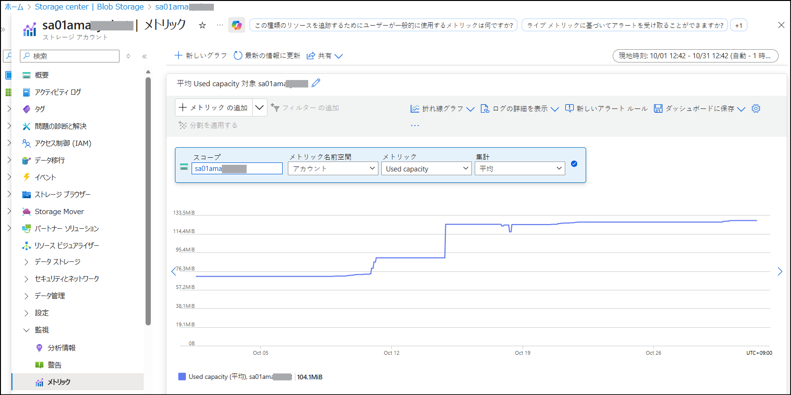


どのようなメトリックが収集できるかは Azure リソースの種類によって異なります。
各種リソースでどのようなメトリックが収集されるかは、以下の公開情報の表内のリンクから確認いただけます。
[Azure Monitor supported metrics by resource type - Azure Monitor | Microsoft Learn](https://learn.microsoft.com/en-us/azure/azure-monitor/reference/metrics-index#supported-metrics-and-log-categories-by-resource-type)

<br>

**■ カスタム メトリックとは**
カスタム メトリックとはユーザーが収集を構成することで収集されるメトリックです。
例えば、Azure Monitor エージェントによって仮想マシンのゲスト OS から収集されるメトリック（ゲスト OS メトリック）や、Application Insights によって Web アプリケーションから収集されるメトリックはカスタム メトリックとして扱われます。カスタム メトリックも、プラットフォーム メトリックと同様に Azure ポータル > 対象の Azure リソース > [監視] > [メトリック] から確認できます。
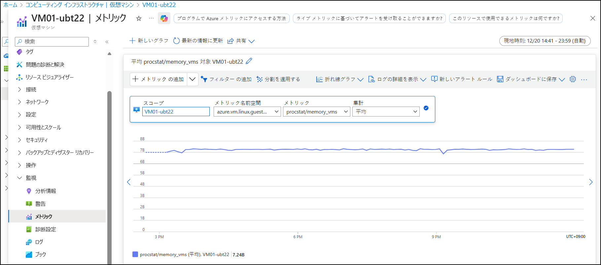


カスタム メトリックの収集にかかる費用や各種メトリックの詳細な説明は、以下の公開情報をご参照ください。
[価格 - Azure Monitor [メトリック] タブ | Microsoft Azure](https://azure.microsoft.com/ja-jp/pricing/details/monitor/)
[Azure Monitor のメトリック - Azure Monitor | Microsoft Learn](https://learn.microsoft.com/ja-jp/azure/azure-monitor/metrics/data-platform-metrics)


<br><!-- 小項目の終わり <br> を追加する -->


#### 5.1.2 アクティビティ ログ
アクティビティ ログには各 Azure リソースの操作等のログ、サービス正常性、リソース正常性があります。

**■ アクティビティ ログ (操作等のログ)**
Azure ポータル > [モニター (監視)] > [アクティビティ ログ] にてサブスクリプション内の Azure リソースに対して実行された操作等のログの一覧を確認できます。
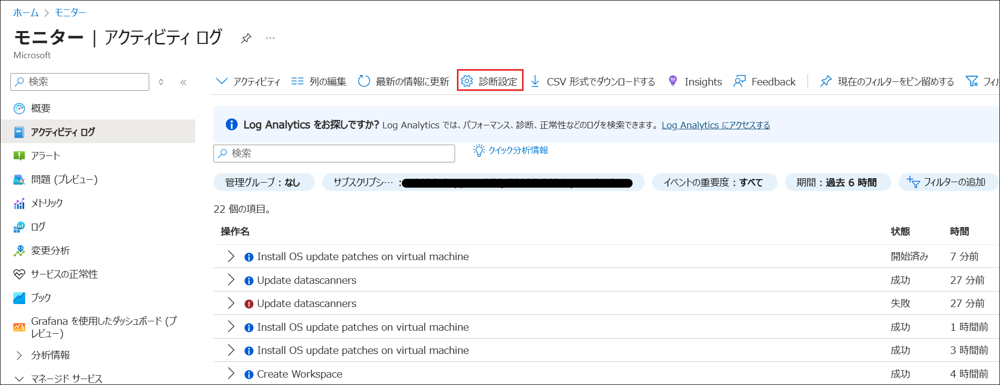
<!--<5-1-7_activitylog1.png>-->

既定ではアクティビティ ログの保持期間は 90 日間です。
90 日以上さかのぼって確認するためには、上図の [診断設定] からサブスクリプション スコープで診断設定を作成します。

[Azure Monitor アクティビティ ログ - Azure Monitor | Microsoft Learn](https://learn.microsoft.com/ja-jp/azure/azure-monitor/platform/activity-log?tabs=log-analytics#export-activity-log)
[Azure Monitor の各種データの保持期間について | Japan Azure Monitoring Support Blog](https://jpazmon-integ.github.io/blog/AzureMonitorEssential/MonitorRetentionPeriod/)

<br>

**■ サービス正常性**
サービス正常性ではご利用の Azure サービスの障害や計画メンテナンス、サービスの廃止などのイベントについて表示します。
Azure ポータル > [モニター (監視)] > [サービスの正常性] > [有効なイベント] もしくは [履歴] をクリックして確認します。
[有効なイベント] には現時点でアクティブなサービス正常性が表示され、[履歴] には過去のサービス正常性イベントが表示されます。
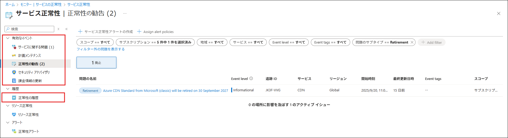

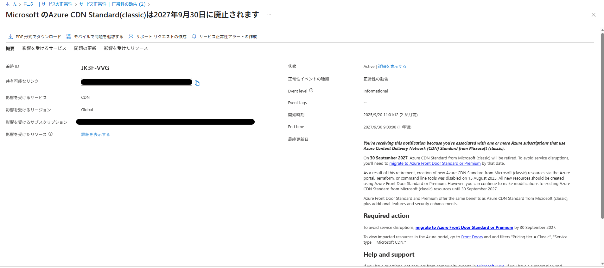

[Azure Service Health ポータル - Azure Service Health | Microsoft Learn](https://learn.microsoft.com/ja-jp/azure/service-health/service-health-portal-update)

<br>

**■ リソース正常性**
リソース正常性では、ご利用の Azure リソースが正常であるかどうかを評価し、リソースの状態が [利用可能 (Available)]、[使用不可 (Unavailable)]、[不明 (Unknown)]、[低下 (Degraded)] のいずれかの状態と表示します。
Azure ポータル > [モニター (監視)] > [サービスの正常性] > [リソース正常性] にて、確認したいリソースの種類を指定して確認します。
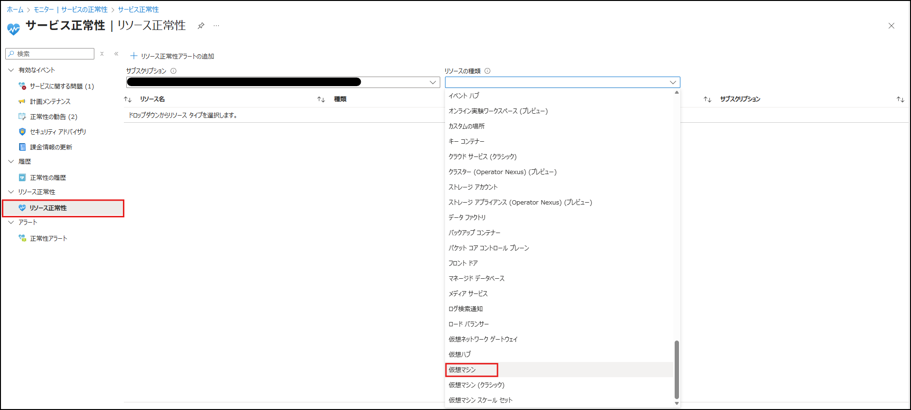

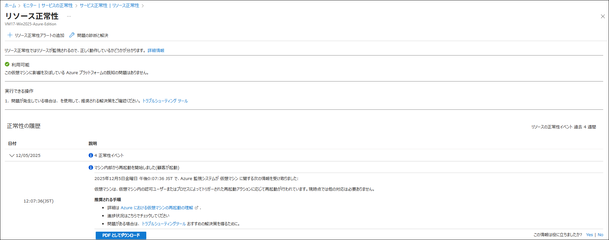

[Azure Resource Health の概要 - Azure Service Health | Microsoft Learn](https://learn.microsoft.com/ja-jp/azure/service-health/resource-health-overview).


<br><!-- 小項目の終わり <br> を追加する -->


#### 5.1.3 仮想マシンからのログ収集
**■ Azure Monitor エージェント (AMA) とデータ収集ルール (DCR) とは**
Azure 仮想マシン (Azure VM) からログを収集するための主な手段は、Azure Monitor エージェントとデータ収集ルールを使用する方法です。それぞれを一言で表現すると、Azure Monitor エージェント (AMA) とは VM 上でデータを集めて送信するもので、データ収集ルール (DCR) とは AMA が収集するデータとその送信先を指定するものです。

<br>

**■ Azure Monitor エージェント (AMA) とデータ収集ルールによるログ収集の流れ**
ログ収集を構成してからログが閲覧できるようになるまでの大まかな流れは以下のとおりです。

- AMA を VM にインストールする、VM と DCR を関連付ける
↓
- 関連付けられた DCR の内容を AMA が認識する
↓
- AMA が DCR で指定されたログを指定された宛先に送信する
↓
- 送信されたログが Azure 基盤側に到着し、処理され、指定の宛先に格納される
↓
- Azure ポータル等でログが閲覧できるようになる

<br>

**■ Azure Monitor エージェント (AMA) とデータ収集ルール (DCR) で収集できるデータの種類**
上記のとおり、収集したいログと送信先に応じて DCR を作成し、VM に関連付ける必要があります。
AMA と DCR を使用して収集できるデータの種類と、指定できる収集先は以下のとおりです。

| データ ソース | 説明 | オペレーティング システム | 収集先 |
| -------------- | ------ | ----------------- | -------- |
| Windows イベント | Windows イベント ログ システムによって出力される情報 | Windows | Log Analytics ワークスペース (Event テーブル) |
| パフォーマンス カウンター | オペレーティング システムとワークロードのパフォーマンスを測定する数値 | Windows, Linux | Log Analytics ワークスペース (Perf テーブル), Azure Monitor メトリック（プレビュー） |
| Syslog | Linux イベント ログ システムによって出力される情報 | Linux | Log Analytics ワークスペース (Syslog テーブル) |
| テキスト ログ | ローカル ディスクのテキスト ログ ファイルに出力される情報 | Windows, Linux | Log Analytics ワークスペース (任意のカスタム テーブル) |
| JSON ログ | ローカル ディスクの JSON ログ ファイルに出力される情報 | Windows, Linux | Log Analytics ワークスペース (任意のカスタム テーブル) |
| IIS ログ | インターネット インフォメーション サービス (IIS) によりローカル ディスク上のファイルに出力される情報 | Windows | Log Analytics ワークスペース (W3CIISLog テーブル) |

Log Analytics ワークスペースに収集されたログはワークスペース内の特定のテーブル内に格納されます。
テーブルについては以下の公開情報をご参照ください。
[Log Analytics ワークスペースの概要 - Azure Monitor | Microsoft Learn](https://learn.microsoft.com/ja-jp/azure/azure-monitor/logs/log-analytics-workspace-overview#log-tables)

<br>

**■ Azure Monitor エージェント (AMA) とデータ収集ルール (DCR) によるログ収集を構成する**
AMA と DCR を使用してログ収集を行う場合、収集するデータ ソースの種類に関わらず、以下の前提条件を満たしているかご確認ください。

- OS がサポートされているか
- ネットワーク要件を満たしているか
- 十分なディスク領域が確保されているか

[Azure Monitor エージェントのネットワーク構成 - Azure Monitor | Microsoft Learn](https://learn.microsoft.com/ja-jp/azure/azure-monitor/agents/azure-monitor-agent-network-configuration?tabs=PowerShellWindows)
[Azure Monitor エージェントでサポートされるオペレーティング システム - Azure Monitor | Microsoft Learn](https://learn.microsoft.com/ja-jp/azure/azure-monitor/agents/azure-monitor-agent-supported-operating-systems)
[Azure Monitor エージェントの要件 | ディスク領域 - Azure Monitor | Microsoft Learn](https://learn.microsoft.com/ja-jp/azure/azure-monitor/agents/azure-monitor-agent-requirements#disk-spaces)


前提条件が確認できたら、次に DCR の作成を行います。
それぞれの作業は、Azure ポータル、コマンドライン (Azure CLI, Azure PowerShell)、ARM テンプレート等を使用して実施できます。
ここでは、Azure ポータルを使用した方法について具体的にご紹介します。

Azure ポータルでの DCR の作成方法や、DCR と VM を関連付ける方法は以下の公開情報をご参照ください。
なお、Azure ポータルで DCR を関連付けた場合、(VM に AMA が未インストールの場合は) AMA のインストールも自動で実施されます。
[Azure Monitor を使用して仮想マシンからログ データを収集する - Azure Monitor | Microsoft Learn](https://learn.microsoft.com/ja-jp/azure/azure-monitor/vm/data-collection?tabs=default#create-a-data-collection-rule)
[Azure Monitor でデータ収集ルールの関連付けを管理する - Azure Monitor | Microsoft Learn](https://learn.microsoft.com/ja-jp/azure/azure-monitor/data-collection/data-collection-rule-associations?tabs=cli#view-and-modify-associations-for-a-dcr-in-the-azure-portal)


Azure ポータル以外の方法で DCR を作成する方法、および DCR と VM を関連付ける方法については以下の公開情報をご参照ください。
[Azure Monitor でデータ収集ルール (DCR) を作成する - Azure Monitor | Microsoft Learn](https://learn.microsoft.com/ja-jp/azure/azure-monitor/data-collection/data-collection-rule-create-edit?tabs=cli#create-or-edit-a-dcr-using-json)
[Azure Monitor でデータ収集ルールの関連付けを管理する - Azure Monitor | Microsoft Learn](https://learn.microsoft.com/ja-jp/azure/azure-monitor/data-collection/data-collection-rule-associations?tabs=cli#create-new-association)


Log Analytics ワークスペースに収集された各種ログは、KQL を使用してクエリすることで確認が可能です。
例えば、パフォーマンス カウンターを収集した場合、そのログは Perf テーブルに収集されるため、以下のようなクエリ結果が得られます。
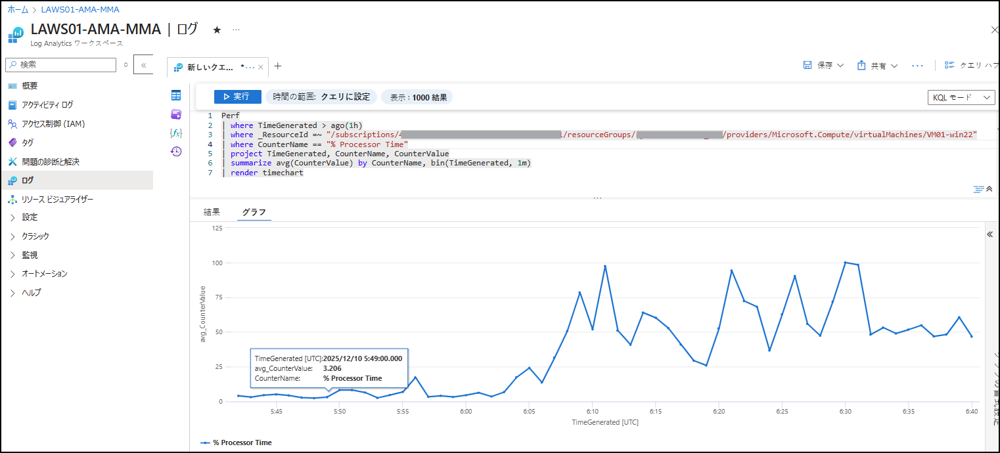


はじめてクエリを実施される方は、以下の公開情報をご参照ください。
[Azure Monitor ログでログ クエリの使用を開始する - Azure Monitor | Microsoft Learn](https://learn.microsoft.com/ja-jp/azure/azure-monitor/logs/get-started-queries?tabs=kql)
[Azure Monitor の Log Analytics の概要 - Azure Monitor | Microsoft Learn](https://learn.microsoft.com/ja-jp/azure/azure-monitor/logs/log-analytics-overview?tabs=simple)

<br>

**■ Azure Monitor エージェント (AMA) の管理**
AMA を VM にインストールする方法として、Azure PowerShell および Azure CLI コマンドを使用する方法や、ARM テンプレートを使用する方法もございます。AMA のアンインストールも、インストールと同様に、Azure ポータル, Azure PowerShell や Azure CLI, ARM テンプレートを使用した方法で実施できます。
[Azure Monitor エージェントのインストールと管理 - Azure Monitor | Microsoft Learn](https://learn.microsoft.com/ja-jp/azure/azure-monitor/agents/azure-monitor-agent-manage?tabs=azure-powershell)


AMA の自動アップグレードを有効化することで、最新バージョンが利用可能となった場合に、自動でアップグレードを適用するように構成することが可能です。自動アップグレードの有効化は、インストール時・インストール後のどちらでも設定できます。
[Azure の仮想マシンとスケール セットの拡張機能の自動アップグレード - Azure Monitor | Microsoft Learn](https://learn.microsoft.com/ja-jp/azure/virtual-machines/automatic-extension-upgrade?tabs=RestAPI1%2CRestAPI2)

AMA の自動アップグレード機能に関するよくあるご質問については以下のブログをご参照ください。
[Azure Monitor エージェントの自動アップグレード機能に関するよくあるご質問集 | Japan Azure Monitoring Support Blog](https://jpazmon-integ.github.io/blog/LogAnalytics/AMAAutoupgradeFAQ/)

<br><!-- 小項目の終わり <br> を追加する -->


#### 5.1.4 コンテナーからのログ収集
AKS などのコンテナー環境の、ノード、Pod、コンテナー、Kubernetes イベント、アプリケーションの状態を継続的に監視するための機能がいくつか提供されています。主な使い分けとしては、ログや Kubernetes イベントの確認には Container Insights、Prometheus 形式のメトリック監視には Managed Prometheus を使用します。

1. Container Insights: コンテナー ログ、Kubernetes イベント、インベントリ情報などを Log Analytics ワークスペースに収集するログ収集機能
2. Managed Prometheus (Azure Monitor managed service for Prometheus) : Prometheus 形式のメトリックを Azure Monitor ワークスペースに収集するメトリック収集機能

[Azure Monitor での Kubernetes の監視 - Azure Monitor | Microsoft Learn](https://learn.microsoft.com/ja-jp/azure/azure-monitor/containers/kubernetes-monitoring-overview)

<br>

**1. Container Insights について**
Container Insights は Azure Kubernetes Service (AKS) などのコンテナー環境から、コンテナー ログ、Kubernetes イベント、インベントリ情報などを収集し、Azure ポータルや Log Analytics で確認できるログ収集機能です。

ノード、Pod、コンテナーなどの状態やイベントを確認し、必要に応じて Log Analytics の KQL クエリや Azure Monitor のアラートを用いた調査・監視を行うことが可能です。以下は、AKS リソースの [モニター (分析情報)] で [Log Analytics の視覚化（クラシック）] を選択し、収集されたログ情報を確認している例です。
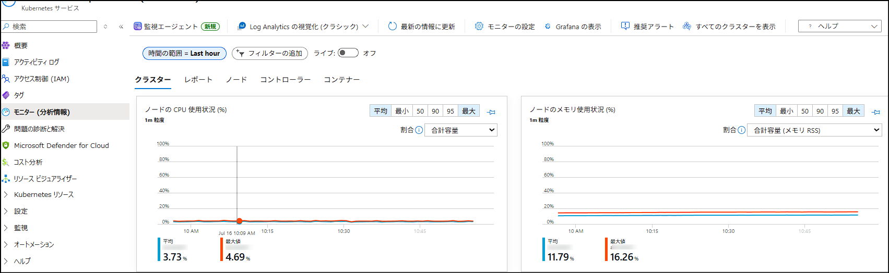

<br>

**■ Container Insights によるデータ収集の流れ**
Container Insights の構成とデータ収集を行う基本的な流れは以下のとおりです。

- Azure ポータルもしくは Azure CLI 等により対象クラスターで Container Insights を有効化する
↓
- コンテナー化された Azure Monitor エージェント (AMA) がデプロイされる
↓
- コンテナー化された AMA により Log Analytics ワークスペースに各ログ データが収集される
↓
- Azure ポータル > 対象のクラスター リソース > [モニター (分析情報)] の画面や、Log Analytics の KQL により分析や可視化を行う

Container Insights の有効化方法については以下の公開情報やブログをご参照ください。
[Azure Kubernetes Service (AKS) クラスターの監視を有効にする - Azure Monitor | Microsoft Learn](https://learn.microsoft.com/ja-jp/azure/azure-monitor/containers/kubernetes-monitoring-enable?tabs=azure-portal#enable-container-insights-and-logging-on-an-aks-cluster)
[Container Insights のご紹介 | Japan Azure Monitoring Support Blog](https://jpazmon-integ.github.io/blog/LogAnalytics/HowToContainerInsights/)

<br>

**■ Container Insights で収集されるログ**
Container Insights で収集される主なログには、コンテナーの標準出力 / 標準エラー出力、Kubernetes イベント、Pod やコンテナーのインベントリ情報などがあります。収集されたログは Log Analytics ワークスペースに保存され、Azure ポータル > 対象の AKS リソース > [モニター (分析情報)] の画面や Log Analytics の KQL クエリから確認できます。

Log Analytics では、用途に応じて複数のテーブルにデータが格納されます。
例えば、コンテナーの標準出力 / 標準エラー出力は主に ContainerLogV2 テーブルに格納され、Kubernetes イベントは KubeEvents、Pod の状態やインベントリ情報は KubePodInventory で確認できます。
  
Container Insights に関連するテーブルの一覧や各テーブルの詳細については、以下の公開情報で、ソリューションが ContainerInsights と記載されているテーブルをご確認ください。
[microsoft.containerservice/managedclusters の Azure Monitor テーブル - Azure Monitor | Microsoft Learn](https://learn.microsoft.com/ja-jp/azure/azure-monitor/reference/tables/microsoft-containerservice-managedclusters)

<br>


**2. Managed Prometheus について**
Managed Prometheus では、Prometheus 形式のメトリックを Azure Monitor ワークスペースに収集します。収集したメトリックは、Azure Monitor ワークスペースのメトリック エクスプローラーや Prometheus エクスプローラー、Azure Managed Grafana などから、PromQL により分析・可視化できます。

以下は、AKS リソースの [モニター (分析情報)] で [マネージド Prometheus の視覚化] を選択し、収集されたメトリック情報を確認している例です。
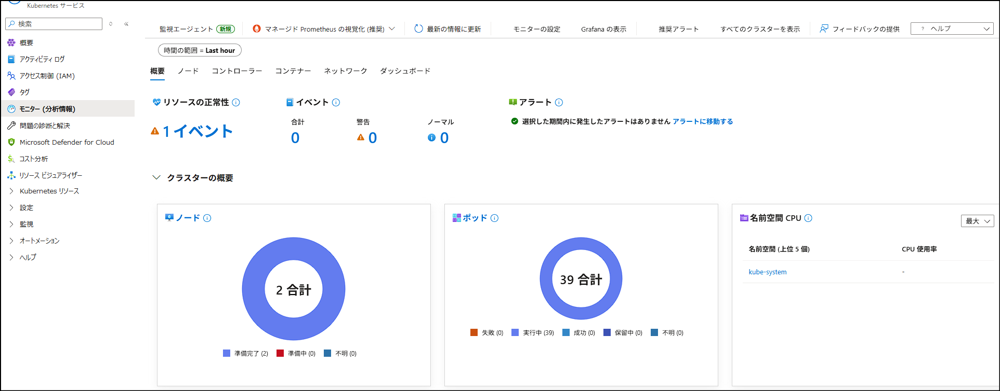

<br>

**■ Managed Prometheus によるデータ収集の流れ**
Managed Prometheus の構成とデータ収集を行う基本的な流れは以下のとおりです。

- Azure ポータルもしくは Azure CLI 等により対象クラスターで Managed Prometheus を有効化する
↓
- Azure Monitor Agent のメトリック アドオンが構成される
↓
- メトリック アドオンにより Prometheus 形式のメトリックが Azure Monitor ワークスペースに収集される
↓
- Azure ポータル > 対象のクラスター リソース > [モニター (分析情報)] の画面や、Azure Monitor ワークスペースのメトリック エクスプローラーなどから PromQL を用いて分析や可視化を行う

Prometheus メトリックの有効化方法については以下の公開情報をご参照ください。
[Azure Kubernetes Service (AKS) クラスターの監視を有効にする - Azure Monitor | Microsoft Learn](https://learn.microsoft.com/ja-jp/azure/azure-monitor/containers/kubernetes-monitoring-enable?tabs=azure-cli#enable-prometheus-metrics-on-an-aks-cluster)

<br>

**■ Managed Prometheus で収集されるメトリック**
Managed Prometheus で既定収集される Prometheus メトリックには、kubelet、cAdvisor、kube-state-metrics、node exporter などから取得されるノード、Pod、コンテナー、Kubernetes オブジェクトのメトリックが含まれます。

収集対象の詳細は、以下の Azure Monitor の既定 Prometheus メトリック構成に記載されています。
[Azure Monitor での既定の Prometheus メトリック構成 - Azure Monitor | Microsoft Learn](https://learn.microsoft.com/ja-jp/azure/azure-monitor/containers/prometheus-metrics-scrape-default)

Arc 対応 Kubernetes クラスターでの Container Insights によるログ収集、および Managed Prometheus による Prometheus メトリック収集の有効化手順については、以下の公開情報をご参照ください。
[Arc 対応 Kubernetes クラスターの監視を有効にする - Azure Monitor | Microsoft Learn](https://learn.microsoft.com/ja-jp/azure/azure-monitor/containers/kubernetes-monitoring-enable-arc?tabs=cli)
  

<br><!-- 小項目の終わり <br> を追加する -->


#### 5.1.5 アプリケーションからのログ収集
Application Insights は、アプリケーションのパフォーマンスを監視するサービスです。
Web アプリや API が
- 正常に動いているか
- エラーが発生していないか
- レスポンスが遅くなっていないか

といったことを、Application Insights を有効化することで、自動的にデータを収集し可視化できます。

収集したデータは下図のように Azure ポータルの画面ですぐに閲覧できます。
前述の
「正常に動いているか」は [有効] グラフ (右側の緑色グラフ)、
「エラーが発生していないか」は [失敗した要求] グラフ (左側の赤色グラフ)、
「レスポンスが遅くなっていないか」は [サーバー応答時間] グラフ (左側の青色グラフ) 
にて確認できます。
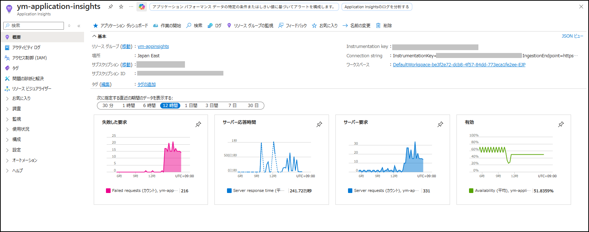


収集したデータの分析方法および可視化方法の詳細は、
本記事 [5.2.8 Application Insights のクエリ](#5-2-8-Application-Insights-のクエリ) と [5.3.4 Application Insights の可視化](#5-3-4-Application-Insights-の可視化) をご参照ください。

また、Azure App Service や Azure VM などの Azure サービスに加えて、オンプレミスのサーバーで動作するアプリケーションからもログを収集できます。Application Insights の詳細については、以下の公開情報をご参照ください。
[Application Insights OpenTelemetry の可観測性の概要 - Azure Monitor | Microsoft Learn](https://learn.microsoft.com/ja-jp/azure/azure-monitor/app/app-insights-overview)

<br>

アプリケーションで Application Insights を有効化する方法は 2 つあります。

**■ 自動インストルメンテーション**
自動インストルメンテーションはソース コードの変更なしで、Application Insights を有効にできます。
手動インストルメンテーションと比較して、簡単に有効化できる一方で一部の機能が制限されます。

自動インストルメンテーションを利用できるシナリオは以下の公開情報をご参照ください。
[Azure Monitor Application Insights の自動インストルメンテーション - Azure Monitor | Microsoft Learn](https://learn.microsoft.com/ja-jp/azure/azure-monitor/app/codeless-overview)

例えば、Azure App Service では Azure ポータル > 対象の App Service > [監視] > [Application Insights] から自動インストルメンテーションを有効化します。
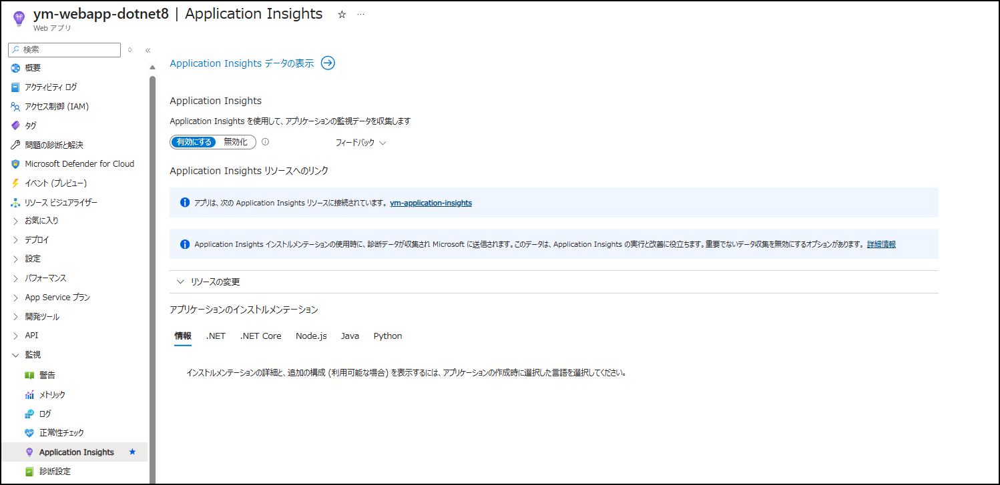

<br>

**■ 手動インストルメンテーション**
アプリケーションのソース コードに Application Insights SDK (クラシックまたは Azure Monitor OpenTelemetry Distro) をインストールして、Application Insights を有効にします。ソース コードの変更は必要ですが、自動インストルメンテーションより多くの情報を取得でき、カスタム テレメトリの収集も可能です。

利用方法はアプリケーションの開発言語ごとに異なるため、詳細は以下の公開情報をご参照ください。
[Application Insights で OpenTelemetry を有効にする - Azure Monitor | Microsoft Learn](https://learn.microsoft.com/ja-jp/azure/azure-monitor/app/opentelemetry-enable?tabs=net)
[Application Insights を使用して .NET アプリケーションと Node.js アプリケーションを監視する (クラシック API) - Azure Monitor | Microsoft Learn](https://learn.microsoft.com/ja-jp/azure/azure-monitor/app/classic-api?tabs=dotnet)


また、Application Insights の可用性テストを使って、アプリケーションの死活監視も可能です。
可用性テストでは、世界中のさまざまな場所から Web リクエストをアプリケーションに定期的に送信します。
アラート ルールの設定も可能で、アプリケーションの応答がない場合や応答が遅い場合はユーザーに警告も可能です。

可用性テストは Azure ポータル > 対象の Application Insights > [調査] > [有効] から設定と結果の確認ができます。
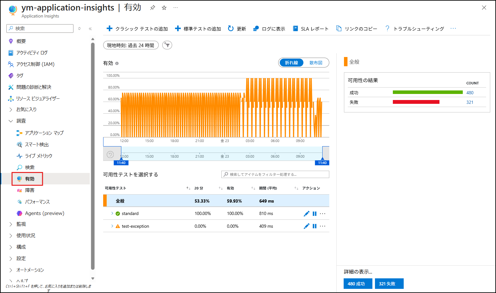


詳細な利用方法は、以下の公開情報をご参照ください。
[Application Insights 可用性テスト - Azure Monitor | Microsoft Learn](https://learn.microsoft.com/ja-jp/azure/azure-monitor/app/availability?tabs=standard)


<br><!-- 小項目の終わり <br> を追加する -->


#### 5.1.6 診断設定
**■ 診断設定とは**
診断設定を使用することで、各 Azure リソースから出力される以下のデータを指定した宛先に送信することができます。
- アクティビティ ログ
- リソース ログ
- プラットフォーム メトリック

宛先には、以下を指定することが可能です。
- Log Analytics ワークスペース
- ストレージ アカウント
- Event Hubs
- Azure Monitor パートナー ソリューション

<br>

**■ 診断設定の主な利用シナリオ**
リソース ログは既定では収集されません。
そのため、リソース ログを収集し監視や分析を行う必要がある場合は診断設定をご利用ください。

アクティビティ ログおよびプラットフォーム メトリックは既定で収集されます。
ただし、そのままではそれぞれを監視したり分析したりする方法は限られています。診断設定を利用することで、Log Analytics ワークスペース、ストレージ アカウント、Event Hubs などの宛先にデータを送信し、監視、分析、長期保管、外部連携といった用途に活用できます。

また、既定で収集されるアクティビティ ログおよびプラットフォーム メトリックの保持期間はそれぞれ 90 日と 93 日です。
診断設定を用いて任意の宛先に収集することで、この保持期間を延長することが可能です。

プラットフォーム メトリックとアクティビティ ログについては、本記事 [5.1.1 プラットフォーム メトリックとカスタム メトリック](#5-1-1-プラットフォーム-メトリックとカスタム-メトリック) と [5.1.2 アクティビティ ログ](#5-1-2-アクティビティ-ログ) をご参照ください。


<br>

**■ 診断設定の作成方法 (リソース ログ・プラットフォーム メトリック)**
診断設定は Azure ポータル上、Azure PowerShell や Azure CLI のコマンド、ARM テンプレートなどを用いて作成することが可能です。Azure ポータル上での作成方法としては、大きく Azure リソースのページから行う方法と、[モニター (監視)] のページから行う方法があります。ここでは、Azure ポータル > 対象の Azure リソース > [監視] > [診断設定] からの作成方法をご紹介します。

Azure ポータル > 対象の Azure リソース > [監視] > [診断設定] > [診断設定を追加] をクリックすると、以下のような作成画面が表示されます。画像のように、収集対象のデータ (ログおよびメトリック) と宛先を選択することが可能です。

※ Web App リソースの診断設定作成画面
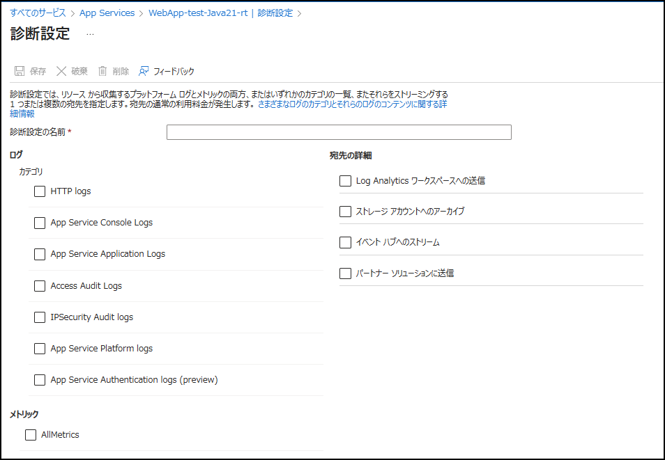


なお、ログはカテゴリ単位で選択することが可能ですが、このカテゴリについてはリソースの種類によって異なります。
また、メトリックについても、どのような種類のメトリックが収集されるかは、リソースの種類によって異なります。
各種リソースからどのようなログおよびメトリックが収集されるかは、以下の公開情報の表内のリンクから確認いただけます。
[Supported Resource log categories for Azure Monitor - Azure Monitor | Microsoft Learn](https://learn.microsoft.com/en-us/azure/azure-monitor/reference/logs-index#supported-metrics-and-log-categories-by-resource-type)

<br>

Log Analytics ワークスペースに収集した場合は以下のように確認が可能です。

※ Log Analytics ワークスペースの AzureDiagnostics テーブルにクエリしたときのサンプル
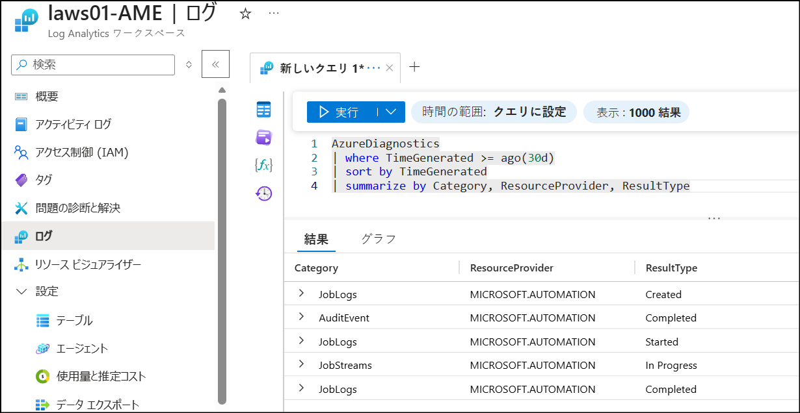


リソース ログは Log Analytics ワークスペースの AzureDiagnostics テーブルに収集されます。
ただし、一部のリソース種では設定によりリソース固有のテーブルに収集することも可能です。

※ Event Hubs のリソース固有テーブルへクエリしたときの例
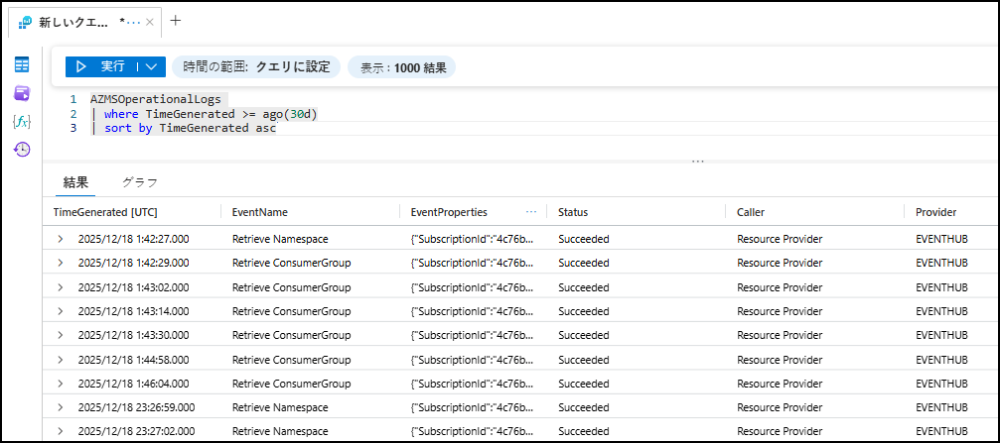


リソース ログのテーブルの詳細は以下の公開情報をご参照ください。
[Azure Monitor のリソース ログ - Azure Monitor | Microsoft Learn](https://learn.microsoft.com/ja-jp/azure/azure-monitor/platform/resource-logs?tabs=log-analytics#collection-mode)
[Azure リソース ログでサポートされているサービスとスキーマ - Azure Monitor | Microsoft Learn](https://learn.microsoft.com/ja-jp/azure/azure-monitor/platform/resource-logs-schema)

<br>

**■ 診断設定の作成方法 (アクティビティ ログ)**
アクティビティ ログ用の診断設定はサブスクリプションのスコープでのみ作成が可能です。
そのため、リソース ログ用の診断設定のように対象リソースの画面から診断設定を作成するのではなく、Azure ポータル > サブスクリプション > [アクティビティ ログ] > [診断設定] から作成します。
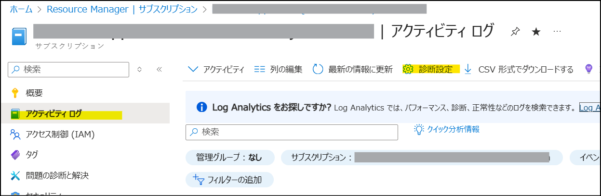


例えば、Log Analytics ワークスペースに送信した場合は、AzureActivity テーブルに収集され、ストレージ アカウントに送信した場合は以下の形式の JSON にログが収集されます。
`insights-activity-logs/resourceId=/SUBSCRIPTIONS/{subscription ID}/y={four-digit numeric year}/m={two-digit numeric month}/d={two-digit numeric day}/h={two-digit 24-hour clock hour}/m=00/PT1H.json`

※ Log Analytics ワークスペースの AzureActivity テーブルにクエリしたときの例
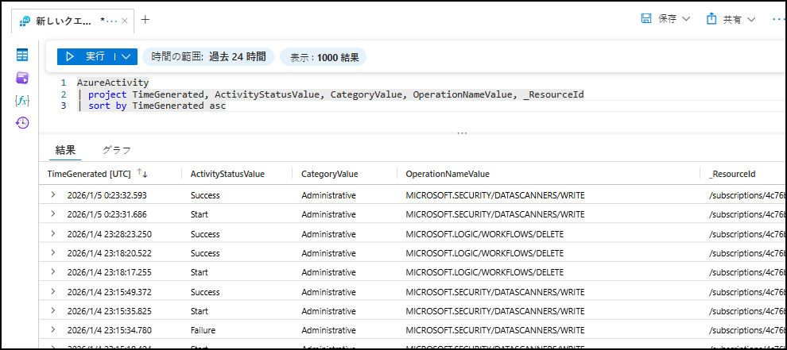


※ ストレージ アカウントにエクスポートされたアクティビティ ログの例
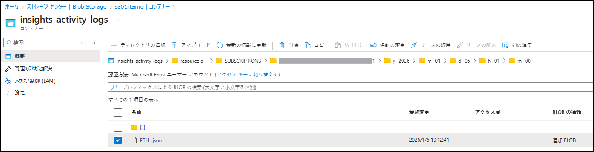


アクティビティ ログ用の診断設定の詳細については以下の公開情報をご参照ください。
[Azure Monitor のアクティビティ ログ | アクティビティ ログのエクスポート - Azure Monitor | Microsoft Learn](https://learn.microsoft.com/ja-jp/azure/azure-monitor/platform/activity-log?tabs=portal-1%2Clog-analytics%2Cportal-2#export-activity-log)

<br><!-- 小項目の終わり <br> を追加する -->


#### 5.1.7 データ エクスポート
**■ データ エクスポートとは**
Log Analytics ワークスペースのデータ エクスポート機能を使用することで、Log Analytics ワークスペースのテーブルに格納されるログを他の宛先 (ストレージ アカウントまたは Event Hubs) にエクスポートすることが可能です。データ エクスポート ルールを作成し、その中で対象となるテーブルと宛先を指定します。

データ エクスポート ルールを作成すると、対象のデータが Azure Monitor のパイプラインに到着次第、Log Analytics ワークスペースのテーブルに取り込まれるのと並行して、指定した宛先へのエクスポートが実施されます。
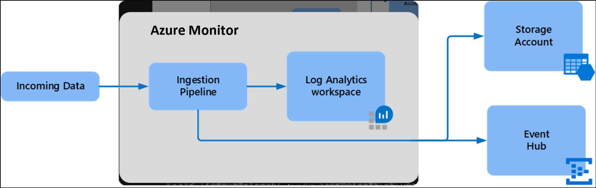

<br>

**■ データ エクスポート機能の主な利用シナリオ - ストレージ アカウント**

**改ざん防止に関するコンプライアンス**
Log Analytics ワークスペースに取り込まれたデータを変更することはできません。しかし、以下の手順で消去することは可能です。
一方で、不変ポリシーが設定されたストレージ アカウントに格納されたデータは、設定した保持期間を超えるまでは変更、削除いずれもできません。そのため、データの改ざん (消去) 防止の要件がある場合は、不変ポリシーが設定されたストレージ アカウントにエクスポートすることをご検討ください。
[Log Analytics ワークスペースのデータを削除する方法 | Japan Azure Monitoring Support Blog](https://jpazmon-integ.github.io/blog/LogAnalytics/LogAnalyticsWorkspacePurge/)


**データの冗長化および長期保管**
監査データやセキュリティ データ等、冗長化や長期保管が必要であるデータについて、Log Analytics ワークスペースと同一リージョンにあるストレージ アカウントへのエクスポートをご利用いただけます。GRS、GZRS など、ストレージ アカウントの冗長オプションを使用することで、他のリージョンにデータをレプリケートすることができます。

また、ストレージ アカウントにエクスポートされたデータは、Log Analytics ワークスペースに設定された保持期間の影響は受けないため、ストレージ アカウントにログをエクスポートし、ストレージ アカウントで長期保管することが可能です。さらに、ストレージ アカウントのライフサイクル管理ポリシーを利用することで、ストレージ アカウントにエクスポートされたデータを管理する (一定期間を過ぎた後に自動で削除する等) ことが可能です。


ストレージ アカウントのライフサイクル管理については、以下の公開情報をご参照ください。
[Azure Blob Storage ライフサイクル管理の概要 - Azure Blob Storage | Microsoft Learn](https://learn.microsoft.com/ja-jp/azure/storage/blobs/lifecycle-management-overview)
[ライフサイクル管理ポリシーを構成する - Azure Blob Storage | Microsoft Learn](https://learn.microsoft.com/ja-jp/azure/storage/blobs/lifecycle-management-policy-configure?tabs=azure-portal)

なお、ストレージ アカウント上にエクスポートされた JSON ファイル内のデータは、KQL の [externaldata operator](https://learn.microsoft.com/en-us/kusto/query/externaldata-operator?view=microsoft-fabric) を使用することでクエリすることが可能です。詳細は、本記事 [5.2.7 ストレージ アカウントに収集したデータの可視化](#5-2-7-ストレージ-アカウントに収集したデータの可視化) をご参照ください。

<br>

**■ データ エクスポート機能の主な利用シナリオ - Event Hubs**
Azure サービスおよびその他のツールとの統合: Event Hubs にエクスポートすることで、他 Azure サービスやツールとの統合が実現可能です。

<br>

**■ データ エクスポート機能の利用開始方法**
データ エクスポート ルールの必要な権限や制限、作成手順の詳細については以下の公開情報をご参照ください。
[Azure Monitor の Log Analytics データ エクスポート - Azure Monitor | Microsoft Learn](https://learn.microsoft.com/ja-jp/azure/azure-monitor/logs/logs-data-export?tabs=portal-1%2Cportal-2#limitations)


一部のテーブルはデータ エクスポート機能がサポートされていないため、ご注意ください。
サポート対象外のテーブルは以下より確認いただけます。
[Log Analytics workspace data export in Azure Monitor | Unsupported tables - Azure Monitor | Microsoft Learn](https://learn.microsoft.com/en-us/azure/azure-monitor/logs/logs-data-export?tabs=portal#unsupported-tables)


<br><!-- 小項目の終わり <br> を追加する -->


#### 5.1.8 ネットワークの監視
Network Watcher は、仮想マシン (VM)、仮想ネットワーク (VNet)、アプリケーション ゲートウェイ、ロード バランサーなどの IaaS 製品のネットワーク正常性の監視や修復が可能なサービスです。
[Azure Network Watcher の概要 | Microsoft Learn](https://learn.microsoft.com/ja-jp/azure/network-watcher/network-watcher-overview?toc=%2Fazure%2Fazure-monitor%2Ftoc.json)

Network Watcher の機能の一つであるネットワークの分析情報は、Azure ポータル > [モニター (監視)] > [分析情報] > [ネットワーク] にて確認できます。
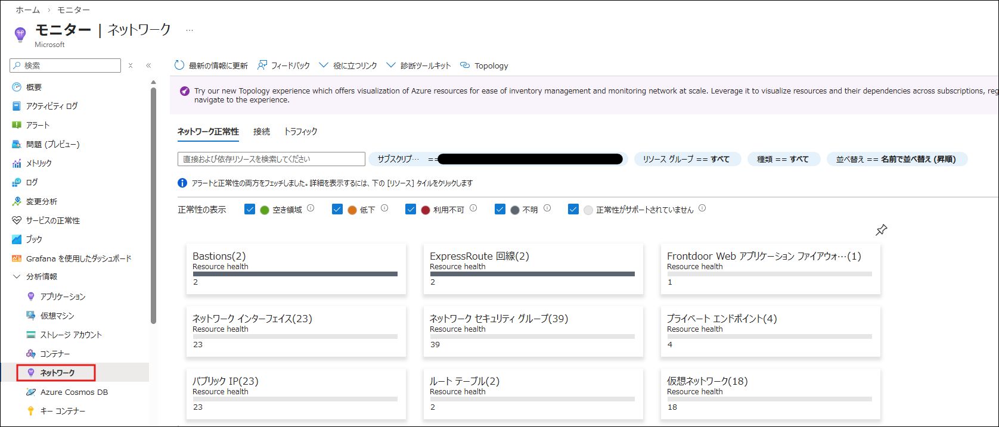

[ネットワークの分析情報 | Microsoft Learn](https://learn.microsoft.com/ja-jp/azure/network-watcher/network-insights-overview?toc=%2Fazure%2Fazure-monitor%2Ftoc.json)

<br>

**お問い合わせに関するご留意事項**
ネットワークの分析情報を含め Network Watcher については、Japan Azure Monitoring サポート チームではなく、Japan Azure Networking サポート チームにて対応しております。これらに関するお困りごとやご質問はネットワーク製品観点でお問い合わせを発行してください。Japan Azure Networking サポート チームのブログは以下のリンクよりご確認ください。
[Japan Azure IaaS Core Support Blog](https://jpaztech.github.io/blog/index.html)


<br><!-- 小項目の終わり <br> を追加する -->
<br><!-- 中項目の終わり <br> を追加する -->


<!-- 中項目 -->
### 5.2 分析とレポート
本項では、取得した監視データの利用方法をご紹介します。

#### 5.2.1 Log Analytics ワークスペースのクエリ  
各種の Azure リソースやマシンから Log Analytics ワークスペースに収集したデータはクエリを実行して確認します。

**■ クエリのモード**
クエリを実行する 2 種類のモードがあります。簡易モードでは Azure ポータル > 対象の Log Analytics ワークスペース > [ログ] > [テーブル] > [対象テーブルの実行] をクリックすることで、簡単にクエリを実行可能です。
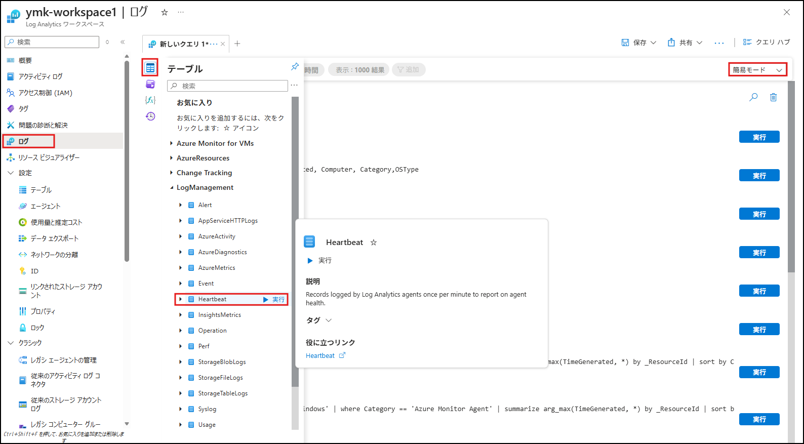


KQL モードではより詳細なクエリを指定して実行することでカスタマイズしたクエリ実行結果を取得することが可能です。
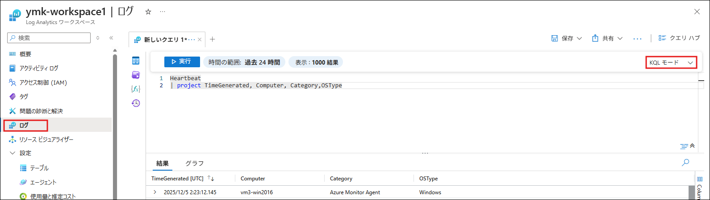

[Azure Monitor ログでログ クエリの使用を開始する - Azure Monitor | Microsoft Learn](https://learn.microsoft.com/ja-jp/azure/azure-monitor/logs/get-started-queries?tabs=kql#search-queries)

<br>

**■ 共有機能**
クエリの実行結果は [共有] から Excel 等のファイルに出力可能です。
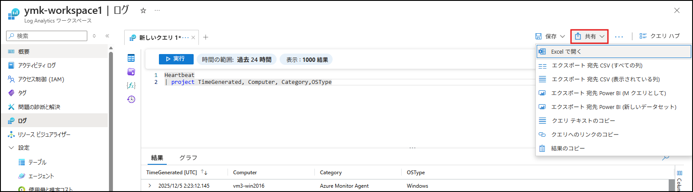

[Log Analytics と Excel を統合する - Azure Monitor | Microsoft Learn](https://learn.microsoft.com/ja-jp/azure/azure-monitor/logs/log-excel)

<br>

**■ アクセス制御モード**
Log Analytics ワークスペースのアクセス制御モードには 2 種類あります。
ワークスペース コンテキスト アクセス制御モードでは Log Analytics ワークスペースの [ログ] からアクセスすることで、複数のリソースから Log Analytics ワークスペースに収集されたすべてのログを参照します。

※ ワークスペース コンテキスト アクセス制御モードの場合の例
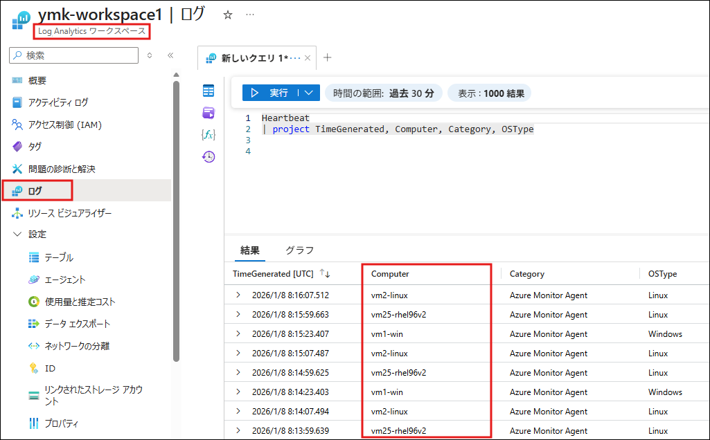


リソース コンテキスト アクセス制御モードでは Azure ポータル > 対象の Azure リソース > [監視] > [ログ] からアクセスすることで、対象のリソースから Log Analytics ワークスペースに収集されたログのみを参照します。

※ リソース コンテキスト アクセス制御モードの場合の例
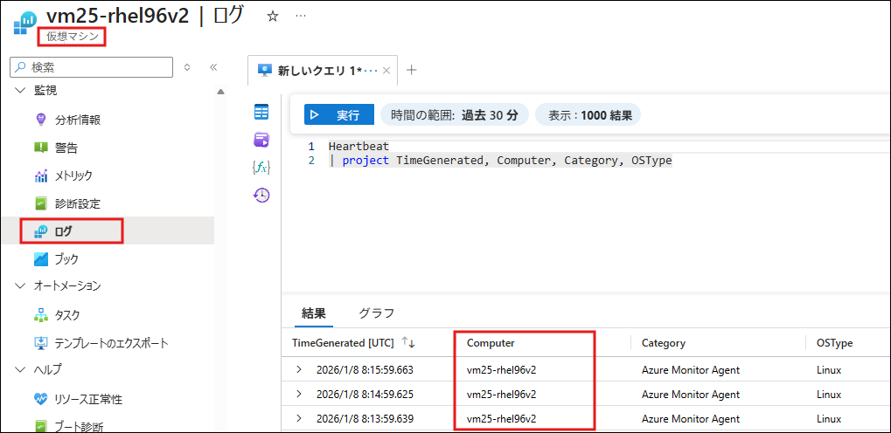

[Log Analytics ワークスペースのアクセス制御モードの違いについて | Japan Azure Monitoring Support Blog](https://jpazmon-integ.github.io/blog/LogAnalytics/AccessControlMode/)


Log Analytics ワークスペース内の各テーブルや、各テーブルのサンプル クエリは、以下の公開情報をご参照ください。
[Azure Monitor Resource log / log analytics tables - Azure Monitor | Microsoft Learn](https://learn.microsoft.com/en-us/azure/azure-monitor/reference/tables-index)
[Azure Monitor log analytics queries by tables - Azure Monitor | Microsoft Learn](https://learn.microsoft.com/en-us/azure/azure-monitor/reference/queries-by-table)


<br><!-- 小項目の終わり <br> を追加する -->


#### 5.2.2 ログ アラート ルール
ログ アラート ルールは、Azure リソースやお客様のアプリケーションなどから収集されたログを監視する機能です。
Log Analytics ワークスペースに収集されたログに加え、Azure Resource Graph や Azure Data Explorer のデータを監視することもできます。


**1. 定期的にクエリを実行してログを評価する**
[KQL (Kusto Query Language)](https://learn.microsoft.com/ja-jp/kusto/query/?view=azure-monitor) という Log Analytics のクエリ言語を使って監視する条件を定義します。
例 : 仮想マシンが停止していないかどうか (過去 10 分間の Heartbeat のレコードが 0 件かどうか)
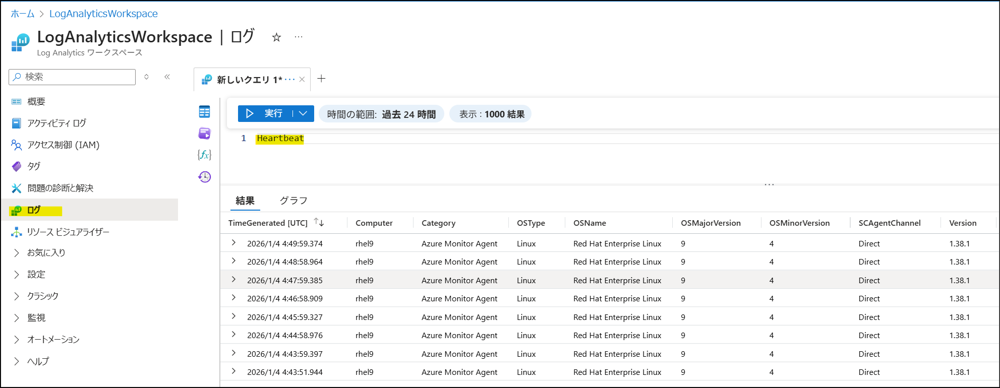


ログ アラート ルールは、指定された評価期間のログを対象に、定期的にクエリを実行します。クエリの実行結果がしきい値（例：過去 10 分間の Heartbeat のレコード数 < 1）を満たすと、アラートが発報します。
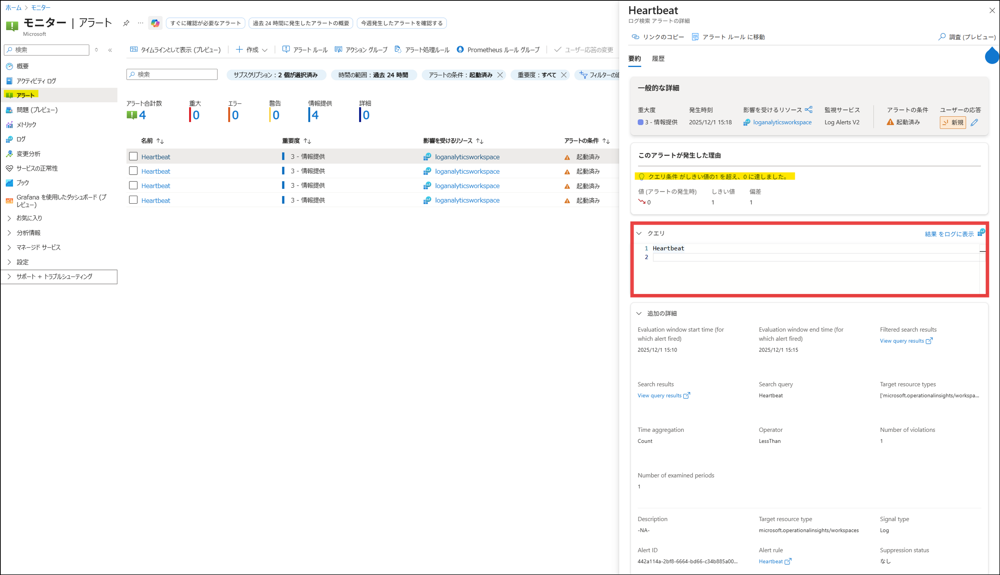


**2. 通知や自動アクションを実行する**
アラートが発報した時に通知する方法や、実行するアクションは「アクション グループ」で設定します。
アラート ルールにアクション グループを関連付けると、メールや電話、SMS で通知したり、Webhook などの自動アクションを実行することが可能です。

※ 以下例はアクション グループで共通アラート スキーマを有効化した時に通知されたメールです。
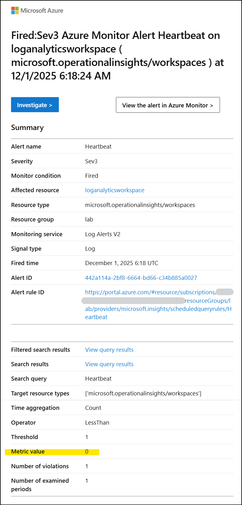


ログ アラート ルールの設定手順などは、以下の公開情報やブログをご参照ください。
[Azure Monitor のログ検索アラート ルールを作成する - Azure Monitor | Microsoft Learn](https://learn.microsoft.com/ja-jp/azure/azure-monitor/alerts/alerts-create-log-alert-rule)
[Azure Monitor でアクション グループを作成および管理する - Azure Monitor | Microsoft Learn](https://learn.microsoft.com/ja-jp/azure/azure-monitor/alerts/action-groups)
[Azure Monitor のアラートに関するよくあるご質問 | Japan Azure Monitoring Support Blog](https://jpazmon-integ.github.io/blog/AzureMonitorEssential/MonitorAlertFAQ/#%E3%83%AD%E3%82%B0-%E3%82%A2%E3%83%A9%E3%83%BC%E3%83%88-%E3%83%AB%E3%83%BC%E3%83%AB)

<br><!-- 小項目の終わり <br> を追加する -->


#### 5.2.3 メトリック アラート ルール
メトリック アラート ルールは、Azure リソースのパフォーマンスや状態を示すメトリックを監視する機能です。
既定で収集されるプラットフォーム メトリックや、既定では収集されない[カスタム メトリック](https://learn.microsoft.com/ja-jp/azure/azure-monitor/metrics/metrics-custom-overview)を監視することが可能です。

**1. 定期的にメトリックの値を評価する**
監視する Azure リソースやメトリックを決め、しきい値などの監視条件を指定します。
例 : Azure VM の CPU 使用率が 80% を超えているかどうか
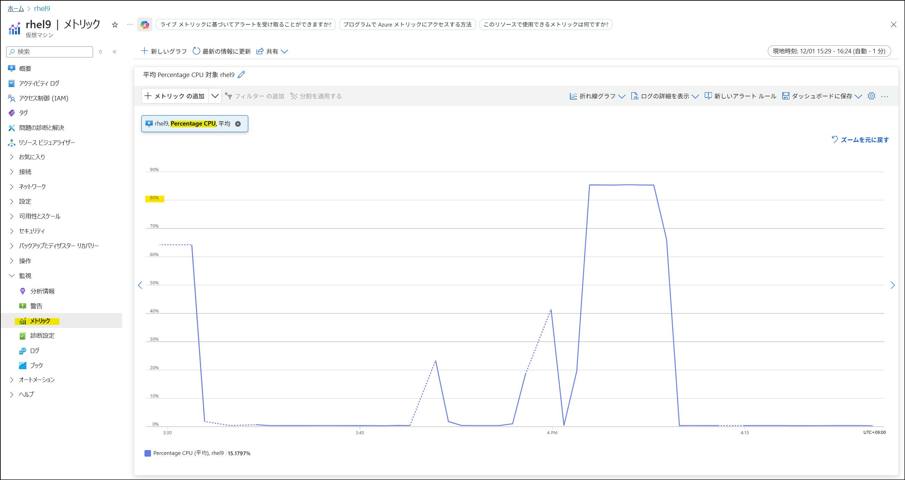

メトリック アラート ルールは、指定されたルックバック期間（評価期間）のメトリックを対象に、しきい値を満たしているかどうかを定期的に評価します。メトリックの値がしきい値（例：PercentageCpu > 80）を満たすと、アラートが発報します。
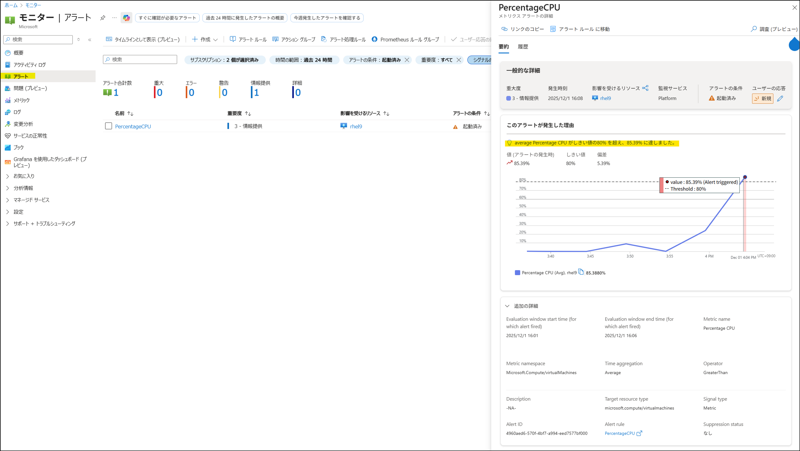


**2. 通知や自動アクションを実行する**
アラートが発報した時に通知する方法や、実行するアクションは「アクション グループ」で設定します。
アラート ルールにアクション グループを関連付けると、メールや電話、SMS で通知したり、Webhook などの自動アクションを実行することが可能です。

※ 以下例はアクション グループで共通アラート スキーマを有効化した時に通知されたメールです。
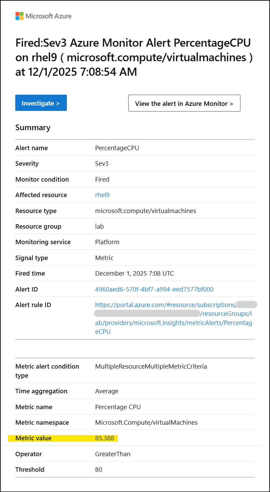


メトリック アラート ルールの設定手順などは、以下の公開情報やブログをご参照ください。
[Azure Monitor のメトリック警告ルールを作成する - Azure Monitor | Microsoft Learn](https://learn.microsoft.com/ja-jp/azure/azure-monitor/alerts/alerts-create-metric-alert-rule)
[Azure Monitor でアクション グループを作成および管理する - Azure Monitor | Microsoft Learn](https://learn.microsoft.com/ja-jp/azure/azure-monitor/alerts/action-groups)
[Azure Monitor のアラートに関するよくあるご質問 | Japan Azure Monitoring Support Blog](https://jpazmon-integ.github.io/blog/AzureMonitorEssential/MonitorAlertFAQ/#%E3%83%A1%E3%83%88%E3%83%AA%E3%83%83%E3%82%AF-%E3%82%A2%E3%83%A9%E3%83%BC%E3%83%88-%E3%83%AB%E3%83%BC%E3%83%AB)

<br><!-- 小項目の終わり <br> を追加する -->


#### 5.2.4 アクティビティ ログ アラート
アクティビティ ログ アラートは、Azure リソースの[アクティビティ ログ](https://learn.microsoft.com/ja-jp/azure/azure-monitor/platform/activity-log?tabs=log-analytics)を監視する機能です。
アクティビティ ログ アラートには、サービス正常性アラートやリソース正常性アラートも含まれます。


**1. 条件に一致するアクティビティ ログが記録されているかどうかを評価する**
監視する Azure リソースやアクティビティ ログの条件を決めます。
例 : Azure VM の割り当て解除 (Deallocate Virtual Machine)
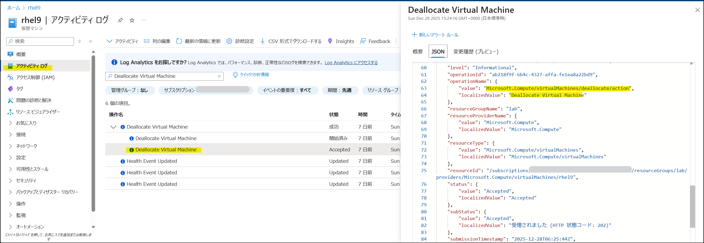


アクティビティ ログ アラートは、指定した条件に一致するアクティビティ ログ イベントが発生しているかどうかを評価します。監視対象の Azure リソースで条件に一致するアクティビティ ログが記録されると、アラートが発報します。
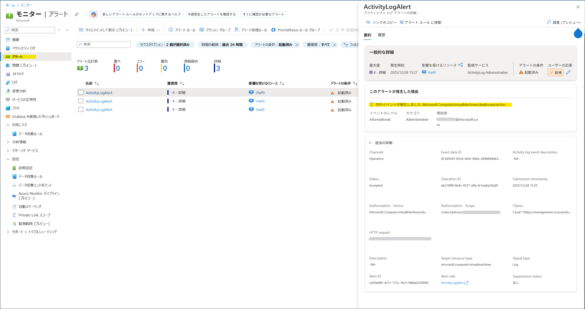


**2. 通知や自動アクションを実行する**
アラートが発報した時に通知する方法や、実行するアクションは「アクション グループ」で設定します。
アラート ルールにアクション グループを関連付けると、メールや電話、SMS で通知したり、Webhook などの自動アクションを実行することが可能です。

※ 以下例はアクション グループで共通アラート スキーマを有効化した時に通知されたメールです。
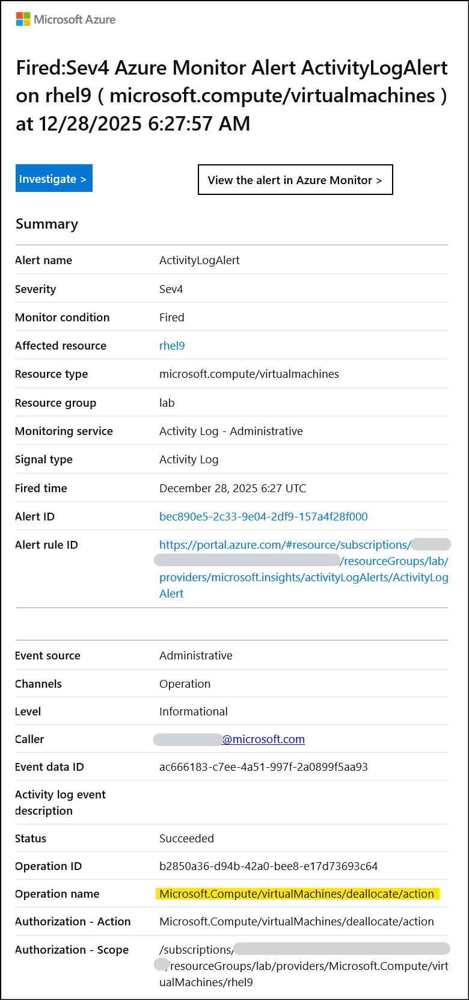


アクティビティ ログ アラートの設定手順などは、以下の公開情報やブログをご参照ください。
[アクティビティ ログ、サービス正常性、またはリソース正常性の警告ルールを作成する - Azure Monitor | Microsoft Learn](https://learn.microsoft.com/ja-jp/azure/azure-monitor/alerts/alerts-create-activity-log-alert-rule?tabs=activity-log)
[Azure Monitor のアラートに関するよくあるご質問 | Japan Azure Monitoring Support Blog](https://jpazmon-integ.github.io/blog/AzureMonitorEssential/MonitorAlertFAQ/#%E3%83%AD%E3%82%B0-%E3%82%A2%E3%83%A9%E3%83%BC%E3%83%88-%E3%83%AB%E3%83%BC%E3%83%AB)

<br><!-- 小項目の終わり <br> を追加する -->


#### 5.2.5 サービス正常性アラートとリソース正常性アラート
**■ サービス正常性アラート**
サービス正常性アラートは、お客様環境にてご利用いただいている Azure サービスおよびリージョンを監視対象とし、Azure サービス自体の正常性を監視する機能です。Azure サービスの障害や計画メンテナンス、サービスの廃止などのイベントが発生した際に、メールや SMS 等の方法で通知することが可能です。
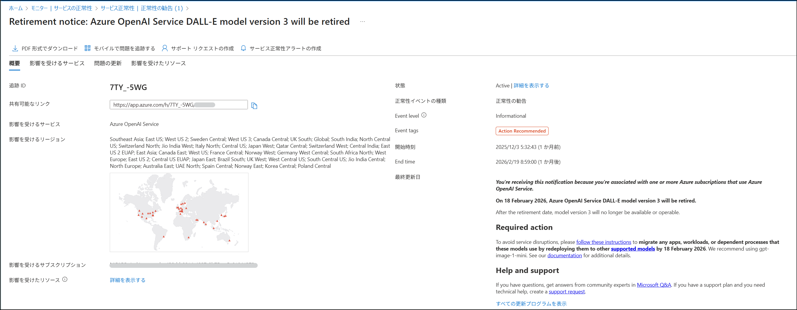


**1. 条件に一致するアクティビティ ログが記録されているかどうかを評価する**
監視する Azure サービス、リージョン、イベントの種類を指定します。サービス正常性アラートは、ご利用いただいているサービスおよびリージョンを対象としたイベントが発生した場合にのみ通知が行われる仕組みのため、"サービス" や "リージョン" はすべて選択いただくことを推奨しております。
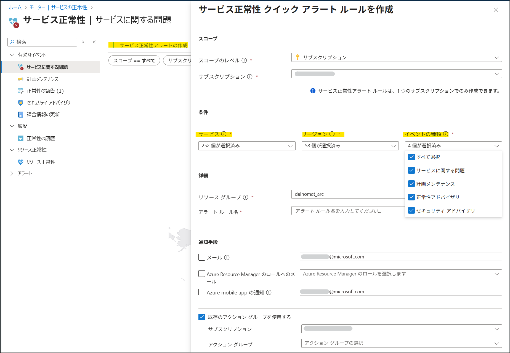

例. Azure OpenAI Service の正常性の勧告
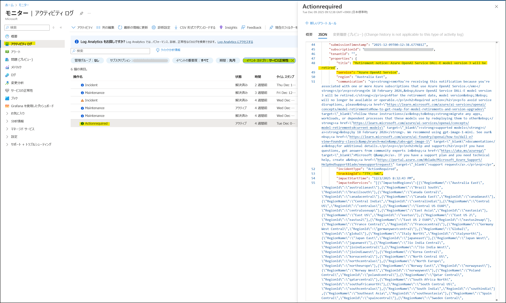


サービス正常性アラート（アクティビティ ログ アラート）は、指定した条件に一致するアクティビティ ログ イベントが発生しているかどうかを評価します。監視対象のサービスやリージョンに関するサービス正常性イベントのアクティビティ ログが記録されると、アラートが発報します。
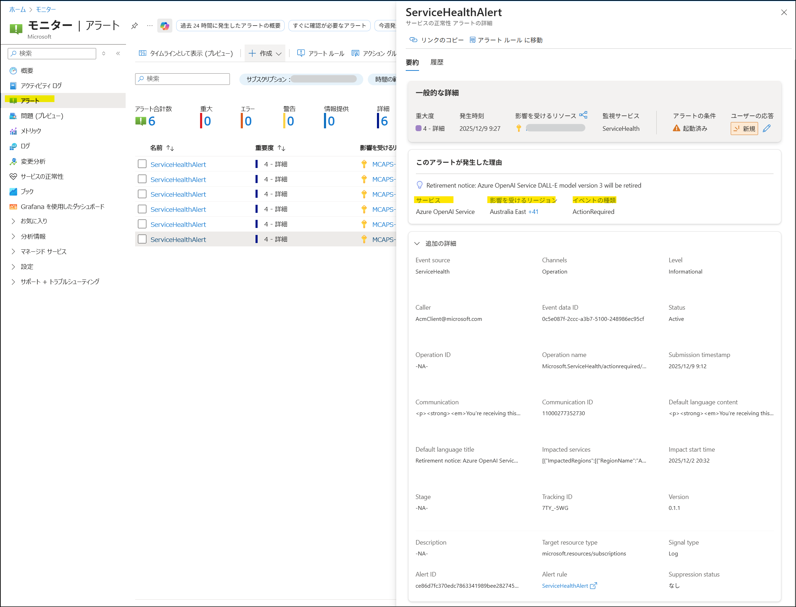


**2. 通知や自動アクションを実行する**
アラートが発報した時に通知する方法や、実行するアクションは「アクション グループ」で設定します。
アラート ルールにアクション グループを関連付けると、メールや電話、SMS で通知したり、Webhook などの自動アクションを実行することが可能です。


※ 以下例は Azure Monitor のアクション グループによって通知されたメールです。
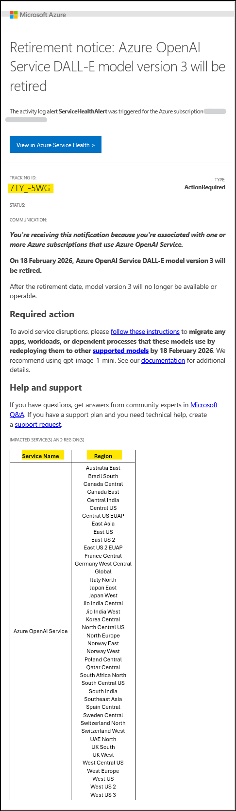

サービス正常性アラートの設定手順などは、以下の公開情報やブログをご参照ください。
[Azure ポータル で Azure サービス通知の Service Health アラートを作成する - Azure Service Health | Microsoft Learn](https://learn.microsoft.com/ja-jp/azure/service-health/alerts-activity-log-service-notifications-portal)
[サービス正常性アラートの設定手順と推奨設定について | Japan Azure Monitoring Support Blog](https://jpazmon-integ.github.io/blog/ame/HowToSetUpServiceHealthAlertsAndRecommendedSettings/)

<br>

**■ リソース正常性アラート**
リソース正常性アラートは、Azure リソースの正常性を監視する機能です。
リソースの正常性に変化が生じた際に、メールや SMS 等の方法で通知することが可能です。サービス正常性アラートは Azure サービスおよびリージョンを監視対象としますが、リソース正常性アラートはお客様環境の固有のリソースを監視します。監視対象のスコープが異なるとご認識ください。

**1. 条件に一致するアクティビティ ログが記録されているかどうかを評価する**
監視する Azure リソースや監視条件を決めます。
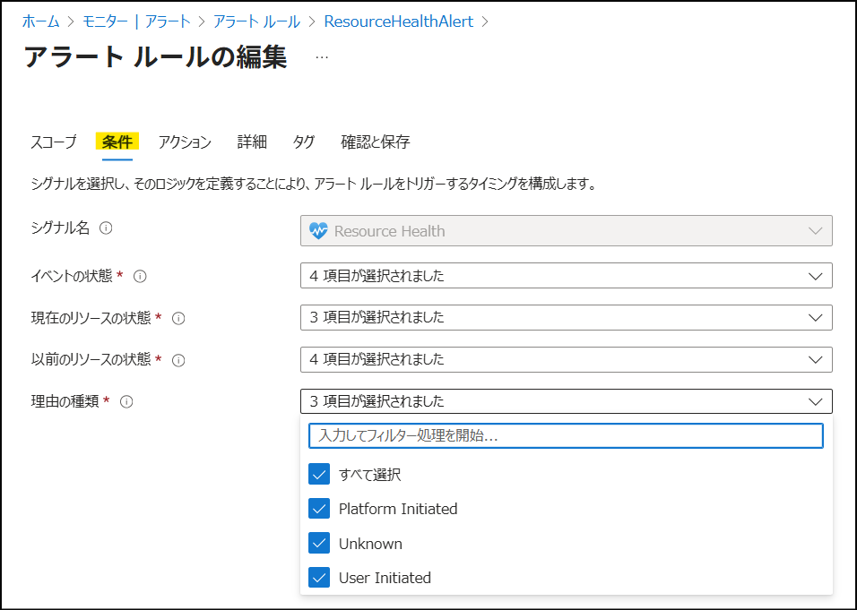


例 : Azure VM のリソース正常性（以下はリソース正常性が解消した際のアクティビティ ログの一例）
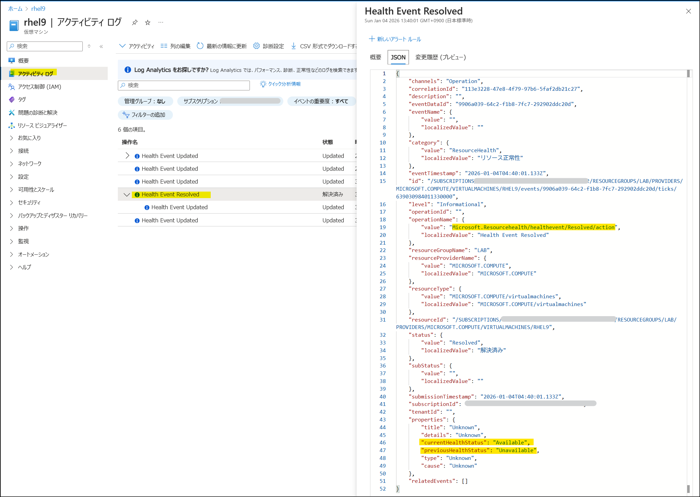


リソース正常性アラート（アクティビティ ログ アラート）は、指定した条件に一致するアクティビティ ログ イベントが発生しているかどうかを評価します。監視対象のリソースで条件に一致したリソース正常性イベントのアクティビティ ログが記録されると、アラートが発報します。
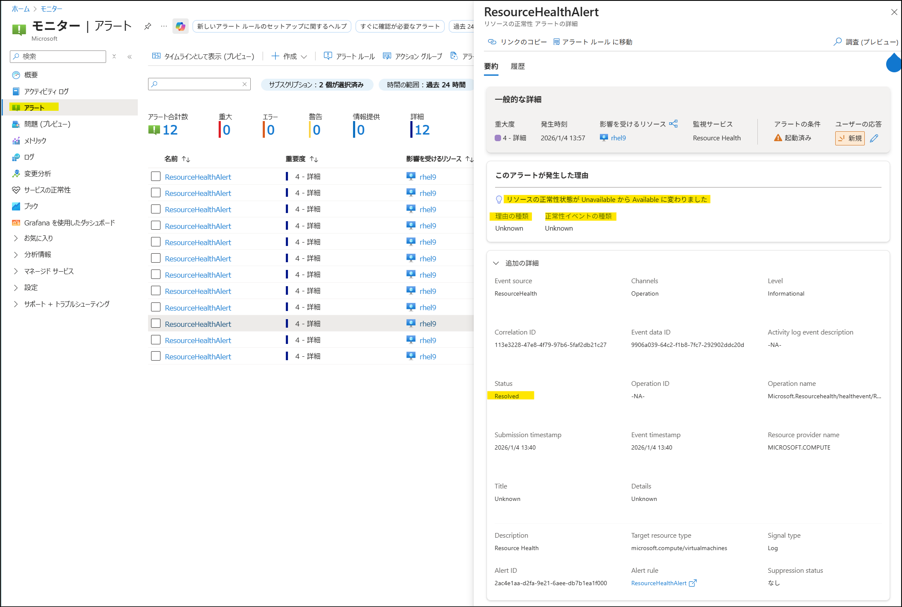


**2. 通知や自動アクションを実行する**
アラートが発報した時に通知する方法や、実行するアクションは「アクション グループ」で設定します。
アラート ルールにアクション グループを関連付けると、メールや電話、SMS で通知したり、Webhook などの自動アクションを実行することが可能です。

※ 以下例は Azure Monitor のアクション グループで共通アラート スキーマを有効化した時に通知されたメールです。
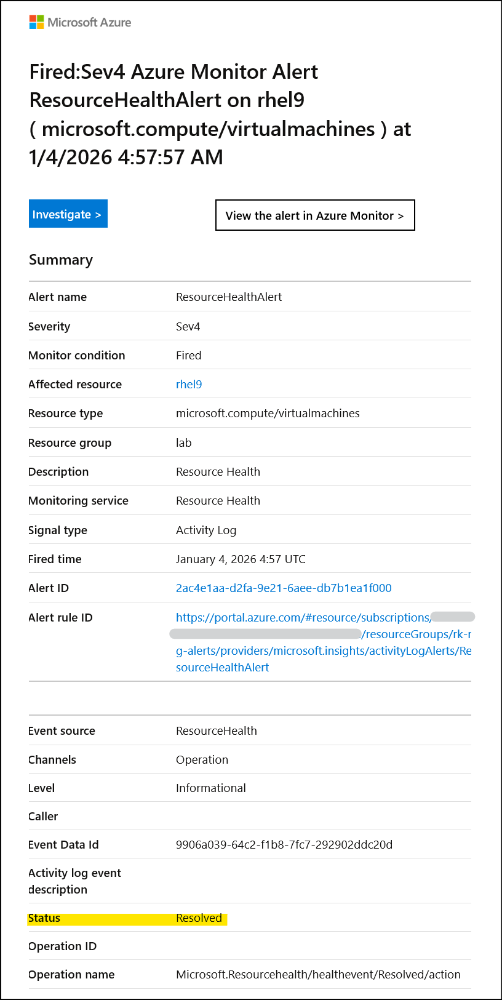


リソース正常性アラートの設定手順などは、以下の公開情報やブログをご参照ください。
[Resource Health アラートを作成する方法 - Azure Service Health | Microsoft Learn](https://learn.microsoft.com/ja-jp/azure/service-health/resource-health-alert-arm-template-guide)
[リソース正常性アラートに関するよくあるご質問 | Japan Azure Monitoring Support Blog](https://jpazmon-integ.github.io/blog/AzureMonitorEssential/ResourceHealthAlert/)

<br><!-- 小項目の終わり <br> を追加する -->


#### 5.2.6 Log Analytics ワークスペースのコスト分析
Log Analytics ワークスペースのコストは収集するデータの量によって変動します。

**1. ログの料金について**
Log Analytics ワークスペースのコストは主に以下 3 点によって決まります。
- データのインジェスト量 (取り込んだログの量)
- データの保有量と保有期間
- Log Analytics ワークスペースが存在するリージョン


**■ データ インジェストに対するコストについて**
インジェストに対するコストは、取り込み先テーブルのテーブル プラン (Analytics (分析) / Basic (基本) / Auxiliary (補助)) により異なり、既定は Analytics プランで設定されています。また、既定の価格モデルは「従量課金制」です。
金額の詳細は以下の公開情報をご参照ください。
[価格 - Azure Monitor | Microsoft Azure](https://azure.microsoft.com/ja-jp/pricing/details/monitor/)

プランを変更する場合はテーブル単位で設定変更が可能です。詳細は以下の公開情報をご参照ください。
[Log Analytics ワークスペースでのデータ使用状況に基づいてテーブル プランを選択する - Azure Monitor | Microsoft Learn](https://learn.microsoft.com/ja-jp/azure/azure-monitor/logs/logs-table-plans?tabs=portal-1#set-the-table-plan)


**■ データ保持に対するコストについて**
Log Analytics ワークスペースに取り込まれたデータは 31 日間無料で保持されます。
データ保持期間を 31 日にご設定いただいている場合はデータ保持料金の費用は発生しません。
既定のデータ保持期間は 30 日です。

<br>

**2. 現在のコストを確認する方法**
[Log Analytics ワークスペース] - [設定] - [使用料と推定コスト] のページ右側に “使用状況のグラフ” として、過去 31 日間の、課金対象のテーブルごとのデータ インジェスト量が表示されます。
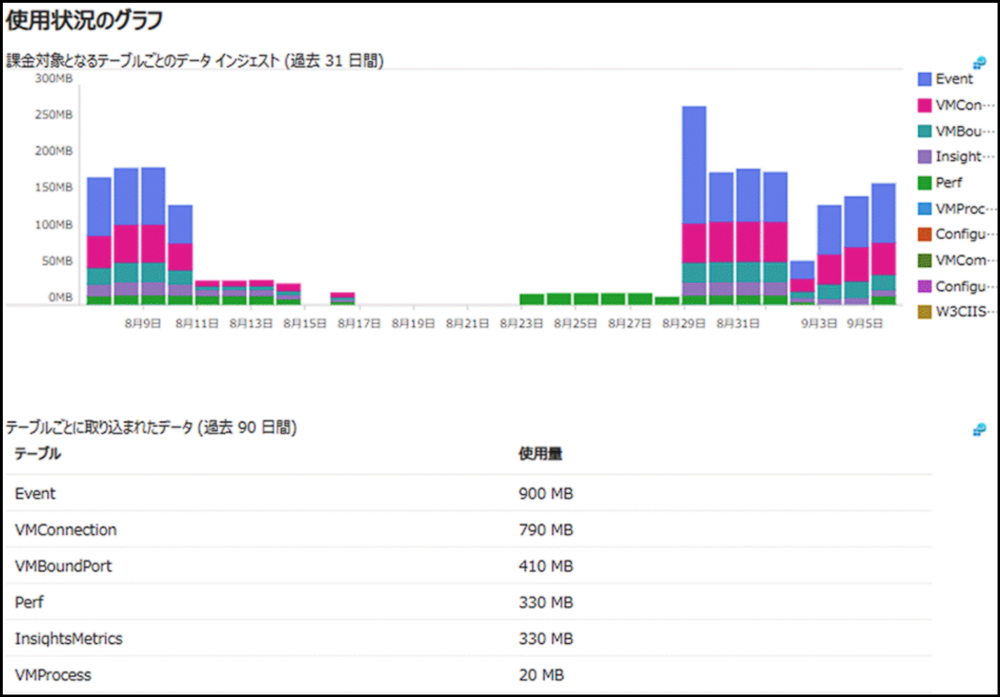

使用料と推定コストについては以下の公開情報をご参照ください。
[Azure Monitor のコストと使用量 - Azure Monitor | Microsoft Learn](https://learn.microsoft.com/ja-jp/azure/azure-monitor/fundamentals/cost-usage#log-analytics-workspace)

<br>

**3. クエリを用いてコストを確認する方法**
Log Analytics ワークスペース内の各テーブルの使用状況データは [Usage](https://learn.microsoft.com/ja-jp/azure/azure-monitor/reference/tables/usage) テーブルに集計されています。Usage の Quantity は MB（Mbytes）単位です。以下は、過去 31 日間の「テーブル (DataType) 別・日別」の課金対象データ量 (MB) を集計する例です。

~~~
Usage 
| where TimeGenerated > ago(32d) 
| where StartTime >= startofday(ago(31d)) and EndTime < startofday(now()) 
| where IsBillable == true 
| summarize BillableDataMB = sum(Quantity) by bin(StartTime, 1d), DataType
| render columnchart
~~~

また、特定のテーブルで課金対象データ量を確認する場合は以下の標準列を使用します。
*   `_IsBillable`：そのレコードが課金対象かどうか （true / false）
*   `_BilledSize`：そのレコードのサイズ（Bytes）

以下は Event テーブルの Event ID ごとの課金対象データ量（MB）を日別に集計する例です。
~~~
Event 
| where TimeGenerated > startofday(ago(31d)) and TimeGenerated < startofday(now()) 
| where _IsBillable == true 
| summarize count(), BillableDataMB =sum(_BilledSize) / 1000 / 1000 by EventID, bin(TimeGenerated, 1d)
~~~

Log Analytics のコスト分析の詳細は、以下の公開情報をご参照ください。 
[Azure Monitor の Log Analytics ワークスペースでの使用量を分析します - Azure Monitor | Microsoft Learn](https://learn.microsoft.com/ja-jp/azure/azure-monitor/logs/analyze-usage#querying-data-volumes-from-the-usage-table)

<br>

**4. コストを分析し削減を検討する**
コスト分析と削減についての検討については以下のブログをご参照ください。
[Log Analytics ワークスペースのコスト増加の原因を分析しコスト削減を検討する | Japan Azure Monitoring Support Blog](https://jpazmon-integ.github.io/blog/LogAnalytics/HowToManageLogAnalyticsBilling/)


<br><!-- 小項目の終わり <br> を追加する -->


#### 5.2.7 ストレージ アカウントに収集したデータの可視化
本記事 [5.1.6 診断設定](#5-1-6-診断設定) や [5.1.7 データ エクスポート](#5-1-7-データ-エクスポート) にて、ストレージ アカウントに出力したログ ファイルに対してもクエリを実行することが可能です。本項では次の 2 つのアプローチを紹介します。

1 つは Azure Data Explorer に BLOB（ログ ファイル）を取り込んで分析する方法、もう 1 つは Log Analytics ワークスペースで externaldata 演算子を使ってクエリを実行する方法です。なお、頻繁にデータにクエリしたり、アラートを発報する必要がある場合は、診断設定ではストレージ アカウントではなく Log Analytics ワークスペースへ収集することをご検討ください。


**■ Azure Data Explorer を使う方法** <a id="azure-data-explorer"></a>
以下に Azure Data Explorer に BLOB を取り込んで、クエリする方法を簡単にご紹介します。

1. クラスターを作成します。
[クイック スタート: Azure Data Explorer クラスターとデータベースを作成する - Azure Data Explorer | Microsoft Learn](https://learn.microsoft.com/ja-jp/azure/data-explorer/create-cluster-and-database?tabs=free#create-a-cluster)

2. データベースを作成します。
[クイック スタート: Azure Data Explorer クラスターとデータベースを作成する - Azure Data Explorer | Microsoft Learn](https://learn.microsoft.com/ja-jp/azure/data-explorer/create-cluster-and-database?tabs=free#create-a-database)

3. Azure Data Explorer のクラスターに [Azure Data Explorer](https://dataexplorer.azure.com/) または下図の ADX の [概要] の [URI] からアクセスします。
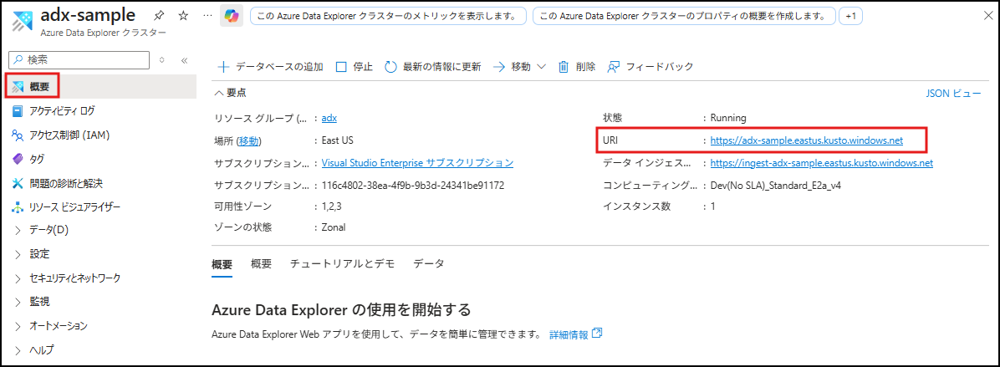

4. クエリを実行したいファイルがあるコンテナーからログを取り込みます。
[Azure Storage からデータを取得する - Azure Data Explorer | Microsoft Learn](https://learn.microsoft.com/ja-jp/azure/data-explorer/get-data-storage)

5. 4 で作成したテーブルに対して、下図のように Log Analytics ワークスペースと同じクエリでデータを参照できます。
    ※ Azure Data Explorer のクエリ結果（テーブル名は手順 4 にて設定できます）
    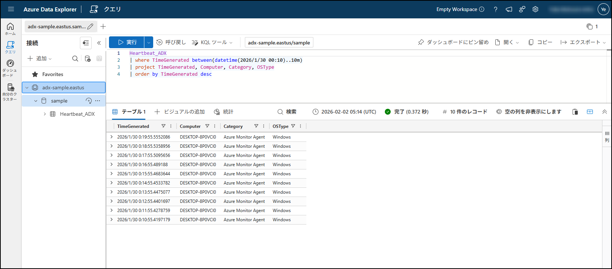

    ※ Log Analytics ワークスペースのクエリ結果
    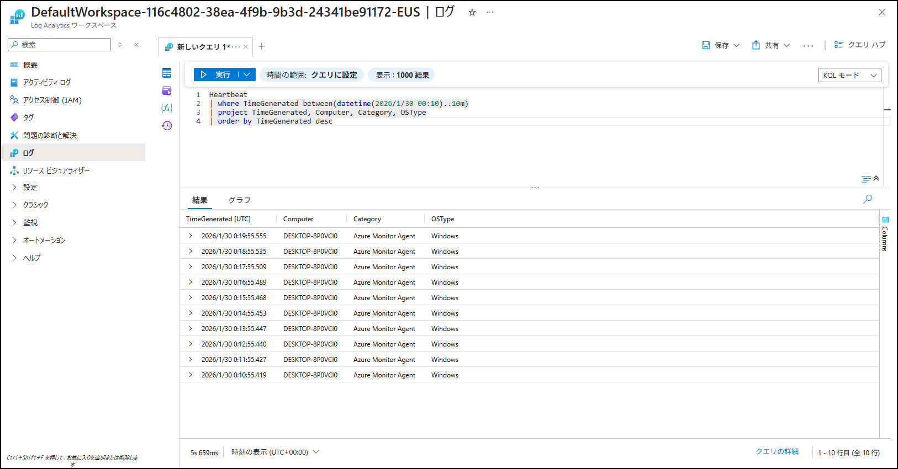


Azure Data Explorer の概要については、以下の公開情報をご参照ください。
なお、Azure Data Explorer リソースの利用にはコストが発生する点をご留意ください。
[Azure Data Explorer とは - Azure Data Explorer | Microsoft Learn](https://learn.microsoft.com/ja-jp/azure/data-explorer/data-explorer-overview)
[Azure Data Explorer の取り込まれたデータの GB あたりのコスト - Azure Data Explorer | Microsoft Learn](https://learn.microsoft.com/ja-jp/azure/data-explorer/pricing-cost-drivers)

<br>

**■ `externaldata` 演算子を使う方法**
Log Analytics ワークスペースの [ログ] から `externaldata` 演算子にて、ストレージ アカウントの BLOB に対してクエリを実行できます。`externaldata` 演算子の使い方を簡単にご紹介します。

1. クエリを実行したい BLOB の SAS を取得します。
   [ストレージ コンテナーと BLOB の共有アクセス署名 (SAS) トークンを作成する - Foundry Tools | Microsoft Learn](https://learn.microsoft.com/ja-jp/azure/ai-services/translator/document-translation/how-to-guides/create-sas-tokens?source=recommendations&tabs=Containers#create-sas-tokens-in-the-azure-portal)

2. [BLOB SAS URL] をコピーします。
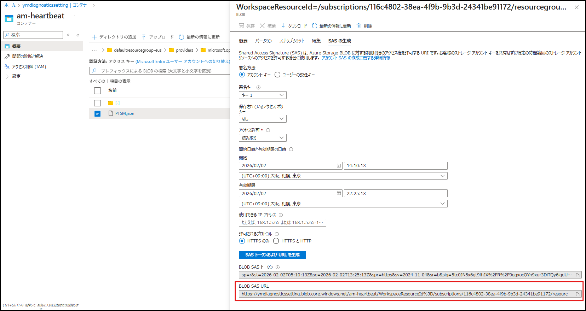

3. Log Analytics ワークスペースの [ログ] にて、2 でコピーした [BLOB SAS URL] を以下クエリの `<BLOB SAS URL>` に設定すると、BLOB のデータに対してクエリを実行できます。
    ```
    let Testdata = externaldata(TimeGenerated:datetime, Computer:string, Category:string, OSType:string)[
    h@"<BLOB SAS URL>"  
    ] with (format='multijson');  
    Testdata  
    ```
    
    ※ externaldata 演算子の実行例
    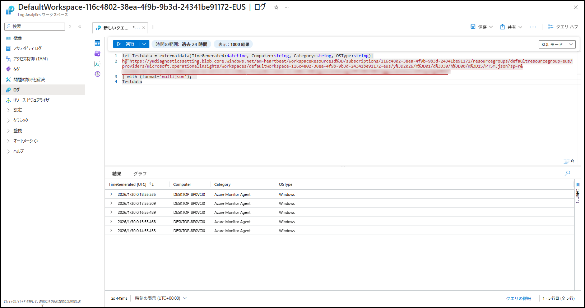
  
    なお、txt 形式で 1 行のレコードを dynamic として取り込むことで、全プロパティを取得することもできます。
    ```
    let Testdata = externaldata(RawData:dynamic) [
    h@"<BLOB SAS URL>"  
    ] with (format='txt');  
    Testdata  
    | evaluate bag_unpack(RawData)  
    ```
    
    ※ externaldata 演算子ですべてのプロパティを取得する実行例
    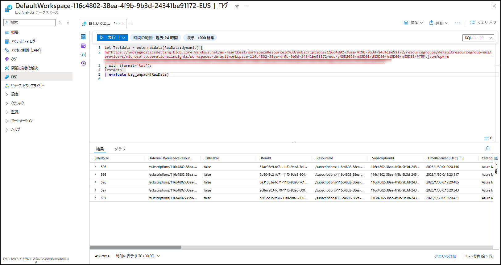


`externaldata` 演算子については、以下の公開情報をご参照ください。
[エクスターナルデータ演算子 - Kusto | Microsoft Learn](https://learn.microsoft.com/ja-jp/kusto/query/externaldata-operator?view=microsoft-fabric)

<br><!-- 小項目の終わり <br> を追加する -->


#### 5.2.8 Application Insights のクエリ
Application Insights に記録されたログは、Application Insights が Log Analytics ワークスペースと統合されているため、Application Insights と Log Analytics ワークスペースの両方から参照できます。

Application Insights は Azure ポータル > Application Insights / Log Analytics ワークスペース > [監視] > [ログ] からクエリを実行します。UI の構成や機能は同じであるため、クエリの実行方法については本記事 [5.2.1 Log Analytics ワークスペースのクエリ](#5-2-1-Log-Analytics-ワークスペースのクエリ) をご参照ください。ただし、ご留意いただく点が 2 つあります。


**1. Application Insights と Log Analytics ワークスペースで同じデータを参照する場合のテーブルとカラムが異なります。**
Application Insights と Log Analytics ワークスペースのテーブルとカラムの対応は以下の公開情報でご案内しております。
テーブルは [テーブル構造] にてご案内しており、Application Insights では [レガシー テーブル名] が利用されています。Log Analytics ワークスペースでは、[新しいテーブル名] が利用されています。カラムは [テーブル スキーマ] にてご案内しております。
例えばリクエスト ログを取得するには、Application Insights では requests テーブルを参照し、Log Analytics ワークスペースでは AppRequests テーブルを参照します。

[Application Insights のクラシック リソースをワークスペースベースのリソースに移行する - Azure Monitor - Azure Monitor | Microsoft Learn](https://learn.microsoft.com/ja-jp/previous-versions/azure/azure-monitor/app/convert-classic-resource#workspace-based-resource-changes)


<br>

**2. Log Analytics ワークスペースからは関連付いたすべての Application Insights のログが参照されます。**
Application Insights の [ログ] からクエリを実行すると、対象の Application Insights のログのみを参照します。
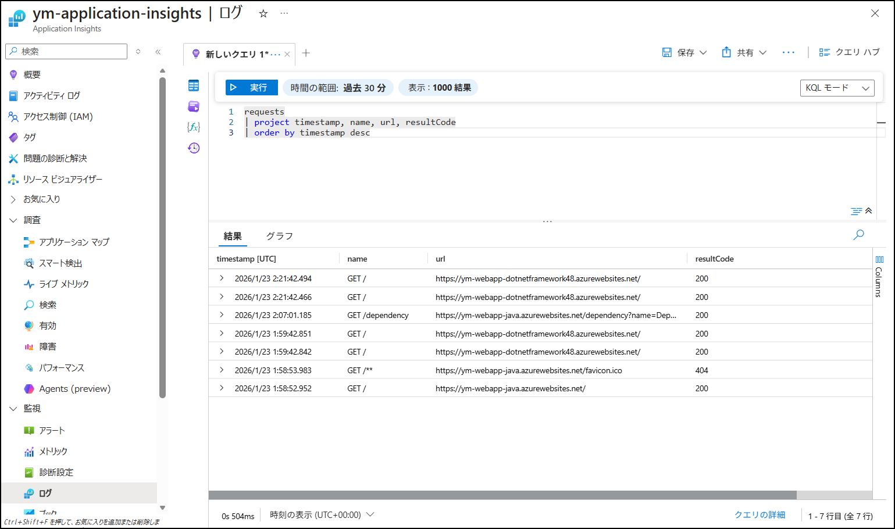


一方で、Log Analytics ワークスペースの [ログ] からクエリを実行すると、対象の Log Analytics ワークスペースに関連付いたすべての Application Insights のログを参照できます。下図の赤枠は上図の Application Insights とは別の Application Insights のログです。
他の Application Insights からのログも同時に参照できることが分かります。
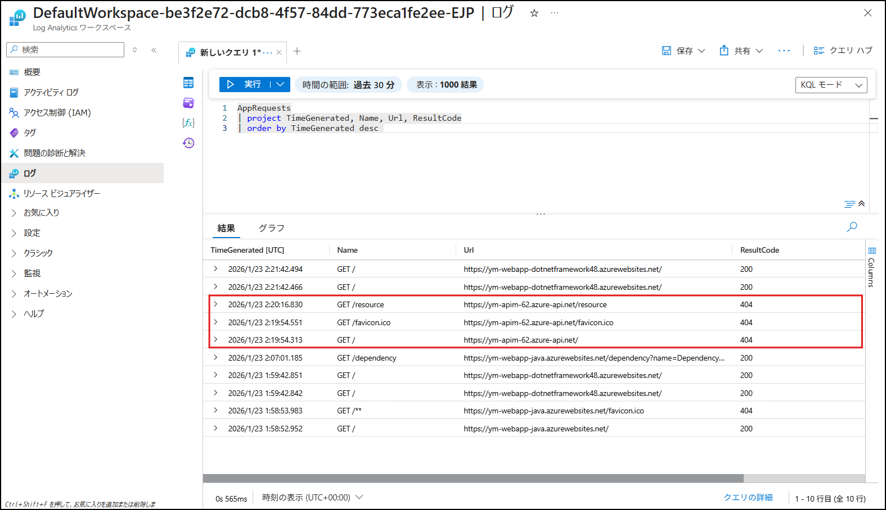

<br><!-- 大項目の終わり <br> を追加する -->


<!-- 中項目 -->
### 5.3 可視化
本項では、取得データを可視化する方法についてご紹介します。

<br>

#### 5.3.1 ワークブック
**1. Azure ワークブックの概要**
Azure ワークブックを利用することで、様々な Azure リソースから得られるデータをもとに、視覚的なレポートを作成することができます。ワークブックは単なるグラフ表示にとどまらず、以下のような内容を組み合わせることで、分析・調査・状況説明に適したレポートを作成できる点が特徴です。

- テキストによる説明
- グラフ、表、タイルなどのビジュアル表示
- パラメーターを用いた対話型操作

<br>

**2. Azure ワークブックが対応するデータ ソース**
Azure ワークブックは、さまざまなデータ ソースから情報を取得できます。

- ログ (Log Analytics ワークスペース、Application Insights)
- メトリック
- Azure Resource Graph
- Azure Resource Manager
- Azure Data Explorer
- JSON

サポートされているデータ ソースの詳細については、以下の公開情報をご参照ください。
[Azure Workbooks のデータ ソース - Azure Monitor | Microsoft Learn](https://learn.microsoft.com/ja-jp/azure/azure-monitor/visualize/workbooks-data-sources)

<br>

**3. Azure ワークブックの可視化機能**
ワークブックには、Azure Monitor のデータを視覚化するための豊富なビジュアル コンポーネントが用意されています。  
使用できる機能はデータ ソースや結果セットに依存しますが、以下のような代表的なコンポーネントがあります。
- [テキスト パラメーター](https://learn.microsoft.com/ja-jp/azure/azure-monitor/visualize/workbooks-visualizations#text-parameters)
- クエリの使用:
    - [グラフ](https://learn.microsoft.com/ja-jp/azure/azure-monitor/visualize/workbooks-visualizations#charts)
    - [グリッド](https://learn.microsoft.com/ja-jp/azure/azure-monitor/visualize/workbooks-visualizations#grids)
    - [タイル](https://learn.microsoft.com/ja-jp/azure/azure-monitor/visualize/workbooks-visualizations#tiles)
    - [ツリー](https://learn.microsoft.com/ja-jp/azure/azure-monitor/visualize/workbooks-visualizations#trees)
    - [ハニカム](https://learn.microsoft.com/ja-jp/azure/azure-monitor/visualize/workbooks-visualizations#honeycomb)
    - [統計](https://learn.microsoft.com/ja-jp/azure/azure-monitor/visualize/workbooks-visualizations#stat)
    - [グラフ](https://learn.microsoft.com/ja-jp/azure/azure-monitor/visualize/workbooks-visualizations#graphs)
    - [マップ](https://learn.microsoft.com/ja-jp/azure/azure-monitor/visualize/workbooks-visualizations#maps)
    - [テキストの視覚化](https://learn.microsoft.com/ja-jp/azure/azure-monitor/visualize/workbooks-visualizations#text-visualizations)

<br>

**4. Azure ワークブックのパラメーター機能**
Azure ワークブックの大きな特徴の一つが、パラメーター機能です。
パラメーターを使用すると、利用者からの入力を受け取り、その値をワークブック内の他のクエリやビジュアルで参照できます。
具体的には以下のような対話型のレポートを作成することができます。
- 表示対象の時間範囲を切り替える
- クエリ結果を動的に変更する
 
<br>

**5. パラメーターの表示方法と入力形式**
ワークブックでは、パラメーターを次のような形式で表示できます。
- テキスト ボックス
- ドロップダウン リスト
- 単一選択／複数選択
- JSON、KQL、Azure Resource Graph による値の動的生成

<br>

**6. Azure ワークブックの作成**
1. Azure ワークブックへのアクセス
Azure ワークブックには Azure ポータル > [モニター (監視)] > [ブック] よりアクセスすると、[ギャラリー] に Azure ワークブックのテンプレートが一覧表示されます。
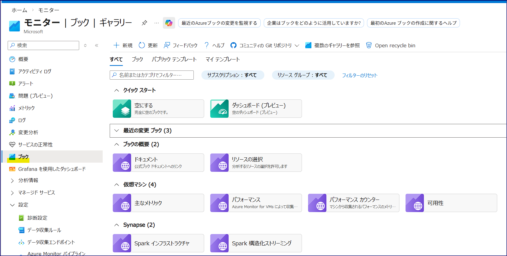


2. テンプレートの表示・編集
[ギャラリー] に表示されているテンプレートを開き、パラメーターを選択してグラフや表をカスタマイズできます。さらに、画面上部の [編集] を選択すると編集モードに切り替わります。編集モードでは、グラフや表の設定変更、パラメーターの追加・並べ替えが可能です。
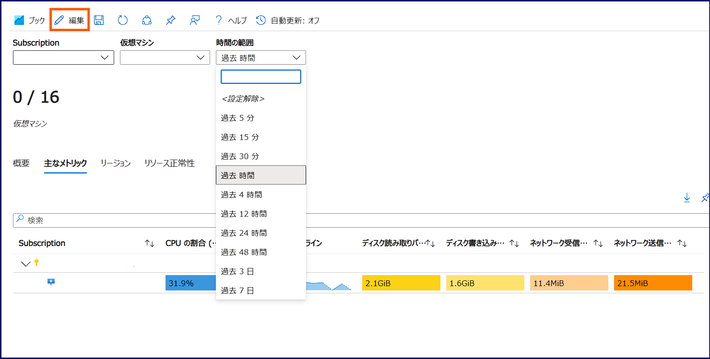

3. パラメーターの作成
パラメーターにより表示時間を切り替えるブックの作成方法について以下にご紹介します。
ⅰ. パラメーターを追加します。
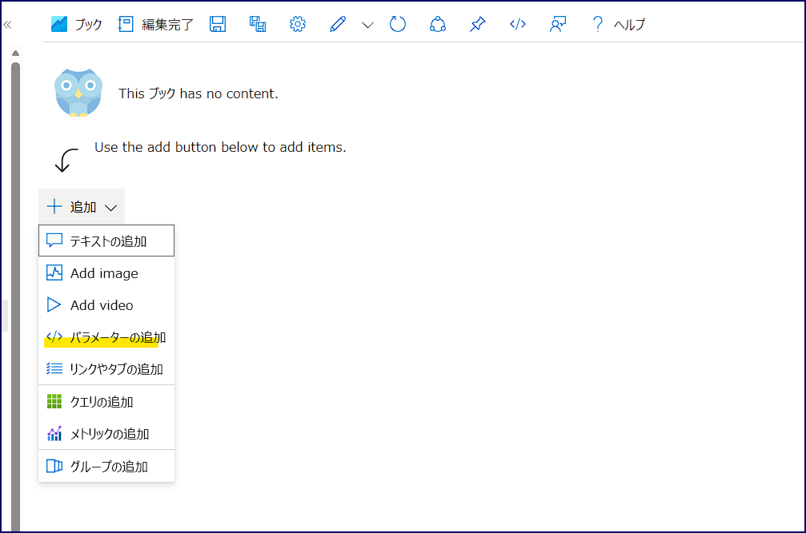
ⅱ. パラメーターの型では「時間の範囲の選択」を選びます。
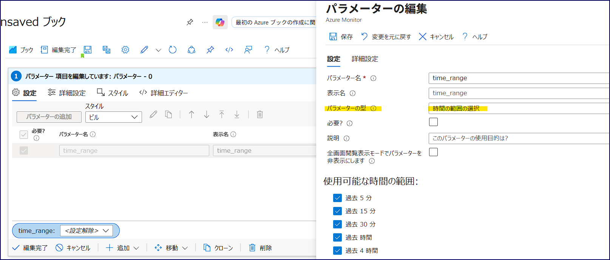
ⅲ. つづいてブックにクエリを追加し、[時間範囲] で先に作成したパラメーター名を指定します。
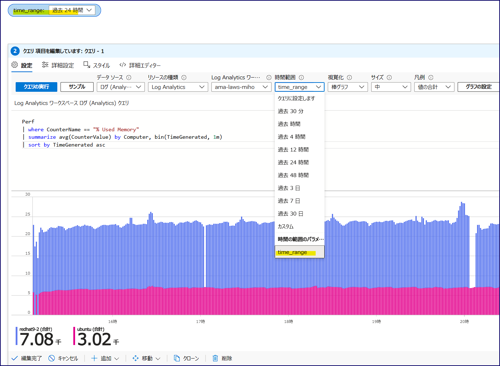
ⅳ. 編集完了後、パラメーターの値を変更すると自動でグラフが変化します。
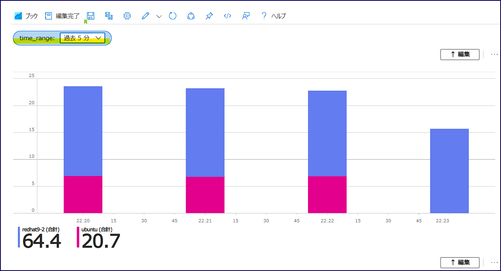


テンプレートやブックのパラメーター、ブックの作成・編集の詳細については、以下の公開情報をご参照ください。
[Azure Workbooks テンプレート - Azure Monitor | Microsoft Learn](https://learn.microsoft.com/ja-jp/azure/azure-monitor/visualize/workbooks-templates)
[ブックのパラメーターを作成する - Azure Monitor | Microsoft Learn](https://learn.microsoft.com/ja-jp/azure/azure-monitor/visualize/workbooks-parameters)
[Azure ワークブックを作成または編集する - Azure Monitor | Microsoft Learn](https://learn.microsoft.com/ja-jp/azure/azure-monitor/visualize/workbooks-create-workbook)

<br><!-- 小項目の終わり <br> を追加する -->


#### 5.3.2 ダッシュボード
Log Analytics ワークスペース内のログに対して実行したクエリをグラフ等に可視化し、ダッシュボードにピン留めすることで、Log Analytics ワークスペースに保存されたデータをリアルタイムで確認できます。

**■ ログ クエリの可視化手順**
Log Analytics ワークスペースにてクエリを実行します。
クエリの実行方法については、本記事 [5.2.1 Log Analytics ワークスペースのクエリ](#5-2-1-Log-Analytics-ワークスペースのクエリ) をご参照ください。

```
<サンプル クエリ>
AzureMetrics
| where MetricName contains "Percentage CPU"
| summarize AggregatedValue = avg(Average) by bin(TimeGenerated, 1m), _ResourceId
| render timechart
```

[保存] > [ピン留め先 Azure ダッシュボード] をクリックします。
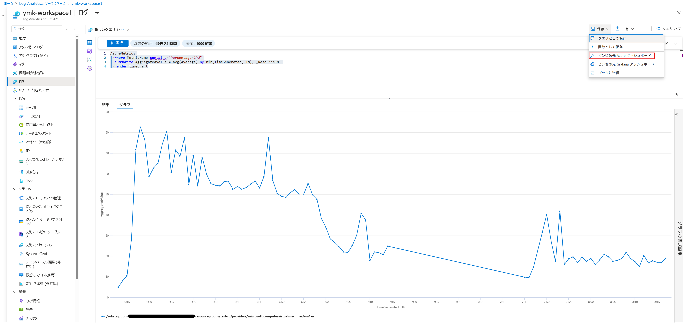

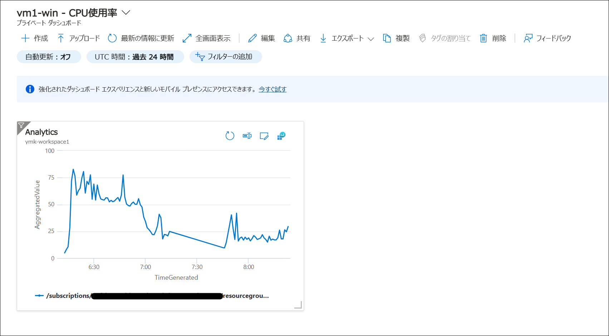

[Azure Monitor ログのデータを視覚化するダッシュボードを作成して共有する - Azure Monitor | Microsoft Learn](https://learn.microsoft.com/ja-jp/azure/azure-monitor/visualize/tutorial-logs-dashboards)


<br>

**■ Azure ワークブックとの違い**
ダッシュボードと類似機能の Azure ワークブックとの違いについて説明します。
Azure ワークブックの詳細は、本記事 [5.3.1 ワークブック](#5-3-1-ワークブック) をご参照ください。

**Azure ワークブック**
- テンプレートが充実している
- 分析内容のカスタマイズ性が高い (KQL 等にて分析内容を要件に合わせて変更できます。) 
- 設定が比較的難しいため利用難度が高い

※ Azure ワークブックは Azure ポータル > [モニター (監視)] > [ブック] からアクセスできます。
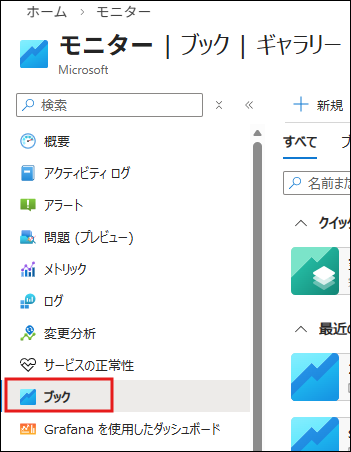

<br>

**ダッシュボード**
- 画面の表示方法 (レイアウト) を容易に変更できる
  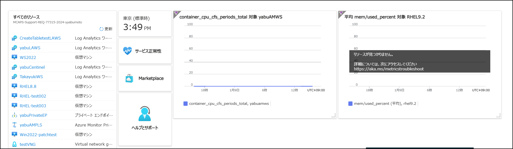

- Azure ワークブックをダッシュボードにピン留めすることができる
  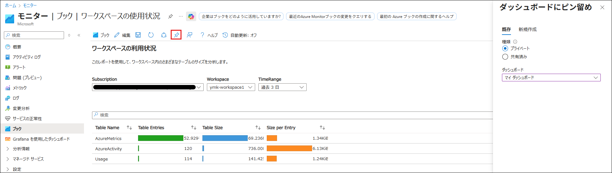

- 分析グラフ以外にもリソースやソリューション ページ等よく使う項目のリンクとしても活用できる
  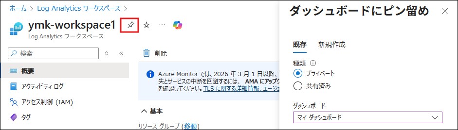

- ダッシュボードは Azure ポータル上のポータル メニュー (画面左上の三本線アイコン) > [ダッシュボード] からアクセスできます。
  

  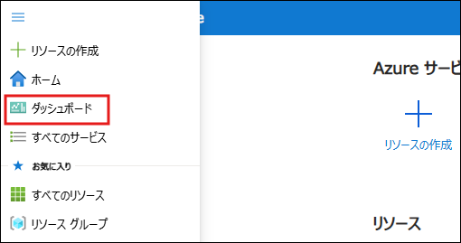

[Azure portal でダッシュボードを作成する - Azure portal | Microsoft Learn](https://learn.microsoft.com/ja-jp/azure/azure-portal/azure-portal-dashboards)

<br><!-- 小項目の終わり <br> を追加する -->


#### 5.3.3 メトリック エクスプローラー
メトリック エクスプローラーではメトリックを時系列のグラフとして可視化します。
Azure ポータル > 対象の Azure リソース > [監視] > [メトリック] からメトリック エクスプローラーにアクセスします。
以下は Azure VM のプラットフォーム メトリック (ホスト メトリック) とゲスト OS メトリックの表示の例です。

**■ プラットフォーム メトリック**
プラットフォーム メトリックは Azure VM を作成すると自動的に収集が開始され、[メトリック名前空間] を “仮想マシンホスト” に設定すると確認できます。
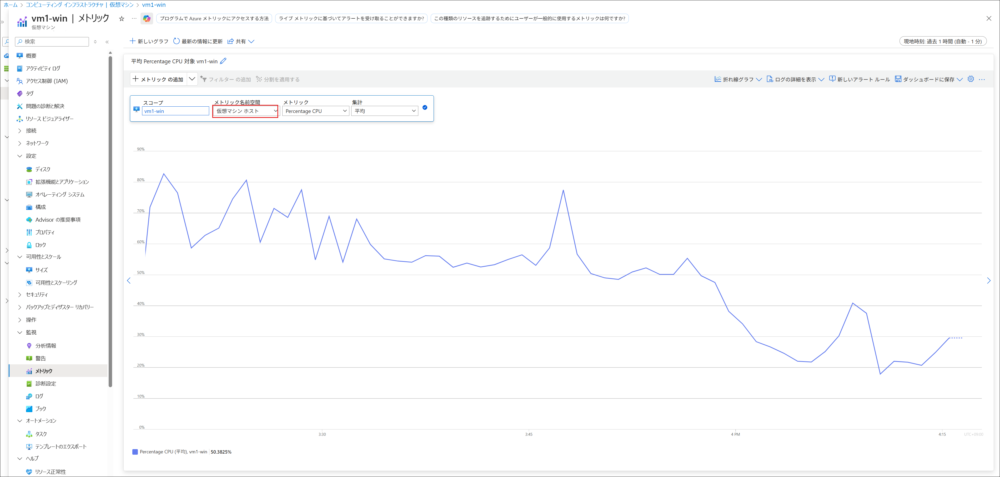


**■ ゲスト OS メトリック**
ゲスト OS メトリックはゲスト OS にインストールした Azure Monitor エージェントにより収集され、[メトリック名前空間] を “仮想マシンのゲスト” に設定すると確認できます。
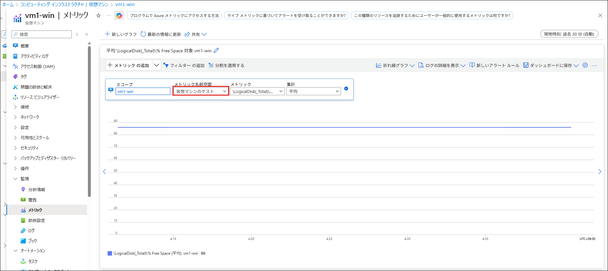


メトリック エクスプローラーの詳細や、プラットフォーム メトリックとゲスト OS メトリックの違いについては、以下の公開情報とブログをご参照ください。
[Azure Monitor メトリックス エクスプローラーを使用してメトリックを分析する - Azure Monitor | Microsoft Learn](https://learn.microsoft.com/ja-jp/azure/azure-monitor/metrics/analyze-metrics)
[Azure VM の監視について | Japan Azure Monitoring Support Blog](https://jpazmon-integ.github.io/blog/LogAnalytics/MonitorAzVM_logs/)

<br><!-- 小項目の終わり <br> を追加する -->


#### 5.3.4 Application Insights の可視化
Application Insights に収集されたデータは、クエリを利用しなくても Azure ポータルの UI から可視化・分析できます。
もちろん Log Analytics ワークスペースへ記録した他のログと同様に、クエリを利用した分析やアラート ルールの構成も可能です。

はじめに Application Insights の [調査] タブ内の各メニューを簡単に紹介します。詳細な使い方は以下の公開情報をご参照ください。
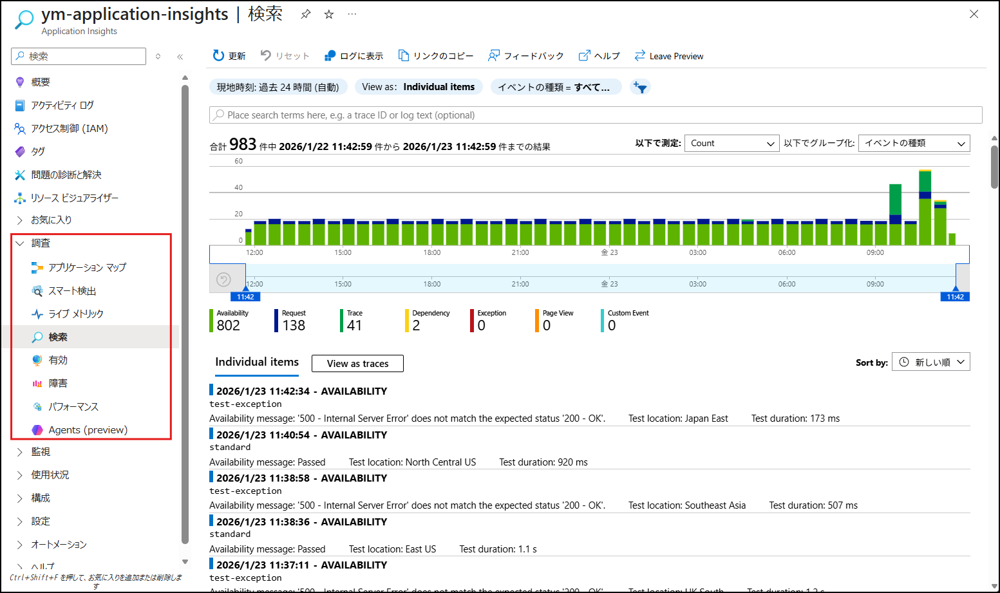


| ポータルの表示 | 内容 | 公開情報のリンク |
|--|--|--|
| アプリケーション マップ | アプリケーションの依存関係を可視化し、各コンポーネント間のパフォーマンスを表示します。 | [公開情報](https://learn.microsoft.com/ja-jp/azure/azure-monitor/app/app-map) |
| スマート検出 | 機械学習によってアプリケーションの異常を検知します。アラート ルールによる通知も設定できます。 | [公開情報](https://learn.microsoft.com/ja-jp/azure/azure-monitor/alerts/proactive-diagnostics) |
| ライブ メトリック | アプリケーションから収集されるテレメトリをリアルタイムに表示します。 |[公開情報](https://learn.microsoft.com/ja-jp/azure/azure-monitor/app/live-stream?tabs=otel) |
| 検索 | 記録されたテレメトリを検索します。後述の [失敗] と [パフォーマンス] では表示されない、ページ ビュー、例外、カスタム イベントなどの個々のテレメトリ項目を検索できます。 | [公開情報](https://learn.microsoft.com/ja-jp/azure/azure-monitor/app/failures-performance-transactions?tabs=search-view%2Cresults-list) |
| 有効 | 可用性テストを作成し、その結果を表示します。 | [公開情報](https://learn.microsoft.com/ja-jp/azure/azure-monitor/app/availability?tabs=standard) [ブログ](https://jpazmon-integ.github.io/blog/applicationInsights/privateAvailabilityTestSampleCode/) |
| 障害 | アプリケーションのエラー状況を分析します。 | [公開情報](https://learn.microsoft.com/ja-jp/azure/azure-monitor/app/failures-performance-transactions?tabs=failures-view%2Cresults-list) |
| パフォーマンス | 応答時間とリクエスト数からアプリケーションのパフォーマンスを分析します。 | [公開情報](https://learn.microsoft.com/ja-jp/azure/azure-monitor/app/failures-performance-transactions?tabs=performance-view%2Cresults-list) |
| Agents (Preview) | AI エージェントの監視データを可視化します。| [公開情報](https://learn.microsoft.com/ja-jp/azure/azure-monitor/app/agents-view) |


また、[使用状況] タブ内の各メニューではアプリケーションの利用状況 (ユーザー、セッションなど) を分析できます。
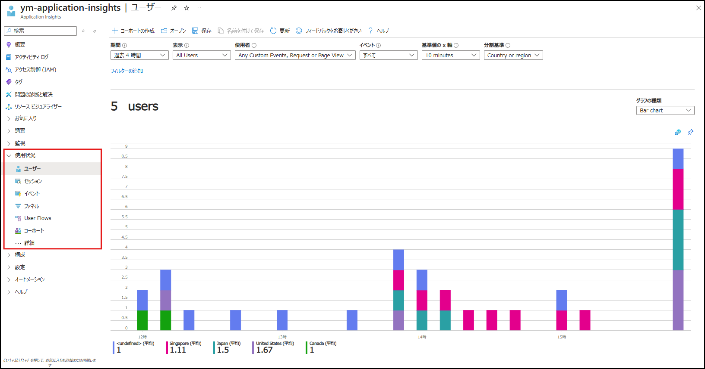

詳細は以下の公開情報をご参照ください。
[Application Insights による利用状況分析 - Azure Monitor | Microsoft Learn](https://learn.microsoft.com/ja-jp/azure/azure-monitor/app/usage?tabs=users)


<br><!-- 小項目の終わり <br> を追加する -->
<br><!-- 大項目の終わり <br> を追加する -->


<!-- 大項目 -->
## 6. セキュリティ
本章では Azure Monitor のセキュリティ機能に関してご紹介します。
すべてのセキュリティ設定を網羅するのではなく、利用者様が疑問を持ちやすく、よくお問い合わせをいただく項目に絞ってご紹介します。

Azure Monitor では、サービス側のセキュリティ対策として、既定でログの送信やクエリなどの転送中のデータが TLS 1.2 以降で保護され、保存されるすべてのデータとクエリは Microsoft マネージド キーで暗号化されます。
また、Microsoft Entra ID による認証や Azure RBAC によるアクセス制御が提供されています。
パブリック エンドポイントへの接続についてもエンドツーエンドで暗号化されるため、後述の Azure Monitor Private Link Scope (AMPLS) を構成しない場合にも、通信や保存データは暗号化されますのでご安心ください。

<br><!-- 大項目の終わり <br> を追加する -->

### 6.1 Azure Monitor Private Link Scope (AMPLS)
**1. AMPLS の概要**
AMPLS（Azure Monitor Private Link）を構成することで、Azure Monitor（Log Analytics や Application Insights など）への通信をパブリック インターネットを経由せず、プライベート ネットワーク経由で行うことが可能になります。

仮想ネットワーク (VNet) にプライベート エンドポイント (PE) を作成して AMPLS に接続し、AMPLS に関連付けた Log Analytics / Application Insights などに対するインジェスト（送信） および クエリ（参照）の通信を、インターネットを経由せず Private Link 経由にする構成です。基本的には VNet ごとに 1 つの PE を作成し構成します。
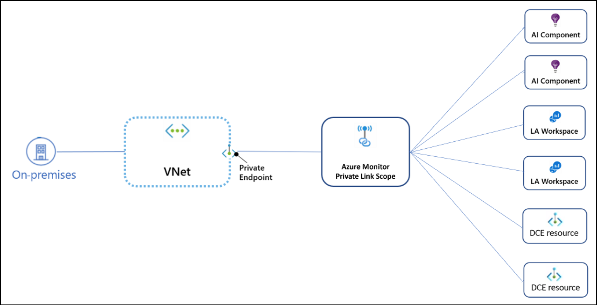

AMPLS の基本的な概念や概要については、以下の公開情報をご参照ください。
[基本的な概念 - Azure Monitor | Microsoft Learn](https://learn.microsoft.com/ja-jp/azure/azure-monitor/logs/private-link-security#basic-concepts)
[Azure Private Link を使用して、ネットワークを Azure Monitor に接続する - Azure Monitor | Microsoft Learn](https://learn.microsoft.com/ja-jp/azure/azure-monitor/fundamentals/private-link-security)

<br>

**■ AMPLS を構成するとできること**
例えば、次のような要件に対応できます。
-  インターネットへの outbound を厳しく制限したまま、VM から Log Analytics にログを送信したい
   > VNet 内の PE 経由で Azure Monitor のエンドポイントへ到達できるため、監視データがパブリック インターネットを経由しない設計が可能です。
-  特定のネットワークからのみ Log Analytics ワークスペースに対するクエリ（KQL）を許可したい
   >  AMPLS では、クエリ / インジェスト それぞれについて、アクセス モード (Open / PrivateOnly) を設計できます。

<br>

**■ AMPLS 環境下で扱う通信の種類**
- データの参照（クエリ）：Log Analytics のログ クエリ、Application Insights のクエリ等
- データの送信（インジェスト）：エージェントや Application Insights SDK 等からのログ/テレメトリ送信

<br>

**2. AMPLS の構成設計について**
AMPLS の構成においては、DNS の名前解決設計が重要なポイントとなります。

**■ AMPLS のプライベート DNS ゾーンについて**
AMPLS を作ると、Azure Monitor のエンドポイントは DNS ゾーンでプライベート IP にマップされ、通信が Private Link 経由になります。Azure Monitor はリソース固有エンドポイントだけでなく、共有 (グローバル/リージョン) エンドポイントも使います。

そのため、たとえ 1 つのリソースに Private Link を構成しただけでも DNS 構成が変更され、“すべてのリソース” 向けトラフィックに影響が出る可能性があります。さらに、同じ DNS を共有するネットワークで複数 AMPLS を作ると DNS が上書き (override) され、既存環境に影響が出る可能性があるため、設計段階での整理が重要となります。
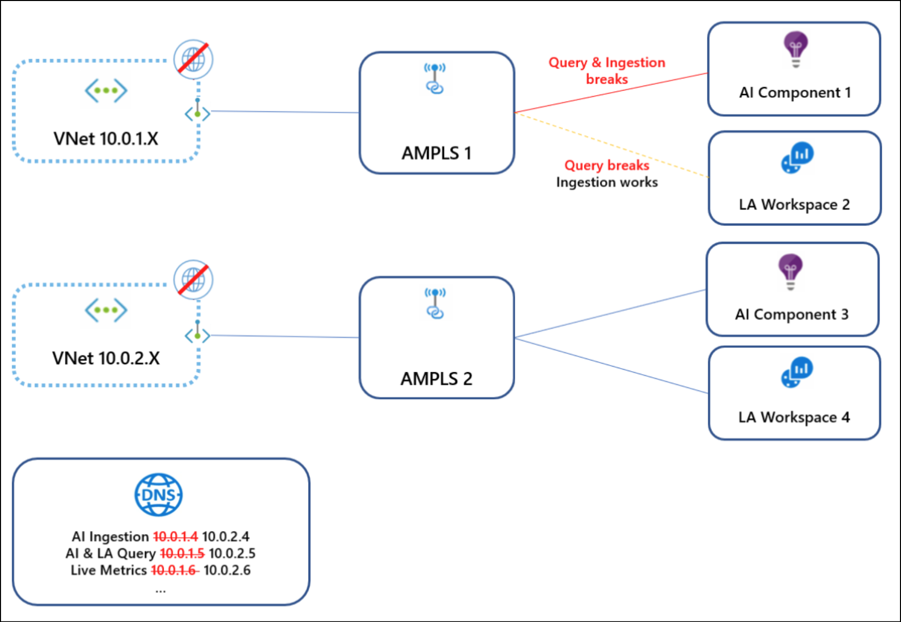

AMPLS のプライベート DNS ゾーンの詳細については、以下の公開情報をご参照ください。
[グローバルおよびリージョンエンドポイントの共有 - Azure Monitor | Microsoft Learn](https://learn.microsoft.com/ja-jp/azure/azure-monitor/fundamentals/private-link-security#shared-global-and-regional-endpoints)
[Azure Monitor Private Link の構成を設計する - Azure Monitor | Microsoft Learn](https://learn.microsoft.com/ja-jp/azure/azure-monitor/fundamentals/private-link-design)

<br>

**■ AMPLS のサブネット サイズ / 必要 IP アドレス数について**
Azure Monitor Private Link の構成では、サポートされる最小の IPv4 サブネットは /27 です。
Azure Monitor プライベート リンク エンドポイントの一覧については、エンドポイントの DNS 設定を確認してください。
また、より詳しい IP 消費の考え方（目安・計算方法の例）は、以下のブログをご参照ください。
[Azure Monitor のプライベート リンクを構成する - Azure Monitor | Microsoft Learn](https://learn.microsoft.com/ja-jp/azure/azure-monitor/fundamentals/private-link-configure?tabs=portal#review-endpoints-dns-settings)
[AMPLS で必要な IP アドレスの個数について | Japan Azure Monitoring Support Blog](https://jpazmon-integ.github.io/blog/AMPLS/ampls-ip-ranges/)

<br>

**■ AMPLS 利用時の注意点（制限事項 / 例外）**
AMPLS は以下の例外、制限事項があります。
- 診断ログ 
[診断設定](https://learn.microsoft.com/ja-jp/azure/azure-monitor/essentials/diagnostic-settings)で Log Analytics ワークスペースに送信されるログやメトリックは、Azure 基盤側で管理されているセキュアなプライベート Microsoft チャネル経由で送信されるため、AMPLS のネットワーク制御の影響を受けません。

- ゲスト OS メトリック
Azure Monitor エージェント (AMA) により送信されるゲスト OS メトリックは、AMPLS 経由で収集することができません。

<br>

**3. AMPLS の構成について**
構成手順の概要は以下のとおりです。詳細は以下の公開情報をご参照ください。
1.  [AMPLS を作成します](https://learn.microsoft.com/ja-jp/azure/azure-monitor/fundamentals/private-link-configure?tabs=portal#create-azure-monitor-private-link-scope-ampls)。
2.  [Azure Monitor リソースを AMPLS に接続します](https://learn.microsoft.com/ja-jp/azure/azure-monitor/fundamentals/private-link-configure?tabs=portal#connect-resources-to-the-ampls)。
3.  [PE を作成し AMPLS に接続します](https://learn.microsoft.com/ja-jp/azure/azure-monitor/fundamentals/private-link-configure?tabs=portal#connect-ampls-to-a-private-endpoint)。

PE の IP 割り当てを**静的**にすると、作成後に PE 側へ割り当てる IP（＝プライベート DNS で解決される各エンドポイントの宛先）を増やせません。そのため、後から AMPLS にデータ収集エンドポイント (DCE) や Application Insights などのリソースを追加して到達先エンドポイントが増える場合、既存の PE では対応できず作り直しが必要になります。将来的に追加で AMPLS にリソースを接続させる可能性がある場合は **動的**割り当てを推奨します。
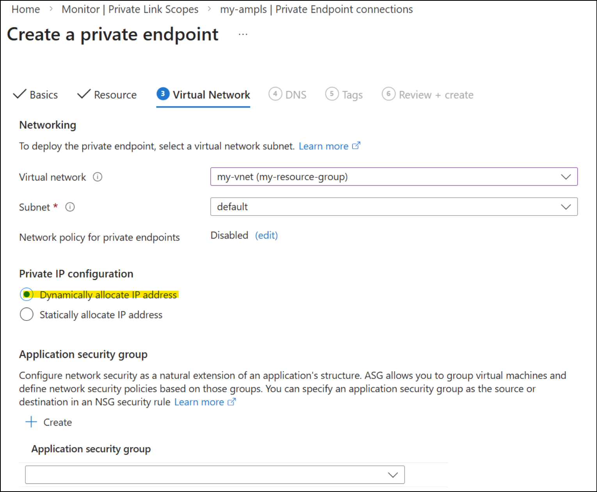


<br><!-- 中項目の終わり <br> を追加する -->

### 6.2 データ削除
Log Analytics ワークスペースのログは、保持期間を超えると自動的に削除されます。
一方、保持期間を迎える前にログを削除する場合は、[REST API](https://learn.microsoft.com/ja-jp/azure/azure-monitor/logs/personal-data-mgmt) を利用いただく必要がございます (Azure ポータルから手動でログを削除することはできません)。ログを削除するための REST API は用途の異なる 2 種類があり、目的に応じて使い分けていただく必要があります。


**■ Purge API**
Log Analytics ワークスペースから対象データを完全に削除します。このため、[GDPR（EU 一般データ保護規則）](https://learn.microsoft.com/ja-jp/compliance/regulatory/gdpr)に準拠しています。
[Workspace Purge - Purge - REST API (Azure Log Analytics) | Microsoft Learn](https://learn.microsoft.com/ja-jp/rest/api/loganalytics/workspace-purge/purge?view=rest-loganalytics-2025-07-01&tabs=HTTP)


**■ Delete Data API**
対象データを削除済みとしてマークし、物理的にデータを削除しません。このため、GDPR に準拠していません。
[Log Analytics ワークスペースのデータを削除する - Azure Monitor | Microsoft Learn](https://learn.microsoft.com/ja-jp/azure/azure-monitor/logs/delete-log-data?tabs=api)


GDPR の要件に準拠する必要がある場合は Purge API、それ以外の場合は基本的に Delete Data API をご利用ください。
REST API の実行手順や前提条件は、以下の公開情報やブログをご参照ください。
[Azure Monitor ログで個人データを管理する - Azure Monitor | Microsoft Learn](https://learn.microsoft.com/ja-jp/azure/azure-monitor/logs/personal-data-mgmt)
[Log Analytics ワークスペースのデータを削除する方法 | Japan Azure Monitoring Support Blog](https://jpazmon-integ.github.io/blog/LogAnalytics/LogAnalyticsWorkspacePurge/)

<br><!-- 中項目の終わり <br> を追加する -->